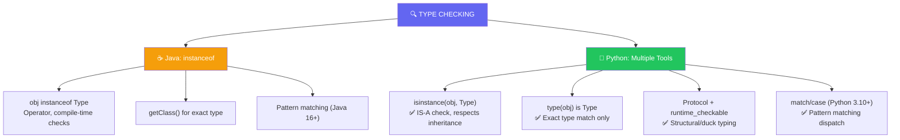

import { Tabs, TabItem, Aside, Badge, Card, CardGrid, Code } from '@astrojs/starlight/components';

## 🔍 Type Checking in Python — Complete Guide

> Python doesn't have an `instanceof` **operator** — instead, it uses the **`isinstance()` function** for runtime type checks, plus `type()`, `Protocol`, and structural typing for flexible, Pythonic type validation.

```python
# Java: obj instanceof String
# Python: isinstance(obj, str)  ✅ function, not operator!

name = "Alice"
print(isinstance(name, str))    # True ✅
print(isinstance(name, object)) # True ✅ (everything is an object)
```

<Aside type="success">
🎯 **Python Advantage**: No compile-time type compatibility checks, no generics erasure surprises, and structural typing with `Protocol` for duck-typing with type hints!
</Aside>

---

## 🗺️ The Full Map: Java `instanceof` → Python Equivalents



---

## 🔑 Rule 1: `isinstance()` — The Primary Type Check (Like `instanceof`)

### 🟢 Basic Usage — Respects Inheritance

```python
# isinstance(obj, Type) → True if obj IS-A Type (or subtype)

class Animal: pass
class Dog(Animal): pass
class Cat(Animal): pass

pet = Dog()

print(isinstance(pet, Dog))     # True ✅ (exact type)
print(isinstance(pet, Animal))  # True ✅ (Dog IS-A Animal)
print(isinstance(pet, Cat))     # False ✅ (Dog is NOT-A Cat)
print(isinstance(pet, object))  # True ✅ (everything inherits from object)
```

### 🔄 Interface-Like Checks with ABCs

```python
# Python uses Abstract Base Classes (ABCs) for interface-like checks
from collections.abc import Iterable, Sequence

def process(items):
    if isinstance(items, Iterable):  # ✅ Works for list, tuple, set, generator...
        return list(items)
    return [items]

# Works with any iterable — duck typing + type hint!
process([1, 2, 3])        # ✅ list
process((4, 5, 6))        # ✅ tuple  
process({7, 8, 9})        # ✅ set
process(x for x in range(3))  # ✅ generator
```

<Code lang="python" title="isinstance with multiple types" code={`
# ✅ Check against multiple types in one call:
value = 42

if isinstance(value, (int, float, complex)):
    print(f"Numeric: {value}")
elif isinstance(value, str):
    print(f"String: {value}")
else:
    print(f"Other: {type(value).__name__}")

# Equivalent to: isinstance(value, int) or isinstance(value, float) or ...
# But cleaner and more efficient!
`} />

<Aside type="tip">
**MUST KNOW**: `isinstance()` walks the **Method Resolution Order (MRO)** — it checks the entire inheritance chain. This makes it perfect for polymorphic code!
</Aside>

---

## 🔬 `type()` — Exact Type Match Only

### 🟡 When You Need Exact Type (No Inheritance)

```python
# type(obj) returns the exact class — no inheritance check

class Animal: pass
class Dog(Animal): pass

pet = Dog()

print(type(pet) is Dog)      # True ✅ (exact match)
print(type(pet) is Animal)   # False ❌ (Dog != Animal exactly)
print(type(pet) == Dog)      # True ✅ (also works with ==)
```

### 🎯 When to Use `type()` vs `isinstance()`

| Use Case | Recommended | Why |
|----------|-------------|-----|
| Polymorphic code | `isinstance()` | Respects inheritance — Dog IS-A Animal ✅ |
| Exact type dispatch | `type() is` | When subclass behavior must differ ✅ |
| Performance-critical | `type() is` | Slightly faster — no MRO walk ⚡ |
| API validation | `isinstance()` | More flexible — accepts subtypes ✅ |

<Code lang="python" title="Exact type dispatch pattern" code={`
# ✅ When subclasses need different handling:
def serialize(obj):
    obj_type = type(obj)
    
    if obj_type is str:
        return f'"{obj}"'  # JSON string
    elif obj_type is int:
        return str(obj)    # JSON number
    elif obj_type is bool:  # ⚠️ bool is subclass of int!
        return "true" if obj else "false"
    else:
        return str(obj)

# ⚠️ Warning: bool is subclass of int in Python!
print(isinstance(True, int))  # True 😱
print(type(True) is int)      # False ✅ — use type() to distinguish
`} />

<Aside type="danger">
⚠️ **Python Quirk**: `bool` is a subclass of `int`!  
```python
isinstance(True, int)  # True — may surprise Java devs!
type(True) is int      # False — exact type check works
type(True) is bool     # True ✅
```
Always use `type() is bool` if you need to distinguish booleans from integers!
</Aside>

---

## 🔬 Structural Typing with `Protocol` (Python 3.8+)

### 🦆 Duck Typing + Type Hints = Structural Typing

```python
# Java: instanceof checks nominal type (class name)
# Python: Protocol checks structural type (has methods/attributes)

from typing import Protocol, runtime_checkable

@runtime_checkable  # ✅ Enables isinstance() checks
class Drawable(Protocol):
    def draw(self) -> str: ...
    def area(self) -> float: ...

class Circle:
    def draw(self) -> str: return "🔵"
    def area(self) -> float: return 3.14

class Square:
    def draw(self) -> str: return "🟦"
    def area(self) -> float: return 4.0

# ✅ isinstance works with Protocol (if @runtime_checkable):
print(isinstance(Circle(), Drawable))  # True ✅ (has .draw() and .area())
print(isinstance(Square(), Drawable))  # True ✅
print(isinstance("text", Drawable))    # False ✅ (no .draw() method)

# ✅ Use in functions with type hints:
def render(shape: Drawable) -> None:
    print(f"Rendering: {shape.draw()} (area: {shape.area()})")

render(Circle())  # 🔵 Rendering: 🔵 (area: 3.14) ✅
```

<Code lang="python" title="Protocol without @runtime_checkable" code={`
from typing import Protocol

class Quackable(Protocol):
    def quack(self) -> str: ...

class Duck:
    def quack(self) -> str: return "Quack!"

class Dog:
    def bark(self) -> str: return "Woof!"

# Without @runtime_checkable, isinstance() won't work:
# isinstance(Duck(), Quackable)  # ❌ Always False at runtime

# But static type checkers (mypy, pyright) still validate:
def make_sound(animal: Quackable) -> str:
    return animal.quack()

make_sound(Duck())   # ✅ mypy: OK — Duck has .quack()
# make_sound(Dog())  # ❌ mypy: Error — Dog has no .quack()
`} />

<Aside type="success">
🚀 **Python Superpower**: Structural typing lets you write interfaces based on **behavior**, not inheritance. Perfect for duck-typing with type safety!
</Aside>

---

## ✨ Pattern Matching with `match`/`case` (Python 3.10+)

### 🎯 Java's Pattern Matching `instanceof` → Python's `match`/`case`

```python
# Java 16+: if (obj instanceof String s) { use(s); }
# Python 3.10+: match obj with case str as s: use(s)

def process(value: object) -> str:
    match value:
        case str(s) if len(s) > 5:      # Type + guard condition
            return f"Long string: {s.upper()}"
        case str(s):                     # Any other string
            return f"Short string: {s}"
        case int(n) if n > 0:           # Positive integer
            return f"Positive: {n * 2}"
        case int(n):                    # Zero or negative
            return f"Non-positive: {n}"
        case list(items):              # Any list
            return f"List with {len(items)} items"
        case _:                         # Default/fallback
            return f"Unknown: {type(value).__name__}"
```

### 🔗 Pattern Matching Features

| Feature | Python `match`/`case` | Java Pattern `instanceof` |
|---------|----------------------|---------------------------|
| Type binding | `case str as s:` or `case str(s):` | `if (obj instanceof String s)` |
| Guard conditions | `case int(n) if n > 0:` | `if (obj instanceof Integer i && i > 0)` |
| Exhaustiveness | `case _:` default | No compile-time exhaustiveness |
| Structural patterns | `case [first, *rest]:` | ❌ Not supported |
| Multiple types | `case str() | bytes():` | ❌ Requires separate checks |

<Code lang="python" title="Structural pattern matching examples" code={`
# ✅ List/tuple destructuring:
def first_two(items):
    match items:
        case [first, second, *_]:  # At least 2 elements
            return first, second
        case [single]:             # Exactly 1 element
            return single, None
        case []:                   # Empty
            return None, None
        case _:                    # Not a list
            return None, None

# ✅ Dict pattern matching:
def handle_config(config: dict):
    match config:
        case {"host": str(host), "port": int(port)}:
            return f"Connecting to {host}:{port}"
        case {"url": str(url)}:
            return f"Fetching {url}"
        case _:
            raise ValueError("Invalid config")

# ✅ Class pattern matching (Python 3.10+):
from dataclasses import dataclass

@dataclass
class Point:
    x: int
    y: int

def describe(point):
    match point:
        case Point(x=0, y=0):
            return "Origin"
        case Point(x=0, y=y):
            return f"On Y-axis at {y}"
        case Point(x=x, y=0):
            return f"On X-axis at {x}"
        case Point(x=x, y=y):
            return f"At ({x}, {y})"
        case _:
            return "Not a Point"
`} />

<Aside type="tip">
**Interview Gold**: Python's `match`/`case` is more powerful than Java's pattern `instanceof` — it supports structural patterns, guards, and exhaustiveness checking via `case _:`. Use it for clean, readable dispatch logic!
</Aside>

---

## ⚠️ Common Traps & Pythonic Solutions

<CardGrid>
  <Card title="Trap 1: Using type() when isinstance() is better" icon="error">
    ```python
    # ❌ Too strict — rejects subclasses:
    def process(items):
        if type(items) is list:  # Only exact list, not subclasses
            return items
    
    # ✅ Prefer isinstance for polymorphism:
    def process(items):
        if isinstance(items, list):  # Accepts list and subclasses
            return items
    
    # ✅ Or better: use duck typing / Protocol:
    def process(items):
        try:
            return list(items)  # Works for any iterable!
        except TypeError:
            return [items]
    ```
  </Card>
  
  <Card title="Trap 2: Forgetting bool is subclass of int" icon="warning">
    ```python
    # ❌ Surprise: bool passes int check!
    def handle_number(n):
        if isinstance(n, int):  # True for bool too! 😱
            return n * 2
    
    handle_number(True)  # Returns 2 — may not be intended!
    
    # ✅ Fix: Check bool first (since bool IS-A int):
    def handle_number(n):
        if isinstance(n, bool):  # Check bool BEFORE int
            return int(n)
        elif isinstance(n, int):
            return n * 2
    
    # ✅ Or use type() for exact match:
    def handle_number(n):
        if type(n) is bool:
            return int(n)
        elif type(n) is int:
            return n * 2
    ```
  </Card>

  <Card title="Trap 3: isinstance with generics (no erasure issues!)" icon="information">
    ```python
    # Java: list instanceof List<String> ❌ Compile Error (type erasure)
    # Python: isinstance(list, list[str]) ✅ Works! (but rarely needed)
    
    from typing import List
    
    items: list[int] = [1, 2, 3]
    
    # ✅ Runtime: generic args are erased, but base type works:
    print(isinstance(items, list))  # True ✅
    
    # ⚠️ Generic args ignored at runtime (but type checkers validate):
    print(isinstance(items, list[int]))  # True ✅ (but [str] would also be True!)
    
    # ✅ Use type hints for static checking, isinstance for runtime base type:
    def process(items: list[int]) -> None:
        if isinstance(items, list):  # Runtime check
            # mypy already validated list[int] statically
            for item in items:
                print(item * 2)  # item inferred as int by mypy
    ```
  </Card>

  <Card title="Trap 4: Protocol without @runtime_checkable" icon="caution">
    ```python
    from typing import Protocol
    
    class Flyable(Protocol):
        def fly(self) -> None: ...
    
    class Bird:
        def fly(self) -> None: print("🕊️")
    
    # ❌ Without @runtime_checkable, isinstance fails at runtime:
    print(isinstance(Bird(), Flyable))  # False 😱 (but mypy says OK!)
    
    # ✅ Add @runtime_checkable for runtime checks:
    from typing import runtime_checkable
    
    @runtime_checkable
    class Flyable(Protocol):
        def fly(self) -> None: ...
    
    print(isinstance(Bird(), Flyable))  # True ✅
    ```
  </Card>

  <Card title="Trap 5: match/case fallthrough behavior" icon="warning">
    ```python
    # ✅ Python match does NOT fall through (unlike C/Java switch):
    def classify(n):
        match n:
            case 1:
                return "one"
            case 2:
                return "two"  # Only this branch executes for n=2
            case _:
                return "other"
    
    # ✅ Use | for OR patterns:
    def is_weekend(day):
        match day:
            case "Saturday" | "Sunday":  # ✅ OR pattern
                return True
            case _:
                return False
    ```
  </Card>
</CardGrid>

---

## 🎯 Interview Cheat Sheet (Python Edition)

<CardGrid>
  <Card title="Q: What's the Python equivalent of Java's instanceof?" icon="information">
    **`isinstance(obj, Type)`** — a function, not an operator:
    ```python
    # Java: if (obj instanceof String) { ... }
    # Python: if isinstance(obj, str): ...
    
    # Key differences:
    # - isinstance() respects inheritance (Dog IS-A Animal) ✅
    # - No compile-time type compatibility checks ✅
    # - Works with ABCs: isinstance(x, Iterable) ✅
    # - Multiple types: isinstance(x, (int, float, str)) ✅
    ```
  </Card>
  
  <Card title="Q: How do you check for exact type (no inheritance)?" icon="approve-check">
    **Use `type(obj) is Type`**:
    ```python
    class Animal: pass
    class Dog(Animal): pass
    
    pet = Dog()
    
    isinstance(pet, Animal)  # True ✅ (IS-A check)
    type(pet) is Animal      # False ❌ (exact match only)
    type(pet) is Dog         # True ✅
    
    # ⚠️ Remember: bool is subclass of int!
    type(True) is int   # False ✅
    type(True) is bool  # True ✅
    ```
  </Card>

  <Card title="Q: How do you check if an object has a method (duck typing)?" icon="rocket">
    **Three Pythonic ways**:
    ```python
    # 1. hasattr() — simple attribute check:
    if hasattr(obj, 'quack'):
        obj.quack()
    
    # 2. Protocol + isinstance() — structural typing with hints:
    from typing import Protocol, runtime_checkable
    @runtime_checkable
    class Quackable(Protocol):
        def quack(self) -> str: ...
    
    if isinstance(obj, Quackable):
        print(obj.quack())
    
    # 3. EAFP — just try it (Pythonic!):
    try:
        obj.quack()
    except AttributeError:
        pass  # Doesn't quack — handle gracefully
    ```
  </Card>

  <Card title="Q: How does Python's match/case compare to Java's pattern instanceof?" icon="backspace">
    **Python's match/case is more powerful**:
    ```python
    # Java: if (obj instanceof String s && s.length() > 5) { ... }
    
    # Python: structural patterns + guards + destructuring:
    match obj:
        case str(s) if len(s) > 5:   # Type + guard ✅
            print(s.upper())
        case [first, *rest]:         # List destructuring ✅
            print(f"First: {first}")
        case {"name": str(name)}:    # Dict pattern ✅
            print(f"Hello {name}")
        case _:                      # Default/fallback ✅
            print("Unknown")
    
    # Bonus: No fallthrough, exhaustive via case _, type-safe with mypy ✅
    ```
  </Card>

  <Card title="Q: Can you check generic types at runtime?" icon="caution">
    **Base type yes, generic args no (but it's OK!)**:
    ```python
    from typing import List
    
    items: list[int] = [1, 2, 3]
    
    # ✅ Runtime: generic args erased, but base type works:
    isinstance(items, list)  # True ✅
    
    # ⚠️ Generic args ignored at runtime (but type checkers validate):
    isinstance(items, list[int])  # True, but list[str] would also be True!
    
    # ✅ Best practice: Use type hints for static checking, 
    # isinstance for runtime base type validation:
    def process(items: list[int]) -> None:
        if isinstance(items, list):  # Runtime safety
            for item in items:  # mypy knows item is int
                print(item * 2)
    ```
  </Card>

  <Card title="Q: What does isinstance(None, type) return?" icon="information">
    **Depends on the type — None is an instance of its type only**:
    ```python
    value = None
    
    isinstance(value, type(None))  # True ✅ (NoneType)
    isinstance(value, object)      # True ✅ (everything is object)
    isinstance(value, str)         # False ✅
    isinstance(value, int)         # False ✅
    
    # ✅ Pythonic None check — use 'is', not isinstance:
    if value is None:  # ✅ Preferred (PEP 8)
        handle_missing()
    
    # isinstance for None is rarely needed — 'is None' is clearer!
    ```
  </Card>
</CardGrid>

<Aside type="danger">
**Most common runtime errors**:
```python
# TypeError: isinstance() arg 2 must be a type or tuple of types
isinstance(5, "int")  # 💥 String, not type!

# NameError: Protocol not imported
@runtime_checkable  # 💥 NameError if not imported from typing

# AttributeError: match/case syntax error (Python < 3.10)
match value:  # 💥 SyntaxError in Python 3.9 or earlier
    case int(): ...
```
</Aside>

---

## 🧩 DSA Patterns: Type Checking in Algorithms

<CardGrid>
  <Card title="Pattern: Polymorphic Node Processing" icon="rocket">
    ```python
    # ✅ Process heterogeneous tree nodes with isinstance:
    class Node: pass
    class Leaf(Node): 
        def __init__(self, value): self.value = value
    class Branch(Node): 
        def __init__(self, children): self.children = children
    
    def sum_tree(node: Node) -> int:
        if isinstance(node, Leaf):
            return node.value  # ✅ Type narrowed — safe attribute access
        elif isinstance(node, Branch):
            return sum(sum_tree(child) for child in node.children)
        else:
            raise TypeError(f"Unknown node type: {type(node)}")
    
    # ✅ Cleaner with match/case (Python 3.10+):
    def sum_tree(node: Node) -> int:
        match node:
            case Leaf(value=v): return v
            case Branch(children=children): 
                return sum(sum_tree(c) for c in children)
            case _: raise TypeError(f"Unknown: {type(node)}")
    ```
  </Card>
  
  <Card title="Pattern: Strategy Selection by Type" icon="shield">
    ```python
    # ✅ Choose algorithm based on input type:
    from collections.abc import Sequence, Set
    
    def find_duplicates(data):
        if isinstance(data, Set):  # ✅ O(1) lookup
            seen = set()
            return {x for x in data if x in seen or seen.add(x)}
        elif isinstance(data, Sequence):  # ✅ Ordered, may have duplicates
            seen = set()
            return [x for x in data if x in seen or seen.add(x)]
        else:  # ✅ Fallback for any iterable
            seen = set()
            result = []
            for x in data:
                if x in seen:
                    result.append(x)
                else:
                    seen.add(x)
            return result
    ```
  </Card>

  <Card title="Pattern: Protocol for Plugin Systems" icon="backspace">
    ```python
    # ✅ Structural typing for flexible plugin architecture:
    from typing import Protocol, runtime_checkable
    
    @runtime_checkable
    class Processor(Protocol):
        def process(self, data: str) -> str: ...
        def name(self) -> str: ...
    
    class UpperCasePlugin:
        def process(self, data: str) -> str: return data.upper()
        def name(self) -> str: return "uppercase"
    
    class ReversePlugin:
        def process(self, data: str) -> str: return data[::-1]
        def name(self) -> str: return "reverse"
    
    # ✅ Register any object matching the Protocol:
    plugins: list[Processor] = [UpperCasePlugin(), ReversePlugin()]
    
    def run_pipeline(text: str) -> str:
        result = text
        for plugin in plugins:
            if isinstance(plugin, Processor):  # ✅ Runtime safety
                result = plugin.process(result)
        return result
    ```
  </Card>

  <Card title="Pattern: Safe Deserialization with Type Guards" icon="information">
    ```python
    # ✅ Validate and narrow types during JSON parsing:
    from typing import Union, TypedDict
    
    class UserDict(TypedDict):
        name: str
        age: int
    
    def parse_user(data: dict) -> Union[UserDict, None]:
        # Type guards with isinstance:
        if not isinstance(data, dict):
            return None
        if not isinstance(data.get("name"), str):
            return None
        if not isinstance(data.get("age"), int):
            return None
        # ✅ All checks passed — safe to return as UserDict
        return {"name": data["name"], "age": data["age"]}
    
    # ✅ Or with match/case (Python 3.10+):
    def parse_user(data: dict) -> Union[UserDict, None]:
        match data:
            case {"name": str(name), "age": int(age)}:
                return {"name": name, "age": age}
            case _:
                return None
    ```
  </Card>
</CardGrid>

<Aside type="tip">
**Competitive Coding Pro Tip**: Use `isinstance()` for quick type dispatch in heterogeneous input problems:
```python
# Problem: Process mixed list of ints, strings, and lists
def solve(items: list) -> int:
    total = 0
    for item in items:
        if isinstance(item, int):
            total += item
        elif isinstance(item, str) and item.isdigit():
            total += int(item)
        elif isinstance(item, list):
            total += solve(item)  # Recursive for nested lists
    return total
```
</Aside>

---

## 🔬 Under the Hood: Python Type Checking Internals

<Code lang="python" title="How isinstance() works internally" code={`
# isinstance() walks the Method Resolution Order (MRO):
class A: pass
class B(A): pass
class C(B): pass

obj = C()
print(C.__mro__)  
# (<class '__main__.C'>, <class '__main__.B'>, 
#  <class '__main__.A'>, <class 'object'>)

print(isinstance(obj, A))  # True — walks C → B → A ✅

# type() is a direct pointer comparison:
print(type(obj) is C)  # True — exact match ✅
print(type(obj) is A)  # False — different type object ✅

# Protocol with @runtime_checkable uses __protocol_attrs__:
from typing import Protocol, runtime_checkable

@runtime_checkable
class Drawable(Protocol):
    def draw(self) -> str: ...

print(Drawable.__protocol_attrs__)  # {'draw'}

# isinstance(obj, Drawable) checks if obj has all __protocol_attrs__
`} />

```text
Type Checking Internals:

isinstance(obj, Type):
• Walks obj's class MRO (Method Resolution Order)
• Checks if Type appears in inheritance chain
• O(depth) but very fast — shallow hierarchies in practice
• Handles ABCs, virtual subclasses, Protocol (@runtime_checkable)

type(obj) is Type:
• Direct pointer comparison of type objects
• O(1) — fastest possible type check
• No inheritance — exact match only

match/case (Python 3.10+):
• Compiled to efficient bytecode with jump tables
• Structural patterns destructure objects at runtime
• Guard conditions (if ...) evaluated after type match
• case _ provides exhaustive fallback (no fallthrough)

Protocol + @runtime_checkable:
• Stores required attributes in __protocol_attrs__
• isinstance() checks if obj has all required attributes
• Does NOT check method signatures at runtime (static checkers do)
• Enables duck-typing with runtime safety
```

<Aside type="note">
**Performance Note**:  
- `type() is` is fastest — direct pointer comparison ✅  
- `isinstance()` walks MRO — still very fast for typical hierarchies ✅  
- `@runtime_checkable` Protocol checks attributes — O(attrs) but usually small ✅  
- `match/case` compiles to efficient dispatch — use for readability, not micro-optimization ✅
</Aside>

---

## 🏢 Real-Life SDE Usage

<CardGrid>
  <Card title="Pattern: API Input Validation" icon="rocket">
    ```python
    from typing import Union, Optional
    from collections.abc import Mapping
    
    def create_user(
        data: Union[dict, str],  # JSON string or dict
        *, 
        validate: bool = True
    ) -> dict:
        """Flexible API endpoint — accepts dict or JSON string"""
        
        # ✅ Type dispatch:
        if isinstance(data, str):
            import json
            try:
                data = json.loads(data)
            except json.JSONDecodeError:
                raise ValueError("Invalid JSON")
        
        # ✅ Now data is dict — validate structure:
        if validate:
            if not isinstance(data, Mapping):  # ✅ Works for dict, defaultdict, etc.
                raise TypeError("Expected mapping")
            if "name" not in data or not isinstance(data["name"], str):
                raise ValueError("Missing/invalid 'name'")
        
        return {"id": generate_id(), **data}
    ```
  </Card>
  
  <Card title="Pattern: Plugin Architecture with Protocol" icon="shield">
    ```python
    from typing import Protocol, runtime_checkable, ClassVar
    
    @runtime_checkable
    class Plugin(Protocol):
        name: ClassVar[str]
        version: ClassVar[str]
        
        def initialize(self) -> bool: ...
        def execute(self, **kwargs) -> dict: ...
        def shutdown(self) -> None: ...
    
    class LoggingPlugin:
        name = "logger"
        version = "1.0"
        
        def initialize(self) -> bool: return True
        def execute(self, **kwargs) -> dict: 
            print(f"[LOG] {kwargs}")
            return {"status": "logged"}
        def shutdown(self) -> None: pass
    
    # ✅ Plugin registry — accepts any object matching Protocol:
    plugins: dict[str, Plugin] = {}
    
    def register(plugin: Plugin) -> None:
        if isinstance(plugin, Plugin):  # ✅ Runtime safety
            plugins[plugin.name] = plugin
            plugin.initialize()
    
    # ✅ Usage — type-safe and flexible:
    register(LoggingPlugin())  # ✅ Works — matches Protocol structurally
    ```
  </Card>

  <Card title="Pattern: Data Processing Pipeline with match/case" icon="information">
    ```python
    from dataclasses import dataclass
    from typing import Union
    
    @dataclass
    class TextEvent: content: str; source: str
    @dataclass  
    class NumberEvent: value: float; metric: str
    @dataclass
    class ErrorEvent: code: int; message: str
    
    Event = Union[TextEvent, NumberEvent, ErrorEvent]
    
    def process_event(event: Event) -> dict:
        """Type-safe dispatch with pattern matching"""
        match event:
            case TextEvent(content=c, source=s):
                return {"type": "text", "length": len(c), "source": s}
            case NumberEvent(value=v, metric=m) if v > 100:
                return {"type": "alert", "metric": m, "value": v}
            case NumberEvent(value=v, metric=m):
                return {"type": "metric", "metric": m, "value": v}
            case ErrorEvent(code=404, message=m):
                return {"type": "warning", "message": f"Not found: {m}"}
            case ErrorEvent(code=c, message=m):
                return {"type": "error", "code": c, "message": m}
            case _:  # Exhaustive fallback
                return {"type": "unknown", "raw": str(event)}
    ```
  </Card>
</CardGrid>

<Code lang="python" title="Production: Type checking utilities" code={`
from typing import TypeVar, Type, Protocol, runtime_checkable, get_type_hints
from collections.abc import Callable

T = TypeVar('T')

def require_type(value: object, expected: Type[T], name: str = "value") -> T:
    """
    Runtime type guard with clear error message
    """
    if not isinstance(value, expected):
        actual = type(value).__name__
        expected_name = getattr(expected, '__name__', str(expected))
        raise TypeError(f"{name}: expected {expected_name}, got {actual}")
    return value  # Type narrowed to T for type checkers

@runtime_checkable
class Serializable(Protocol):
    def to_dict(self) -> dict: ...
    @classmethod
    def from_dict(cls, data: dict) -> 'Serializable': ...

def safe_serialize(obj: object) -> str:
    """Serialize if possible, fallback to repr"""
    import json
    
    if isinstance(obj, Serializable):
        return json.dumps(obj.to_dict())
    elif isinstance(obj, (dict, list, str, int, float, bool, type(None))):
        return json.dumps(obj, default=str)  # Fallback for non-serializable
    else:
        return repr(obj)  # Last resort

# Usage examples:
name = require_type(user_input, str, "username")  # Raises if not str
payload = safe_serialize({"user": name, "action": "login"})  # JSON string
`} />

<Aside type="caution">
**Production Checklist** for type checking:
1. ✅ Use `isinstance()` for polymorphic code — respects inheritance
2. ✅ Use `type() is` only when exact type match is required
3. ✅ Use `Protocol + @runtime_checkable` for structural typing with runtime checks
4. ✅ Use `match`/`case` (3.10+) for clean, exhaustive type dispatch
5. ✅ Remember: `bool` is subclass of `int` — check `bool` before `int` if distinguishing
6. ✅ Generic type args erased at runtime — use base type for `isinstance()`
7. ✅ Prefer EAFP (try/except) over explicit type checks when appropriate
</Aside>

---

## 🔑 Quick Reference Summary

<table>
  <thead>
    <tr>
      <th>Check Type</th>
      <th>Python Syntax</th>
      <th>Inheritance?</th>
      <th>Best For</th>
    </tr>
  </thead>
  <tbody>
    <tr><td>IS-A relationship</td><td><code>isinstance(obj, Type)</code></td><td>✅ Yes</td><td>Polymorphic code, API validation</td></tr>
    <tr><td>Exact type match</td><td><code>type(obj) is Type</code></td><td>❌ No</td><td>Dispatch when subclasses differ</td></tr>
    <tr><td>Structural typing</td><td><code>@runtime_checkable Protocol</code></td><td>N/A</td><td>Duck-typing with type hints</td></tr>
    <tr><td>Pattern dispatch</td><td><code>match obj: case Type(): ...</code></td><td>✅ Yes</td><td>Clean, exhaustive type-based logic</td></tr>
    <tr><td>Has attribute/method</td><td><code>hasattr(obj, 'name')</code></td><td>N/A</td><td>Simple duck-typing checks</td></tr>
    <tr><td>None check</td><td><code>obj is None</code></td><td>N/A</td><td>✅ Always use 'is', not isinstance</td></tr>
  </tbody>
</table>

<Aside type="tip">
**Pro Checklist for Python Type Checking**:
1. ✅ Default to `isinstance()` — it's the Pythonic `instanceof`
2. ✅ Use `type() is` only when you need exact type (no inheritance)
3. ✅ Leverage `Protocol` for flexible, behavior-based interfaces
4. ✅ Use `match`/`case` (3.10+) for readable, exhaustive dispatch
5. ✅ Remember: `bool` IS-A `int` — check order matters!
6. ✅ Generic args erased at runtime — check base type only
7. ✅ When in doubt: try the operation and catch `AttributeError` (EAFP)
</Aside>

---

## 🧪 Test Your Understanding

<Code lang="python" title="Predict the output — Python type checking quiz" code={`
from typing import Protocol, runtime_checkable

# Q1: Basic isinstance with inheritance
class Animal: pass
class Dog(Animal): pass
pet = Dog()
print(isinstance(pet, Dog))     # ?
print(isinstance(pet, Animal))  # ?
print(isinstance(pet, object))  # ?

# Q2: type() exact match
print(type(pet) is Dog)     # ?
print(type(pet) is Animal)  # ?

# Q3: bool/int quirk
print(isinstance(True, int))   # ? (surprise!)
print(type(True) is int)       # ?
print(type(True) is bool)      # ?

# Q4: Protocol with @runtime_checkable
@runtime_checkable
class Quackable(Protocol):
    def quack(self) -> str: ...

class Duck:
    def quack(self) -> str: return "Quack!"

print(isinstance(Duck(), Quackable))  # ?

# Q5: match/case pattern matching (Python 3.10+)
def classify(value):
    match value:
        case int(n) if n > 0: return "positive"
        case int(n): return "non-positive"
        case str(s): return f"string:{len(s)}"
        case _: return "other"

print(classify(42))    # ?
print(classify(-5))    # ?
print(classify("hi"))  # ?
print(classify(None))  # ?

# Q6: None type check
value = None
print(isinstance(value, type(None)))  # ?
print(value is None)                  # ?

# Expected Output:
# True
# True  
# True
# True
# False
# True
# True (bool IS-A int!)
# False
# True
# True (Duck has .quack())
# "positive"
# "non-positive"
# "string:2"
# "other"
# True
# True
`} />

<details>
<summary>✅ Click to reveal explanations</summary>

```text
Q1: isinstance respects inheritance — Dog IS-A Animal IS-A object ✅
Q2: type() is exact match only — Dog != Animal ✅
Q3: bool is subclass of int in Python — isinstance(True, int) is True! 😱
Q4: @runtime_checkable enables isinstance with Protocol — Duck has .quack() ✅
Q5: match/case: guards (if n>0) filter after type match; case _ is fallback ✅
Q6: type(None) is NoneType; 'is None' is PEP 8 preferred for None checks ✅
```
</details>

<Aside type="caution">
**Final Warning**: Type checking bugs are subtle — they often produce "almost right" behavior. Always:
- Use `isinstance()` for polymorphic code, `type() is` for exact dispatch
- Check `bool` before `int` if you need to distinguish them
- Use `@runtime_checkable` for Protocol if you need runtime `isinstance()` checks
- Remember: `match`/`case` doesn't fall through — each case is exclusive
- Test edge cases: `None`, empty collections, boundary values, subclass instances
- Document type expectations in docstrings and type hints
</Aside>

---

## 🗒️ Quick Revision Cheat Sheet

```python
# 📦 TYPE CHECKING AT A GLANCE

# 🔍 IS-A CHECK (like Java instanceof)
isinstance(obj, Type)              # ✅ Respects inheritance — default choice
isinstance(obj, (A, B, C))         # ✅ Check multiple types in one call
isinstance(obj, collections.abc.Iterable)  # ✅ ABCs for duck-typing

# 🎯 EXACT TYPE MATCH
type(obj) is Type                  # ✅ No inheritance — exact match only
type(obj) == Type                  # ✅ Also works (is preferred for identity)

# 🦆 STRUCTURAL TYPING (Protocol)
from typing import Protocol, runtime_checkable

@runtime_checkable
class Drawable(Protocol):          # ✅ Define behavior, not inheritance
    def draw(self) -> str: ...

isinstance(obj, Drawable)          # ✅ True if obj has .draw() method

# ✨ PATTERN MATCHING (Python 3.10+)
match value:
    case int(n) if n > 0: ...      # ✅ Type + guard condition
    case str(s): ...               # ✅ Type binding
    case [first, *rest]: ...       # ✅ Structural pattern (list)
    case {"key": val}: ...         # ✅ Dict pattern
    case _: ...                    # ✅ Default/fallback (exhaustive)

# ⚠️ MUST KNOW QUIRKS
# ❌ bool is subclass of int:
isinstance(True, int)  # True 😱 — check bool first if distinguishing!

# ❌ Generic args erased at runtime:
isinstance([1,2], list[int])  # True, but list[str] would also be True!
# ✅ Use base type for runtime checks, type hints for static validation

# ❌ Protocol without @runtime_checkable:
# isinstance(obj, Protocol)  # Always False at runtime without decorator!

# 🎯 DSA PATTERNS
# Polymorphic tree processing:
def traverse(node):
    if isinstance(node, Leaf): return node.value
    elif isinstance(node, Branch): return sum(traverse(c) for c in node.children)

# Strategy selection by type:
if isinstance(data, set): ...  # O(1) lookup
elif isinstance(data, list): ...  # Ordered access

# Plugin system with Protocol:
@runtime_checkable
class Plugin(Protocol):
    def execute(self, data): ...

plugins = [p for p in candidates if isinstance(p, Plugin)]

# 🔒 PRODUCTION TIPS
# Use isinstance() for 95% of type checks — Pythonic and flexible
# Use type() is only when exact type matters (rare)
# Use Protocol for behavior-based interfaces (duck-typing + hints)
# Use match/case (3.10+) for clean, exhaustive dispatch logic
# Remember: 'is None' for None checks, not isinstance(None, type)
# Document type expectations in docstrings and type hints
```

> 🚀 **Final Wisdom**: Python's type checking tools are designed for flexibility and clarity. `isinstance()` handles inheritance naturally, `Protocol` enables structural typing, and `match`/`case` provides powerful pattern dispatch. Embrace the Pythonic way: *"Duck typing is powerful, but type hints make it safer"*. When checking types, choose the right tool for the job — your code will be more robust, readable, and maintainable! 🐍🔍

<Badge text="Astro 6 Ready" variant="success" /> • <Badge text="Python 3.10+" variant="tip" /> • <Badge text="Interview Optimized" variant="caution" />
```

---

## 🔄 Key Conversion Summary

| Java `instanceof` Concept | Python Equivalent | Critical Difference |
|--------------------------|-----------------|-------------------|
| `obj instanceof Type` operator | `isinstance(obj, Type)` function | Python: function, not operator — more flexible with tuples |
| Compile-time type compatibility check | No compile-time check — always runtime | Python: dynamic typing — no "inconvertible types" error |
| `null instanceof X` → false | `None` check: use `is None`, not `isinstance` | Python: `is None` is PEP 8 standard; `isinstance(None, X)` works but rare |
| Pattern matching `instanceof String s` | `match obj: case str(s):` or `if isinstance(obj, str)` | Python: `match`/`case` (3.10+) more powerful with structural patterns |
| `getClass() == Type.class` for exact match | `type(obj) is Type` | Same concept, but Python: `bool` is subclass of `int` — watch order! |
| Interface check: `obj instanceof Interface` | `isinstance(obj, ABC)` or `Protocol` | Python: ABCs for nominal, `Protocol` for structural interface checks |
| Generic type check: `obj instanceof List<String>` ❌ | `isinstance(obj, list)` ✅ (args erased) | Python: generic args ignored at runtime, but type checkers validate statically |
| Array type: `obj instanceof int[]` | `isinstance(obj, list)` or `isinstance(obj, tuple)` | Python: no primitive arrays — use `list`, `tuple`, `array.array`, or `numpy` |

> 🎯 **Pro Interview Tip**: When asked about type checking in Python, emphasize:  
> 1. `isinstance()` is the Pythonic `instanceof` — respects inheritance, accepts tuples ✅  
> 2. `type() is` for exact matches — but watch `bool` IS-A `int` quirk ✅  
> 3. `Protocol + @runtime_checkable` for structural/duck typing with runtime safety ✅  
> 4. `match`/`case` (3.10+) for powerful, exhaustive pattern dispatch ✅  
> 5. Generic args erased at runtime — check base type, rely on type hints for specifics ✅  
> This demonstrates deep Python fluency beyond basic syntax! 🐍🔍