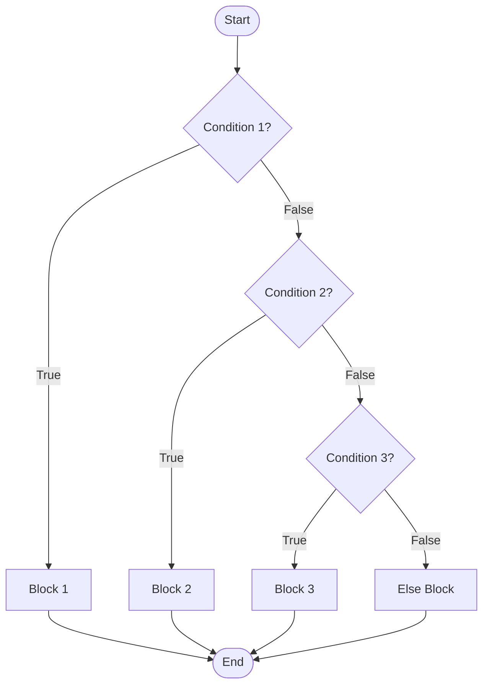

import { Aside, Badge, Card, CardGrid, Code } from '@astrojs/starlight/components';

## 🔀 Python Selection Statements

---

## 🗺️ The Full Map

```text
Selection Statements in Python
│
├── if
│   ├── if
│   ├── if-else
│   ├── elif
│   └── nested if
│
├── Conditional Expression (Ternary)
│   └── value_if_true if condition else value_if_false
│
└── Structural Pattern Matching (Python 3.10+)
    ├── match subject:
    │   case pattern:
    │   case pattern if guard:
    │   case _:  ← wildcard (default)
```

---

# if / elif / else Ladder

---

## 🔬 if Syntax

Python uses **indentation** instead of braces `{}` to define blocks. It uses `elif` instead of `else if`.

```python
# Form 1: Simple if
if condition:
    # runs if True

# Form 2: if-else
if condition:
    # True branch
else:
    # False branch

# Form 3: if-elif-else ladder
if condition1:
    # Branch 1
elif condition2:
    # Branch 2
elif condition3:
    # Branch 3
else:
    # Default branch

// Form 4 — nested if
if outer:
    if inner:
        # code
```

---

## 🔑 Core Rule: Condition Coerces to Boolean

> The argument to an `if` statement **can be any value**. Python coerces it to boolean using **Truthy/Falsy rules**.

```python

x = 5

if x:
    pass               # ✅ Runs! 5 is truthy

if x == 5:
    pass               # ✅ Runs! Comparison returns True

if x := 5:
    pass               # ✅ Runs! Assignment expression returns 5 (truthy)
                        # Similar to JS assignment-in-condition,
                        # but Python requires :=, not =

# ❌ Invalid in Python
if x = 5:
    pass
# SyntaxError

# Unlike Java — Python allows many types in if conditions
# Implicit bool conversion happens automatically

# behind

# if x:
#     => if bool(x)

# if (x := 10):
#     => x = 10
#     => if bool(10)

# if x and y:
#     => if bool(x and y)

# if 5 and 10:
#     => 5 and 10 returns 10
#     => if bool(10)
#     => if True

# if 5 or 10:
#     => 5 or 10 returns 5
#     => if bool(5)
#     => if True

# if x > y:
#     => x > y returns True/False

# if x == y:
#     => x == y returns True/False

# Python comparison rules:
# - Number vs Number → numeric comparison
# - String vs String → lexicographic comparison
# - Many incompatible types raise TypeError
#
# Example:
# 10 > 5      => True
# "xyz" > "abc" => True
# 10 > "5"    => TypeError
```

---

## One-Line `if` (Inline)

```python
if x > 0: print("positive")    # valid but discouraged by PEP 8
```

---

## Ternary Expression — Conditional Expression

```python
# Syntax:
value = true_expr if condition else false_expr

# Examples:
label   = "even" if n % 2 == 0 else "odd"
result  = x if x > 0 else -x          # abs()
clamped = min_val if x < min_val else (max_val if x > max_val else x)
```

---

## 🔬 Truthy/Falsy Coercion

> In Python, the condition doesn't have to be a strict `boolean`. It can be **any object**. Python evaluates its **"Truthiness"**.

```
┌──────────────────────────────────────────────────────────┐
│            ANYTHING inside if → bool(value)              │
│                                                          │
│  FALSY → else branch:            TRUTHY → if branch:     │
│  False                           True                    │
│  None                            1, -1, 42               │
│  0                               "0", "False"            │
│  0.0                             [1, 2], {"a": 1}        │
│  0j                              (1, 2)                  │
│  ""                              {1, 2}                  │
│  []                              object()                │
│  ()                              float("inf")            │
│  {}                              lambda x: x             │
│  set()                           complex(1, 2)           │
│  range(0)                                                │
└──────────────────────────────────────────────────────────┘
```

<Code lang="python" title="Truthy/Falsy examples" code={`
x = 5
if x: 
    print("x is truthy")  # ✅ Prints

y = 0
if y:
    print("y is truthy")  
else:
    print("y is falsy")   # ✅ Prints

name = ""
if name:
    print("Name provided")
else:
    print("Name missing") # ✅ Prints
`} />

<Aside type="note">
**Java vs Python**: Java requires `boolean` (`if (x > 0)`). Python allows implicit truthiness (`if x:`). This makes Python code cleaner but requires understanding what counts as "False".
</Aside>

---

### 🔄 Flow Diagram: if-elif-else



<Code lang="python" title="Grade Calculator" code={`
marks = 85

if marks >= 90:
    grade = "A"
elif marks >= 75:
    grade = "B"
elif marks >= 60:
    grade = "C"
else:
    grade = "F"

print(f"Grade: {grade}")  # Grade: B
`} />

<Aside type="tip">
**Performance Tip**: Like Java, Python evaluates top-to-bottom. Place the **most likely** conditions first to skip unnecessary checks.
</Aside>

---

## 🔬 Bytecode — What `if` Compiles To

```python
import dis

def check(x):
    if x > 0:
        return "positive"
    else:
        return "negative"

dis.dis(check)
# LOAD_FAST     x
# LOAD_CONST    0
# COMPARE_OP    >
# POP_JUMP_IF_FALSE   →  (jump to else branch)
# LOAD_CONST   'positive'
# RETURN_VALUE
# LOAD_CONST   'negative'    ← else branch
# RETURN_VALUE
```

```
if uses JUMP instructions:
  POP_JUMP_IF_FALSE  →  condition false → jump over if body
  POP_JUMP_IF_TRUE   →  condition true  → jump over else body
  JUMP_FORWARD       →  unconditional jump after if body
```

---

## 🔬 Ternary Bytecode

```python
import dis

def f(x):
    return "pos" if x > 0 else "neg"

dis.dis(f)
# LOAD_FAST     x
# LOAD_CONST    0
# COMPARE_OP    >
# POP_JUMP_IF_FALSE  → (jump to 'neg')
# LOAD_CONST    'pos'
# JUMP_FORWARD       → (skip 'neg')
# LOAD_CONST    'neg'
# RETURN_VALUE
```

> Ternary is an **expression** — it returns a value. `if/else` statement is not. Use ternary when you need the result inline; use `if/else` for multi-line or side effects.

---

## ⚠️ Interview Traps — if Statement

<Card title="Trap 1: Indentation Matters!" icon="error">
    ```python
    x = 5
    if x > 0:
        print("Positive")
        print("Indented Wrong")  # 💥 IndentationError!

    # ✅ Fix: Consistent indentation (usually 4 spaces)
    if x > 0:
        print("Positive")
        print("Part of if block")
    ```
    <Aside type="caution">
        **Why it matters**: Python uses whitespace to define scope. Inconsistent tabs/spaces cause crashes.
    </Aside>
</Card>  

<Card title="Trap 2: Assignment (=) vs Comparison (==)" icon="warning">
    ```python
        x = 5

        # ❌ Syntax Error in Python 3.8+ (unless using Walrus :=)
        # if x = 5: ... 

        # ✅ Correct:
        if x == 5:
            print("Five")
            
        # ⚠️ Logical Bug:
        flag = False
        if flag = True: ... # Syntax Error

        # ✅ Pythonic:
        if flag: ... 
    ```
    <Aside type="caution">
        **Pro Tip**: Python prevents accidental assignment in `if` statements (mostly). Use `==` for comparison.
    </Aside>
</Card>

<Card title="Trap 3: None Checks" icon="shield">
    ```python
        obj = None

        # ❌ Risky if obj might not have .equals() equivalent
        # if obj.equals("val"): ... # AttributeError

        # ✅ Pythonic Identity Check:
        if obj is None:
            print("It's null")
            
        # ✅ Safe attribute access:
        if obj is not None and obj.value > 10:
            pass
    ```
    <Aside type="caution">
        **Interview Answer**: Use `is None` or `is not None` for identity checks. Use `==` for value equality.
    </Aside>
</Card>

<Card title="Trap 4: Chained Comparisons" icon="rocket">
    ```python
        # Java: if (x > 10 && x < 20)

        # Python: Chained comparisons!
        x = 15
        if 10 < x < 20:
            print("InRange") # ✅ Valid and Pythonic
            
        # Even works with multiple operators:
        if 0 <= x <= 100:
            print("Valid Score")
    ```
    <Aside type="tip">
        **Bonus**: This is evaluated efficiently (short-circuited) just like `and`.
    </Aside>
</Card>

---

## 🟡 Structural Pattern Matching (Python 3.10+)

> Python 3.10 introduced `match/case`. It is **NOT** just a switch statement; it's a **pattern matching** engine. It can destructure data, check types, and guard conditions.

---

### 🔑 Key Improvements over Java Switch

| Feature | Java `switch` | Python `match/case` |
|---------|---------------|---------------------|
| **Values** | Constants only | Patterns (Lists, Dicts, Classes) |
| **Fall-through** | Yes (dangerous) | No (automatic break) |
| **Return Value** | No (Statement) | No (Statement)* |
| **Type Checking** | No (unless pattern matching preview) | Yes (`case int():`) |
| **Wildcards** | `default` | `case _:` |

*\*Note: Python `match` is a statement, not an expression. It doesn't return a value directly like Java 14+ switch expressions.*

---

### 💻 Syntax Comparison

<Code lang="python" title="Basic match/case" code={`
day = 3

match day:
    case 1:
        print("Monday")
    case 2:
        print("Tuesday")
    case 3:
        print("Wednesday")
    case _:  # Wildcard (like default)
        print("Other day")
`} />

<Code lang="python" title="Multiple patterns & Guards" code={`
status = 404

match status:
    case 200 | 201:  # OR pattern
        print("Success")
    case 400 | 401 | 403:
        print("Client Error")
    case 500 | 502:
        print("Server Error")
    case _:
        print("Unknown Status")
`} />

<Code lang="python" title="Structural Matching (The Superpower)" code={`
# Matching Lists
def process_command(cmd):
    match cmd:
        case ["quit"]:
            print("Quitting...")
        case ["save", filename]:
            print(f"Saving to {filename}")
        case ["load", filename]:
            print(f"Loading {filename}")
        case _:
            print("Unknown command")

process_command(["save", "data.txt"]) 
# Output: Saving to data.txt
`} />

<Code lang="python" title="Matching Dicts & Classes" code={`
from dataclasses import dataclass

@dataclass
class Point:
    x: int
    y: int

p = Point(10, 20)

match p:
    case Point(x=0, y=0):
        print("Origin")
    case Point(x=0, y=y):
        print(f"On Y-axis at {y}")
    case Point(x=x, y=0):
        print(f"On X-axis at {x}")
    case Point(x=x, y=y):
        print(f"Point at ({x}, {y})")
    case _:
        print("Not a point")
`} />

<Aside type="tip">
    **Version Check**: `match/case` requires **Python 3.10+**.For older versions, use `if/elif/else` or dictionary mapping.
</Aside>

---

### Pattern Types — The Full Arsenal

#### Literal Pattern

```python
match status_code:
    case 200: print("OK")
    case 404: print("Not Found")
    case 500: print("Server Error")
    case _:   print("Unknown")
```

#### Capture Pattern

```python
match point:
    case (x, y):        # captures x and y into variables
        print(x, y)     # x and y are NOW bound in this scope
```

#### Class Pattern

```python
from dataclasses import dataclass

@dataclass
class Point:
    x: float
    y: float

@dataclass
class Circle:
    center: Point
    radius: float

def describe(shape):
    match shape:
        case Point(x=0, y=0):
            print("origin")
        case Point(x=x, y=0):
            print(f"on x-axis at {x}")
        case Circle(center=Point(x=cx, y=cy), radius=r):
            print(f"circle at ({cx},{cy}) radius={r}")
        case _:
            print("unknown shape")
```

#### Sequence Pattern

```python
match command.split():
    case ["quit"]:
        quit()
    case ["go", direction]:
        move(direction)
    case ["go", direction, speed]:
        move(direction, int(speed))
    case ["pick", "up", item]:
        pick_up(item)
    case [first, *rest]:            # star capture
        print(f"starts with {first}, rest={rest}")
```

#### Mapping Pattern (Dict)

```python
match event:
    case {"type": "click", "x": x, "y": y}:
        handle_click(x, y)
    case {"type": "keypress", "key": key}:
        handle_key(key)
    case {"type": "resize", **rest}:    # ** captures remaining keys
        handle_resize(**rest)
```

#### OR Pattern `|`

```python
match command:
    case "quit" | "exit" | "q":
        quit()
    case "help" | "h" | "?":
        show_help()
```

#### Guard Pattern (`if`)

```python
match point:
    case (x, y) if x == y:
        print(f"diagonal at {x}")
    case (x, y) if x > 0 and y > 0:
        print("first quadrant")
    case (x, y):
        print(f"somewhere at {x}, {y}")
```

#### AS Pattern

```python
match command:
    case ("go" | "move") as action:
        print(f"movement command: {action}")
```

---

### 🔬 `match` Internals — How It Works

```
match is NOT compiled to a series of == checks.
CPython uses a specialized pattern matching bytecode:

  MATCH_SEQUENCE   ← checks if subject is sequence
  MATCH_MAPPING    ← checks if subject is mapping
  MATCH_CLASS      ← checks isinstance + extracts attrs
  GET_LEN          ← for length-based patterns
  MATCH_KEYS       ← for dict key extraction

match is O(1) per pattern clause for most patterns.
Guard conditions are evaluated after structural match.
```

```python
# What match checks:
match x:
    case ClassName(attr=val):
        # 1. isinstance(x, ClassName)
        # 2. hasattr(x, '__match_args__')
        # 3. Extract attributes
        # 4. Compare values
```

```python
# __match_args__ — controls positional matching:
class Point:
    __match_args__ = ("x", "y")   # defines positional order

    def __init__(self, x, y):
        self.x = x
        self.y = y

p = Point(1, 2)
match p:
    case Point(1, y):   # positional: x=1 matched, y captured
        print(y)        # 2
```

---

### 🔬 `match` Scope — Capture Variables Leak

```python
x = "original"

match something:
    case (x, y):    # x is CAPTURE variable — shadows outer x!
        pass        # x is now bound to matched value

print(x)   # matched value, NOT "original"
```

> Unlike comprehension variables, `match` capture variables **always leak** into enclosing scope. Names in patterns are captures, not comparisons — unless they're dotted names.

```python
# To compare against existing variable — use dotted name:
Color.RED = 1
status = 1

match status:
    case Color.RED:     # ✅ comparison — checks status == Color.RED
        print("red")
    case red:           # ❌ capture — binds 'red' to status value
        print("captured")
```

---

## 🔄 The "Old School" Switch Alternatives (Pre-3.10)

Before Python 3.10, developers used two main patterns to replace switch.

---

### 1. Dictionary Mapping (Best for Values)

<Code lang="python" title="Dictionary Dispatch" code={`
def get_day_name(day):
    # Map values to results
    days = {
        1: "Monday",
        2: "Tuesday",
        3: "Wednesday",
        4: "Thursday",
        5: "Friday",
        6: "Saturday",
        7: "Sunday"
    }
    # .get() provides a default if key missing
    return days.get(day, "Invalid Day")

print(get_day_name(3))  # Wednesday
`} />

---

### 2. Function Mapping (Best for Actions)

<Code lang="python" title="Function Dispatch" code={`
def start():
    print("Starting...")

def stop():
    print("Stopping...")

def handle_command(cmd):
    actions = {
        "start": start,
        "stop": stop,
    }
    
    # Get function, default to lambda if missing
    func = actions.get(cmd, lambda: print("Unknown"))
    func()  # Call the function

handle_command("start")
`} />

---

## 🧩 DSA & Practical Patterns

<Card title="Pattern: State Machine with Match" icon="rocket">
    ```python
        def next_state(current, event):
            match (current, event):
                case ("IDLE", "START"):
                    return "RUNNING"
                case ("RUNNING", "STOP"):
                    return "IDLE"
                case ("RUNNING", "PAUSE"):
                    return "PAUSED"
                case _:
                    return current # No change
    ```
</Card>

<Card title="Pattern: Type-Based Dispatch" icon="backspace">
    ```python
        def process(data):
            match data:
                case int():
                    print(f"Processing number: {data}")
                case str():
                    print(f"Processing text: {data}")
                case list():
                    print(f"Processing list of len {len(data)}")
                case _:
                    print("Unknown type")
    ```
</Card>

---
