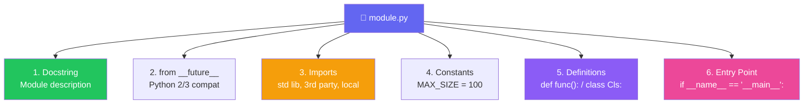

import { Aside, Badge, Card, CardGrid, Code, LinkCard } from '@astrojs/starlight/components';

## 📁 Python Source File Structure — Complete Guide

> Unlike Java, Python source files (`.py`) are **flexible**. There is no strict order for imports, no requirement for public classes to match filenames, and no compilation step before running. Understanding **Modules** and **Packages** is key.

---

## 🏛️ Valid Source File Structure Diagram

```text
+-----------------------------+
|  1. Docstring & Comments    |  ← Optional, recommended first
+-----------------------------+
|  2. Future Imports          |  ← Optional, MUST be first code
+-----------------------------+
|  3. Module Imports          |  ← Optional, any number
+-----------------------------+
|  4. Module Globals/Constants|  ← Optional
+-----------------------------+
|  5. Class/Function Defs     |  ← Logic (Classes, Functions)
+-----------------------------+
|  6. Main Guard              |  ← if __name__ == "__main__":
+-----------------------------+
```



<Code lang="python" title="Complete valid source file example" code={`
"""
This is a module docstring.
It describes what this file does.
"""

# 1. Future imports (if needed)
# from __future__ import annotations

# 2. Standard Library Imports
import os
import sys

# 3. Third-Party Imports
import requests

# 4. Local Application Imports
from my_package.utils import helper

# 5. Module Constants
MAX_RETRIES = 3

# 6. Class/Function Definitions
class DataService:
    def __init__(self):
        self.data = []

    def fetch(self):
        return requests.get("https://api.example.com")

def main():
    service = DataService()
    print(service.fetch())

# 7. Entry Point
if __name__ == "__main__":
    main()
`} />

> 🔑 **Key Difference**: In Python, the filename (`module.py`) does **NOT** need to match any class name inside it. A single file can contain multiple classes and functions.

---

## ⚠️ Critical Rules — Must Know

<CardGrid>
  <Card title="Rule 1: Indentation Defines Structure" icon="error">
    Python has **no braces `{}`**. Structure is defined by **indentation** (usually 4 spaces).
    ```python
    def my_func():
        print("Indented")  # ✅ Part of function
      print("Wrong")       # ❌ IndentationError!
    ```
    **Consistency is mandatory**: Mix of tabs and spaces → `TabError`.
  </Card>
  
  <Card title="Rule 2: No Public Class Filename Match" icon="approve-check">
    In Java: `public class MyApp` must be in `MyApp.java`.  
    In Python: You can have `class MyApp` in `utils.py`, `main.py`, or `anything.py`.  
    The **filename** becomes the **module name**.
  </Card>

  <Card title="Rule 3: Execution Order Matters" icon="caution">
    Python executes code **top-to-bottom**.
    ```python
    print(hello)  # ❌ NameError: hello not defined yet
    hello = "Hi"
    
    # ✅ Fix: Define before use
    hello = "Hi"
    print(hello)
    ```
    Unlike Java, you can't call a method defined later in the file unless it's inside a function/class that hasn't run yet.
  </Card>

  <Card title="Rule 4: One Module per File" icon="information">
    Each `.py` file is a **module**.  
    You can import it using its filename (without `.py`).
    ```python
    # file: math_utils.py
    def add(a, b): return a + b
    
    # file: main.py
    import math_utils
    print(math_utils.add(1, 2))
    ```
  </Card>
</CardGrid>

---

## 📦 Packages — Directories with `__init__.py`

> A **Package** is a directory containing Python modules. It helps organize code hierarchically.

### 🔑 Structure

```text
my_project/
├── main.py
└── my_package/           ← Directory
    ├── __init__.py       ← Makes it a package
    ├── module_a.py
    └── module_b.py
```

<Code lang="python" title="Importing from packages" code={`
# Import specific module from package
from my_package import module_a

# Import specific function
from my_package.module_a import my_function

# Import everything (not recommended)
from my_package import *
`} />

<Aside type="note">
**`__init__.py`**:  
- In Python 3.3+, this file is **optional** for basic packages (Namespace Packages).  
- However, it is **recommended** to include it to initialize package-level variables or control what gets exported via `__all__`.
</Aside>

---

## 🔄 Import Statements — Deep Dive

> `import` loads a module/package into memory. It is executed at **runtime**, not just compile-time.

### ❌ Without Import — Verbose

<Code lang="python" title="Using fully qualified names" code={`
import math

# Must prefix with module name
result = math.sqrt(16)
pi = math.pi
`} />

### ✅ With Import — Clean

<Code lang="python" title="Importing specific items" code={`
from math import sqrt, pi

# Direct access
result = sqrt(16)
print(pi)
`} />

---

## 📦 Types of Import Statements

### 1️⃣ Standard Import

> Imports the entire module. Access items via `module.name`.

<Code lang="python" title="Standard import" code={`
import os
import sys

print(os.getcwd())
print(sys.version)
`} />

### 2️⃣ From Import

> Imports specific attributes/functions directly into the current namespace.

<Code lang="python" title="From import" code={`
from collections import defaultdict
from os.path import join

# Use directly
my_dict = defaultdict(list)
path = join("folder", "file.txt")
`} />

### 3️⃣ Alias Import (`as`)

> Renames the module or item to avoid conflicts or shorten names.

<Code lang="python" title="Aliasing" code={`
import numpy as np
import pandas as pd
from math import pi as PI

print(np.array([1, 2, 3]))
print(PI)
`} />

### 🔍 Import Validation — Which Are Valid?

<Code lang="python" title="✅ Valid imports" code={`
import os                     # ✅ Standard
from os import path           # ✅ From import
from os.path import join      # ✅ Nested from import
import os.path                # ✅ Import submodule
`} />

<Code lang="python" title="❌ Invalid imports" code={`
import os.path.join           # ❌ SyntaxError: can't import function directly with 'import'
from os import *              # ⚠️ Valid but discouraged (pollutes namespace)
import "os"                   # ❌ SyntaxError: quotes not allowed
`} />

---

## ⚠️ Import Naming Conflicts — Ambiguity Trap

### Case 1: Name Shadowing

<Code lang="python" title="Shadowing built-ins or modules" code={`
import math

# ❌ Bad: Overwrites the math module reference
math = 5 
print(math.sqrt(16))  # 💥 AttributeError: 'int' object has no attribute 'sqrt'

# ✅ Good: Use different variable names
result = 5
print(math.sqrt(16))
`} />

### Case 2: Circular Imports

<Code lang="python" title="Circular dependency" code={`
# file: a.py
import b  # ❌ If b.py also imports a, this crashes!

# file: b.py
import a  # ❌ Circular import error

# ✅ Fix: Refactor code to remove dependency, or import inside function
def use_a():
    import a  # Lazy import
`} />

### 🧠 Import Resolution Order (sys.path)

When you `import module`, Python searches in this order:

1.  **Built-in modules** (e.g., `sys`, `math`)
2.  **Current Directory** (script location)
3.  **PYTHONPATH** environment variable
4.  **Installation-dependent defaults** (site-packages)

<Code lang="python" title="Checking search path" code={`
import sys
print(sys.path)
# List of directories where Python looks for modules
`} />

<Aside type="tip">
**Pro Tip**: Avoid naming your files the same as standard libraries (e.g., `email.py`, `random.py`). Python will import **your** file instead of the library, causing weird errors!
</Aside>

---

## 🆚 Java `import` vs Python `import`

<table>
  <thead>
    <tr>
      <th>Feature</th>
      <th>Java `import`</th>
      <th>Python `import`</th>
    </tr>
  </thead>
  <tbody>
    <tr>
      <td>Mechanism</td>
      <td>Compile-time hint</td>
      <td>Runtime execution</td>
    </tr>
    <tr>
      <td>File Size</td>
      <td>No effect</td>
      <td>No effect (but loads module into memory)</td>
    </tr>
    <tr>
      <td>Execution</td>
      <td>Never executes imported code</td>
      <td>Executes module code once (cached)</td>
    </tr>
    <tr>
      <td>Static Import</td>
      <td>`import static pkg.Class.method`</td>
      <td>`from pkg.module import method`</td>
    </tr>
    <tr>
      <td>Wildcard</td>
      <td>`import pkg.*`</td>
      <td>`from pkg import *` (discouraged)</td>
    </tr>
  </tbody>
</table>

<CardGrid>
  <Card title="Java Import — Compile-Time" icon="information">
    ```java
    import java.util.List;
    // Compiler just knows where List is.
    // No code from List.java runs until you use it.
    ```
  </Card>
  
  <Card title="Python Import — Runtime Execution" icon="approve-check">
    ```python
    import my_module
    # my_module.py code RUNS immediately.
    # Top-level print statements in my_module will execute!
    # Result is cached in sys.modules.
    ```
  </Card>
</CardGrid>

---

## ⭐ The `if __name__ == "__main__"` Guard

> This is Python's equivalent to Java's `public static void main(String[] args)`, but more flexible.

<Code lang="python" title="Entry point pattern" code={`
def main():
    print("Running as script")

def helper():
    print("Helper function")

# Only run main() if this file is executed directly
if __name__ == "__main__":
    main()
`} />

### 🔑 How It Works

| Scenario | `__name__` Value | Behavior |
|----------|------------------|----------|
| Run directly (`python app.py`) | `"__main__"` | `if` block **executes** |
| Imported (`import app`) | `"app"` | `if` block **skipped** |

<Aside type="tip">
**Why use it?**  
It allows a file to be both a **reusable module** (imported by others) and a **standalone script** (run directly).
</Aside>

---

## 🖨️ Print vs System.out.println

> Python uses `print()` function, which is simpler and more versatile than Java's `System.out.println`.

<Code lang="python" title="Print examples" code={`
print("Hello")             # Basic print
print("Hello", "World")    # Multiple args (space-separated)
print("Value:", 42)        # Mixed types

# Formatting (f-strings are preferred)
name = "Alice"
print(f"Name: {name}")     # f-string (Python 3.6+)

# End character (default is \n)
print("Hello", end=" ")    # No newline
print("World")             # Prints on same line: "Hello World"
`} />

---

## 📦 Package Initialization (`__init__.py`)

> This file runs when the package is first imported. It's used to expose APIs or set up state.

<Code lang="python" title="__init__.py usage" code={`
# my_package/__init__.py

# Expose specific classes/functions at package level
from .module_a import ClassA
from .module_b import func_b

# Define __all__ to control 'from package import *'
__all__ = ["ClassA", "func_b"]

# Initialize package-level config
CONFIG = {"debug": False}
`} />

<Code lang="python" title="Using the package" code={`
from my_package import ClassA, func_b

# Clean API — users don't need to know internal module structure
obj = ClassA()
`} />

---

## 🎯 Interview Cheat Sheet

<CardGrid>
  <Card title="Q: What is the difference between a Module and a Package?" icon="information">
    - **Module**: A single `.py` file.  
    - **Package**: A directory of modules (usually with `__init__.py`).
  </Card>
  
  <Card title="Q: Does Python have a `public` keyword?" icon="error">
    **NO ❌**. All members are technically public.  
    Convention: Prefix with `_` (e.g., `_internal_var`) to indicate "protected/private". It’s a hint, not enforcement.
  </Card>

  <Card title='Q: What does `if __name__ == "__main__":` do?' icon="rocket">
    It checks if the script is being run directly.  
    - If **Yes**: Executes the block (entry point).  
    - If **No** (imported): Skips the block.
  </Card>

  <Card title="Q: How do you handle circular imports?" icon="shield">
    1. Refactor code to remove dependency.  
    2. Move import **inside** the function that needs it (lazy import).  
    3. Merge modules if they are too tightly coupled.
  </Card>

  <Card title="Q: What is `__init__.py`?" icon="backspace">
    It marks a directory as a Python package.  
    It can contain initialization code and define what gets exported via `__all__`.
  </Card>

  <Card title="Q: Why is `from module import *` bad?" icon="caution">
    It pollutes the namespace, makes it hard to trace where names come from, and can cause name conflicts.  
    ✅ Prefer explicit imports: `from module import func`.
  </Card>
</CardGrid>

---

## 🧩 DSA & Practical Patterns

<CardGrid>
  <Card title="Pattern: Utility Module" icon="rocket">
    Group helper functions in a separate file.
    ```python
    # utils.py
    def is_prime(n):
        if n < 2: return False
        for i in range(2, int(n**0.5) + 1):
            if n % i == 0: return False
        return True
    ```
    ```python
    # main.py
    from utils import is_prime
    print(is_prime(7))
    ```
  </Card>
  
  <Card title="Pattern: Configuration Package" icon="shield">
    Store settings in a package.
    ```python
    # config/__init__.py
    DB_HOST = "localhost"
    DB_PORT = 5432
    ```
    ```python
    # app.py
    from config import DB_HOST, DB_PORT
    ```
  </Card>

  <Card title="Pattern: Lazy Import for Performance" icon="backspace">
    Import heavy libraries only when needed.
    ```python
    def process_image(path):
        import PIL.Image  # Only imports if function is called
        img = PIL.Image.open(path)
        # ...
    ```
  </Card>
</CardGrid>

---

## 🔑 Quick Reference Summary

### Source File Order (Convention, not Strict)
1.  Docstring
2.  `from __future__` imports
3.  Standard library imports
4.  Third-party imports
5.  Local application imports
6.  Constants/Globals
7.  Classes/Functions
8.  `if __name__ == "__main__":`

### Import Types
| Type | Syntax | Example |
|------|--------|---------|
| Module | `import mod` | `import os` |
| Item | `from mod import item` | `from os import path` |
| Alias | `import mod as m` | `import numpy as np` |
| All | `from mod import *` | `from math import *` (Avoid) |

### Key Concepts
| Concept | Description |
|---------|-------------|
| Module | Single `.py` file |
| Package | Directory with `__init__.py` |
| `__name__` | `"__main__"` if run directly, else module name |
| `sys.path` | List of directories Python searches for imports |
| `_variable` | Convention for "private" members |

<Aside type="caution">
**Final Checklist**:
1. ✅ Use meaningful filenames (they become module names).
2. ✅ Avoid naming files after standard libraries (`test.py`, `email.py`).
3. ✅ Use `if __name__ == "__main__":` for entry points.
4. ✅ Prefer explicit imports over wildcards.
5. ✅ Use `_prefix` for internal/private members.
6. ✅ Keep `__init__.py` clean — use it for API exposure.
7. ✅ Watch out for circular imports!
</Aside>

---

## 🧪 Test Your Understanding

<Code lang="python" title="Predict the behavior" code={`
# File: my_mod.py
print("Module Loaded")

def hello():
    print("Hello Func")

if __name__ == "__main__":
    print("Main Block")

# Q1: If I run \`python my_mod.py\`, what prints?
# Q2: If I run \`import my_mod\` in another script, what prints?

# File: app.py
import my_mod
my_mod.hello()

# Q3: What is the output of app.py?
`} />

<details>
<summary>✅ Click to reveal answers</summary>

```text
Q1: 
Module Loaded
Main Block
(Runs top-to-bottom, __name__ is "__main__")

Q2: 
Module Loaded
(Imports execute top-level code, but __name__ is "my_mod", so main block skips)

Q3: 
Module Loaded
Hello Func
(Import loads module, then calls function)
```
</details>

> 🚀 **Final Wisdom**: Python's structure is designed for **readability** and **flexibility**. Forget rigid class-filename matching. Focus on logical grouping into modules and packages, use `__init__.py` to define clean APIs, and always guard your entry points. Keep it Pythonic! 🐍✨

<Badge text="Astro 6 Ready" variant="success" /> • <Badge text="Python 3.10+" variant="tip" /> • <Badge text="Interview Optimized" variant="caution" />

---

# 📁 Python Source File Structure

---

## 🧠 Mental Model First

```
A Python source file is executed TOP TO BOTTOM, once, when imported or run.
Every statement at module level executes immediately.
There is no "main" entry point — unless you define one.

FILE LIFECYCLE:
  ┌─────────────────────────────────────────────────┐
  │  1. OS reads file bytes                         │
  │  2. CPython decodes with declared encoding      │
  │  3. Tokenizer → Parser → AST                   │
  │  4. Compiler → PyCodeObject (.pyc)              │
  │  5. PVM executes module body top-to-bottom      │
  │  6. Module object stored in sys.modules         │
  │  7. Subsequent imports reuse sys.modules cache  │
  └─────────────────────────────────────────────────┘
```

---

## 🗂️ Canonical Source File Layout

```
my_module.py
│
├── 1. Shebang line              (optional, Unix only)
├── 2. Encoding declaration      (optional, default UTF-8)
├── 3. Module docstring          (optional but standard)
├── 4. __future__ imports        (must be first real code)
├── 5. Standard library imports  (stdlib)
├── 6. Third-party imports       (pip packages)
├── 7. Local/project imports     (your own modules)
├── 8. Module-level dunders      (__all__, __version__, __author__)
├── 9. Constants                 (UPPER_SNAKE_CASE)
├── 10. Exceptions               (custom exception classes)
├── 11. Classes                  (data models, services)
├── 12. Functions                (helpers, utilities)
├── 13. Main guard               (if __name__ == "__main__")
└── 14. Entry point call         (main())
```

---

## 🔬 Full Annotated Example

```python
#!/usr/bin/env python3                         # 1. Shebang
# -*- coding: utf-8 -*-                        # 2. Encoding

"""
Payment processing module.

Handles charge, refund, and dispute operations
against the Stripe payment gateway.

Usage:
    from payments import PaymentService
    svc = PaymentService(api_key="sk_live_...")
    svc.charge(amount=1000, currency="usd")
"""                                            # 3. Module docstring

from __future__ import annotations             # 4. __future__

import os                                      # 5. Stdlib
import sys
import logging
from decimal import Decimal
from typing import Optional

import stripe                                  # 6. Third-party
import requests
from pydantic import BaseModel

from .models import Transaction                # 7. Local
from .config import settings
from .exceptions import PaymentError

__all__     = ["PaymentService", "charge"]    # 8. Module dunders
__version__ = "2.4.1"
__author__  = "Ali"

log = logging.getLogger(__name__)             # 9. Module-level setup

MAX_RETRIES    = 3                            # 10. Constants
DEFAULT_CURRENCY = "usd"
SUPPORTED_CURRENCIES = frozenset({"usd", "eur", "gbp"})


class InsufficientFundsError(PaymentError):   # 11. Exceptions
    """Raised when account balance is insufficient."""
    pass


class PaymentService:                         # 12. Classes
    """Wraps Stripe API for payment operations."""

    def __init__(self, api_key: str):
        self.client = stripe.Stripe(api_key)

    def charge(
        self,
        amount: Decimal,
        currency: str = DEFAULT_CURRENCY,
    ) -> Transaction:
        ...


def _validate_currency(currency: str) -> None: # 13. Functions
    if currency not in SUPPORTED_CURRENCIES:
        raise ValueError(f"Unsupported: {currency}")


def main() -> int:                             # 14. Main function
    logging.basicConfig(level=logging.INFO)
    svc = PaymentService(api_key=os.environ["STRIPE_KEY"])
    svc.charge(Decimal("10.00"))
    return 0


if __name__ == "__main__":                    # 15. Main guard
    sys.exit(main())
```

---

## 1️⃣ Shebang Line

```python
#!/usr/bin/env python3
```

```
Line 1 only. Starts with #! (hash-bang).
Tells the OS which interpreter to use when file is executed directly.

Without shebang:
  python3 script.py     ← works (explicit interpreter)
  ./script.py           ← fails (OS doesn't know what to run)

With shebang:
  chmod +x script.py
  ./script.py           ← OS reads shebang, runs python3

/usr/bin/env python3    ← searches PATH for python3 (portable)
/usr/bin/python3        ← hardcoded path (fragile, breaks in venvs)
```

> Python itself ignores the shebang — it's a `#` comment. Only the OS kernel reads it via `execve()`.

---

## 2️⃣ Encoding Declaration

```python
# -*- coding: utf-8 -*-
# coding: utf-8
# coding=utf-8
```

```
Must appear on line 1 or line 2.
Default since Python 3: UTF-8.
Required only if file contains non-UTF-8 bytes.

CPython reads the first two lines looking for this pattern:
  coding[=:]\s*([-\w.]+)

If found → uses declared codec.
If not found → assumes UTF-8.

Python 2 default was ASCII — encoding declaration was REQUIRED
for any non-ASCII characters. Legacy codebases have it everywhere.
```

---

## 3️⃣ Module Docstring

```python
"""
Single line summary.

Extended description. Multiple paragraphs OK.
Describes what the module does, not how.

Attributes:
    MODULE_CONST: description

Example:
    >>> import mymodule
    >>> mymodule.do_something()
"""
```

```
Module docstring:
  ├── Must be FIRST statement (after shebang/encoding)
  ├── Accessible via:  module.__doc__
  │                    help(module)
  │                    pydoc module
  └── Used by Sphinx, mkdocs for auto-documentation
```

```python
import mymodule
print(mymodule.__doc__)     # prints the docstring
help(mymodule)              # formatted output
```

---

## 4️⃣ `__future__` Imports

```python
from __future__ import annotations    # postponed evaluation of annotations
from __future__ import division       # Python 2 only (3/2 = 1.5 not 1)
from __future__ import print_function # Python 2 only
```

```
RULES:
  ├── Must appear BEFORE any other code (except docstring, comments, shebang)
  ├── Only import statements — no assignment, no function call
  └── Used to enable features from future Python versions in current version

Most important today:
  from __future__ import annotations
  → makes ALL annotations strings (lazy evaluation)
  → allows forward references without quotes:
    def foo(x: MyClass) → OK even if MyClass defined later
  → prevents circular import issues from type hints
```

---

## 5️⃣ Import Section — Order and Convention (PEP 8)

```python
# GROUP 1 — Standard library
import os
import sys
import json
import logging
from pathlib import Path
from typing import Optional, List, Dict

# GROUP 2 — Third-party (pip packages)
import numpy as np
import requests
from fastapi import FastAPI, HTTPException
from sqlalchemy import create_engine

# GROUP 3 — Local/project imports
from myproject.models import User
from myproject.utils import hash_password
from . import config                    # relative import
from .database import get_db            # relative import
```

```
RULES:
  ├── One blank line between each group
  ├── Alphabetical within each group (convention, not enforced)
  ├── Absolute imports preferred over relative (PEP 8)
  ├── Relative imports (.module) only inside packages
  └── Never: from module import *  (pollutes namespace)
```

### 🔬 Import System Internals

```
import mymodule

CPython steps:
1. Check sys.modules["mymodule"]  ← cache hit? return it immediately
2. Find module using sys.meta_path finders
3. Load: read .py → compile → PyCodeObject
4. Execute module body (runs top to bottom)
5. Store result in sys.modules["mymodule"]
6. Bind name "mymodule" in current namespace

Subsequent imports: step 1 hits cache → O(1), no re-execution
```

```python
import sys

# See what's already imported:
sys.modules.keys()

# See where Python looks for modules:
sys.path

# Force re-import (testing):
import importlib
importlib.reload(mymodule)
```

---

## 6️⃣ Module-Level Dunders

```python
__all__      = ["PublicClass", "public_func"]  # controls `from x import *`
__version__  = "1.2.3"                         # package version
__author__   = "Ali"
__email__    = "ali@example.com"
__license__  = "MIT"
```

### 🔬 `__all__` Internals

```python
# Without __all__:
from mymodule import *
# imports EVERYTHING without leading underscore

# With __all__:
__all__ = ["PublicClass", "public_func"]
from mymodule import *
# imports ONLY names in __all__

# __all__ also controls:
# - IDE autocompletion suggestions
# - pydoc output
# - what's considered "public API"
```

---

## 7️⃣ Constants

```python
# Module-level constants:
MAX_CONNECTIONS = 100
DATABASE_URL    = "postgresql://localhost/db"
DEBUG           = os.environ.get("DEBUG", "false").lower() == "true"

# Immutable collections as constants:
ALLOWED_METHODS  = frozenset({"GET", "POST", "PUT", "DELETE"})
STATUS_CODES     = (200, 201, 204, 400, 401, 403, 404, 500)

# Computed constants:
ONE_DAY_SECONDS  = 60 * 60 * 24   # compiler folds this
ONE_MB           = 1 << 20        # 1048576
```

```
Convention: UPPER_SNAKE_CASE for constants
Python has no const keyword — convention only
Type checkers (mypy) can enforce with Final:

from typing import Final
MAX_SIZE: Final = 100
MAX_SIZE = 200   # mypy error: Cannot assign to a Final
```

---

## 8️⃣ Class Ordering Convention

```python
class MyService:
    # 1. Class variables / constants
    DEFAULT_TIMEOUT = 30

    # 2. __init__
    def __init__(self, url: str):
        self.url = url
        self._session = None

    # 3. Class methods (@classmethod)
    @classmethod
    def from_env(cls) -> "MyService":
        return cls(os.environ["SERVICE_URL"])

    # 4. Static methods (@staticmethod)
    @staticmethod
    def _build_headers(token: str) -> dict:
        return {"Authorization": f"Bearer {token}"}

    # 5. Properties (@property)
    @property
    def is_connected(self) -> bool:
        return self._session is not None

    # 6. Public methods
    def connect(self): ...
    def disconnect(self): ...

    # 7. Private methods (_single_underscore)
    def _validate(self): ...

    # 8. Dunder methods
    def __repr__(self): ...
    def __str__(self): ...
    def __enter__(self): ...
    def __exit__(self, *args): ...
```

---

## 9️⃣ `if __name__ == "__main__"` — The Main Guard

```python
# Every module has __name__:
# run directly    → __name__ = "__main__"
# imported        → __name__ = "mymodule"  (filename without .py)
```

```
WHY IT EXISTS:
  Without guard:
    import mymodule   → runs EVERYTHING at top level
                        including side effects, heavy computation,
                        blocking calls, sys.exit()

  With guard:
    import mymodule   → imports only — no execution
    python mymodule.py → runs everything
```

```python
# Pattern 1 — simple script:
if __name__ == "__main__":
    main()

# Pattern 2 — with exit code:
if __name__ == "__main__":
    sys.exit(main())

# Pattern 3 — with argument parsing:
if __name__ == "__main__":
    import argparse
    parser = argparse.ArgumentParser()
    parser.add_argument("--port", type=int, default=8080)
    args = parser.parse_args()
    sys.exit(main(args))
```

---

## 🔬 Module Object — What Gets Created

```python
# After executing my_module.py, Python creates:
module = types.ModuleType("my_module")
module.__name__    = "my_module"
module.__file__    = "/path/to/my_module.py"
module.__doc__     = "module docstring"
module.__package__ = "mypackage"
module.__spec__    = ModuleSpec(...)
module.__dict__    = {
    "PaymentService": <class>,
    "charge": <function>,
    "__all__": [...],
    "__version__": "2.4.1",
    ...                      # everything defined at module level
}
```

```python
import mymodule
mymodule.__dict__    # all module-level names
vars(mymodule)       # same
dir(mymodule)        # all names including inherited
```

---

## 🔬 `.pyc` — Compiled Bytecode Cache

```
First import of mymodule.py:
  ├── Compile → bytecode
  ├── Save to __pycache__/mymodule.cpython-312.pyc
  └── Execute bytecode

Subsequent imports:
  ├── Check if .pyc exists and is fresh (mtime + size check)
  ├── If fresh → load .pyc directly (skip tokenize/parse/compile)
  └── Execute bytecode
```

```
__pycache__/
  mymodule.cpython-312.pyc

Filename format:  {name}.{implementation}-{version}.pyc
  cpython-312  → CPython 3.12
  pypy-310     → PyPy 3.10
```

```python
import py_compile
py_compile.compile("mymodule.py")   # manually compile

import compileall
compileall.compile_dir("mypackage/")  # compile entire package
```

---

## 📦 Package Structure (Multiple Files)

```
myproject/
│
├── __init__.py          ← makes directory a package
│   │                      executed on "import myproject"
│   └── from .core import Service   ← re-exports for clean API
│
├── core.py              ← main business logic
├── models.py            ← data models
├── utils.py             ← helper functions
├── exceptions.py        ← custom exceptions
├── config.py            ← configuration
│
├── tests/
│   ├── __init__.py
│   ├── test_core.py
│   └── conftest.py      ← pytest fixtures
│
├── pyproject.toml       ← project metadata + dependencies
├── README.md
└── .env                 ← environment variables (not in git)
```

### `__init__.py` Role

```python
# myproject/__init__.py

# 1. Package docstring:
"""MyProject — payment processing library."""

# 2. Version:
__version__ = "1.0.0"

# 3. Public API re-export (controls what `from myproject import *` gives):
from .core import PaymentService
from .exceptions import PaymentError

__all__ = ["PaymentService", "PaymentError"]
```

```python
# With above __init__.py:
from myproject import PaymentService   # ✅ clean import
# vs
from myproject.core import PaymentService  # also works but exposes internals
```

---

## 💀 Interview Trap 1 — Module Code Runs on Import

```python
# dangerous_module.py
print("I run on import!")       # 💀 prints every time someone imports
DB.connect()                    # 💀 connects DB on import
sys.exit(0)                     # 💀 kills the importing process!

# Fix — guard ALL side effects:
if __name__ == "__main__":
    print("Only when run directly")
    DB.connect()
```

---

## 💀 Interview Trap 2 — Circular Imports

```python
# a.py
from b import B_func    # imports b

# b.py
from a import A_func    # imports a → a imports b → b imports a → ∞

# ImportError: cannot import name 'A_func' from partially initialized module 'a'
```

```
Fix options:
  1. Restructure — extract shared code to c.py
  2. Late import — move import inside function body
  3. from __future__ import annotations + TYPE_CHECKING guard:

from __future__ import annotations
from typing import TYPE_CHECKING
if TYPE_CHECKING:
    from .models import User   # only for type checker, not runtime
```

---

## 💀 Interview Trap 3 — `__all__` Doesn't Restrict Direct Import

```python
# mymodule.py
__all__ = ["public_func"]

def public_func(): ...
def _private_func(): ...
def sneaky_func(): ...   # not in __all__ but also not _prefixed
```

```python
from mymodule import *          # only public_func
from mymodule import sneaky_func  # ✅ still works! __all__ only blocks *
import mymodule; mymodule.sneaky_func()  # ✅ also works
```

> `__all__` controls `import *` only. It's a **convention signal**, not access control. Nothing in Python prevents importing any name directly.

---

## 💀 Interview Trap 4 — Mutable Module-Level State

```python
# cache.py
_cache = {}                     # mutable module-level state

def get(key):
    return _cache.get(key)

def set(key, value):
    _cache[key] = value
```

```
Module is imported ONCE → _cache is ONE dict for entire process.
Every call to set() mutates the SAME dict.
All imports of cache.py share the SAME _cache.

This is sometimes intentional (singleton pattern).
But in tests — state leaks between test cases silently.

Fix for tests:
  def clear(): _cache.clear()   # expose reset
  Or use dependency injection instead of global state
```

---
