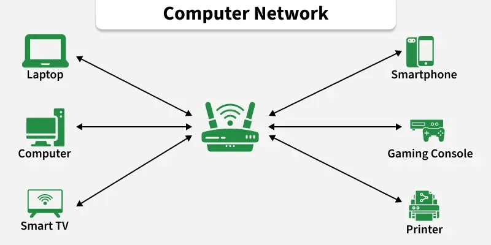
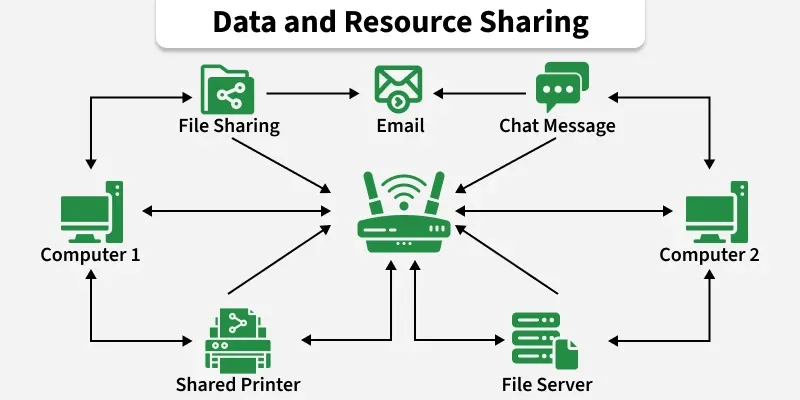
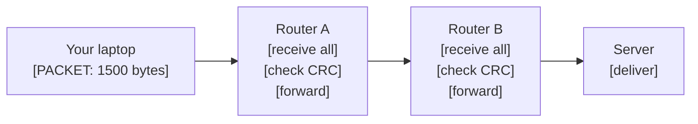
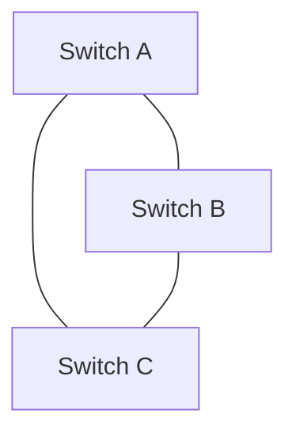

import { Aside, Steps } from '@astrojs/starlight/components';

# 🌐 What is a Network?
## 🧠 Core Definition

> A **network** is a set of **nodes** connected by **edges** where nodes can exchange data.

> A computer network is a system of interconnected devices, such as computers, servers, smartphones, and printers, that communicate to exchange data. They communicate using wired or wireless connections and can range from small home networks to the global Internet.



- Resource Sharing: Allows sharing of hardware like printers, scanners, and storage devices, reducing cost.
- Data Sharing: Enables users to share files, applications, and databases easily.
- Communication: Supports email, video conferencing, instant messaging, and web access.
- Data Management: Helps in storing, securing, and backing up data efficiently.
- Remote Access: Allows users to access systems and cloud services from anywhere.
- Better Collaboration: Improves teamwork and information exchange among users



That's it. Everything else — TCP, HTTP, BGP, Kubernetes networking — is just implementation detail layered on top of this primitive.

| Term | What it maps to | Examples |
|---|---|---|
| Node | Any addressable device | PC, router, switch, phone, container, VM |
| Edge | Any communication link | Copper wire, fibre, Wi-Fi, virtual tunnel |
| Protocol | Language nodes agree to speak | IP, TCP, HTTP, gRPC |
| Address | How you identify a node | IP address, MAC address, hostname |
| Path | Route from node A to node B | Sequence of hops through intermediate nodes |

---

Computer network is a collection of interconnected devices that communicate with each other to exchange data and resources. It enables efficient communication and supports services like email, file sharing, and internet access.

Nodes are physical devices such as computers, mobiles, or printers.
Routers and switches control the flow of information.
Transmission media carry data from one device to another.
Wired media includes Ethernet and optical fiber cables.

Working
Computer network operates by enabling devices to communicate and exchange data using a shared communication system. Each device in the network follows predefined rules to ensure that data is transmitted accurately, efficiently, and securely.

A network consists of nodes such as computers, servers, routers, and switches that send or receive data.
These nodes are connected through links, which may be wired (cables, optical fiber) or wireless (Wi-Fi, radio signals).
When data is sent, it is broken into small packets and transmitted across the network.
Protocols define how data packets are formatted, transmitted, received, and acknowledged.
Each device is identified by a unique IP address, which ensures data reaches the correct destination.
Network devices like switches and routers forward data packets along the best available path.
Security mechanisms, such as firewalls, monitor traffic and allow or block data based on security rules.
Types of Computer Network Architecture
Computer Network falls under these broad Categories:

Client-Server Architecture: Represents a type of computer network architecture in which nodes function as servers or clients, where the server manages client behavior, known as Client-Server Architecture.
Peer-to-Peer Architecture: Operates without any central server, allowing each device to act as either a client or a server, known as P2P (Peer-to-Peer) Architecture.
Network Devices
These are physical devices that connect computers, printers and other electronic equipment to a network and enable data sharing, transferring and managing.

1. Router
Functions as a networking device that connects multiple networks and directs data between them.

Connects local networks to the internet
Determines the best path for data packets
Uses IP addresses to forward data correctly
2. Switch
Connects devices within the same network and manages internal data communication.

Connects computers, printers, and servers
Sends data only to the intended device
Improves network efficiency and performance
3. Hub
Acts as a basic device that connects multiple devices within a network.

Broadcasts data to all connected devices
Does not filter or manage traffic
Less secure and less efficient than a switch
4. Bridge
Connects two network segments and filters traffic between them.

Reduces unnecessary data transmission
Improves network performance
Works using MAC addresses
5. Gateway
Connects two different networks that use different protocols.

Translates data between different systems
Enables communication between dissimilar networks
Commonly used to connect private networks to external networks
6. Access Point (AP)
Provides wireless connectivity to devices in a network.

Extends a wired network into Wi-Fi
Allows mobile devices to connect wirelessly
Improves network coverage area
7. Modem
Converts digital data into signals suitable for transmission and vice versa.

Connects a home or office network to the ISP
Converts digital signals to analog and back
Enables internet access
8. Firewall
Security device that monitors and controls network traffic.

Blocks unauthorized access
Filters incoming and outgoing data
Protects networks from cyber threats
Goals and Uses
Resource Sharing: Allow multiple users to share hardware, software, and data resources efficiently.
Internet and Cloud Access: Enable access to the Internet, online services, and cloud-based applications.
Cost Efficiency: Reduce operational and infrastructure costs through shared resources and centralized systems.
Reliability and Availability: Improve system reliability using backup paths and fault-tolerant mechanisms.
Scalability and Growth: Support easy expansion by adding new devices and services as demand increases.
Security and Control: Protect data and network resources using authentication, access control, and monitoring.

## 🔬 Deep Dive — What Actually Happens Inside

### How data moves: Store-and-Forward

Data doesn't flow like water through a pipe. It moves as **discrete packets**.



Each intermediate node:

<Steps>

1. Receives the **entire packet**
2. Checks for **bit errors** (CRC)
3. Looks up the **next hop** in its routing table
4. **Forwards** it out the correct interface

</Steps>

This is **store-and-forward switching**. The alternative — **cut-through switching** — starts forwarding before the full packet arrives (used in low-latency financial networks, less error checking).

### Packet vs Circuit Switching

```text
CIRCUIT SWITCHING (old telephone network)
┌──────┐   dedicated path reserved   ┌──────┐
│ Alice│══════════════════════════════│  Bob │
└──────┘   entire duration of call   └──────┘
             (wasted if silent)

PACKET SWITCHING (internet)
┌──────┐  [pkt1]──►[pkt1]──►[pkt1]  ┌──────┐
│ Alice│  [pkt2]──►[pkt2]──►[pkt2]  │  Bob │
└──────┘  [pkt3] can take diff path  └──────┘
             (bandwidth shared, efficient)
```

The internet chose packet switching. **Why it matters in prod:** packet loss, reordering, and variable latency are *design properties*, not bugs — TCP was built to handle them.

---

## 📐 ASCII Diagram — Network Topologies

```text
BUS                     STAR                    RING
                        
A──B──C──D──E          A   B   C               A
  shared medium         └─┬─┘                 / \
  1 collision domain      │ Switch            E   B
  1 failure = split     A─┤                   \ /
                        D─┤                    D─C
                        E─┘                  
  Dead: legacy LAN      Used: modern LAN      Metro fibre (SONET)

MESH (partial)          MESH (full)             TREE (hierarchical)
                        
A───B                  A───B                       Core
│\ /│                  │╲ /│                      /    \
│ X │                  │ X │                   Dist   Dist
│/ \│                  │/ \│                  / \    / \
C───D                  C───D                Acc Acc Acc Acc
                        all pairs           │   │   │   │
  fault tolerant        $n(n-1)/2$ edges    Hosts...
  partial cost          expensive           Used: Enterprise / DC
  Used: WAN core        Used: DC spine
```

---

## 🌳 DSA / Internals Connection

<Aside type="danger" title="Important">
A network IS a weighted directed graph $G(V, E, W)$
</Aside>

Every networking algorithm maps 1:1 to a graph algorithm you know:

| Network concept | Graph algorithm | Where used |
|---|---|---|
| Routing (find best path) | Dijkstra's shortest path | OSPF protocol |
| Routing (distance vector) | Bellman-Ford | RIP protocol |
| Loop prevention on switches | Spanning Tree (BFS) | STP/RSTP |
| Bandwidth allocation | Max-Flow (Ford-Fulkerson) | Traffic engineering |
| Network partition detection | Connected components (Union-Find) | Fault detection |
| BGP path selection | Longest prefix match on a Trie | Every router, every packet |

### The Trie in every router 🔍

When a packet arrives at a router, it looks up the destination IP in a **routing table**. That lookup is a **longest prefix match** on a compressed Trie (Patricia Trie / CIDR trie).

```text
Packet dest: 192.168.10.5

Routing table (Trie):
192.168.0.0/16  → next hop A     ← matches
192.168.10.0/24 → next hop B     ← longer match ✓
192.168.10.4/30 → next hop C     ← longest match ✓✓ WIN

Router forwards to C. Not A. Not B.
```

This is why **CIDR subnetting** matters and why prefix length is called "specificity." The most specific (longest) matching prefix always wins. Hardware routers do this in silicon using **TCAM (Ternary Content Addressable Memory)** — $O(1)$ lookup regardless of table size.

---

## 🏭 Production Scenario

**Fat-Tree Topology in AWS / Google Data Centers**

Consumer star topology doesn't scale. A single core switch becomes a bottleneck and a single point of failure. Hyperscalers use **fat-tree**:

```text
         Layer 3: Core switches (full mesh)
         ┌───┐ ┌───┐ ┌───┐ ┌───┐
         │ C1│─│ C2│─│ C3│─│ C4│
         └─┬─┘ └─┬─┘ └─┬─┘ └─┬─┘
           │  ╲  │  ╲  │  ╲  │
         Layer 2: Aggregation switches
         ┌───┐ ┌───┐ ┌───┐ ┌───┐
         │ A1│ │ A2│ │ A3│ │ A4│
         └─┬─┘ └─┬─┘ └─┬─┘ └─┬─┘
           │     │     │     │
         Layer 1: Edge/ToR (Top-of-Rack) switches
         ┌───┐ ┌───┐ ┌───┐ ┌───┐
         │ E1│ │ E2│ │ E3│ │ E4│
         └┬─┬┘ └┬─┬┘ └┬─┬┘ └┬─┬┘
          │ │   │ │   │ │   │ │
         Servers (your EC2 instances live here)
```

**Why fat-tree:** Multiple equal-cost paths between any two servers (ECMP). No single link is a bottleneck. Any one switch failing doesn't isolate any server. Bisection bandwidth is maximised.

**What this means for your code:** Two EC2 instances in different racks have ~1-4ms RTT and ~10 Gbps between them. Two instances in the same rack share a ToR switch — ~0.1ms RTT, ~25 Gbps. Your placement decision is a network topology decision.

---

## 🐛 Related Bug / Silent Failure

### Broadcast Storm — topology misconfiguration brings down the entire network



If STP is disabled and there's a loop:

<Steps>

1. Broadcast frame → Switch A floods to B and C
2. Switch B receives it → floods back to A and C
3. Switch C receives it → floods back to A and B
4. Frames multiply exponentially.
5. 100% CPU on all switches. Network dead in seconds.

</Steps>

<Aside type="caution" title="The trap">
A junior engineer disables STP thinking it "speeds things up" (it does add ~30s convergence delay). Network runs fine for weeks. One broadcast frame later — full outage. Root cause takes hours to find because no single device looks broken.
</Aside>

**Prod equivalent today:** Same storm can happen in Kubernetes if CNI plugin misconfigures bridge networking with a loop in overlay rules.

---

## 🪤 Interview Traps

**Trap 1 — "The Internet is a network"**  
Wrong framing. The Internet is an **internetwork** — a network *of* networks. Each ISP, enterprise, cloud provider runs its own autonomous network (AS — Autonomous System). BGP connects them. When you say "my request goes to Google," it traverses ~3–8 different AS networks, each with its own topology, routing policy, and failure domain.

**Trap 2 — Physical topology ≠ Logical topology**  
Old Ethernet: physically a **star** (all cables go to hub), logically a **bus** (all nodes share one collision domain because a hub just broadcasts). A star topology with a hub is NOT the same as a star with a switch. Interviewers ask this to catch rote memorisers.

**Trap 3 — Full mesh doesn't scale**  
Interviewers ask: "why don't we just connect every node to every other node?" Answer: **$\frac{n(n-1)}{2}$ edges** for $n$ nodes. 1000 nodes = ~500,000 links. Beyond ~10 nodes it's physically and economically impossible. Real networks use **hierarchical** or **partial mesh** with redundancy where it matters (core), and tree structure where cost matters (access layer).

**Trap 4 — Latency is not just distance**  
Senior devs get caught assuming latency = distance / speed of light. Real latency:

$$
\text{Latency} = \text{propagation delay} + \text{transmission delay} + \text{queuing delay} + \text{processing delay}
$$

* **Propagation delay:** $\frac{\text{distance}}{2 \times 10^8 \text{ m/s (in fibre)}}$
* **Transmission delay:** $\frac{\text{packet\_size}}{\text{link\_bandwidth}}$
* **Queuing delay:** how congested the node is
* **Processing delay:** routing table lookup, CRC check

A 1ms fibre link under heavy load can have 50ms latency due to queuing. This is why CDNs exist — reduce propagation delay, but queuing at origin still kills you.

---

## 💻 Code — Build the mental model in Python

This is the graph model of a network. Not a toy — this is exactly what network simulation tools (ns-3, GNS3) do internally.

```python
from collections import defaultdict, deque
import heapq

class Network:
    """
    A network modelled as a weighted directed graph.
    Nodes = devices (identified by name/IP).
    Edges = links with latency (ms) and bandwidth (Mbps).
    """
    def __init__(self):
        # adjacency list: node -> [(neighbour, latency_ms, bandwidth_mbps)]
        self.graph = defaultdict(list)
        self.nodes = set()

    def add_node(self, name: str):
        self.nodes.add(name)

    def add_link(self, src: str, dst: str, latency_ms: float, bandwidth_mbps: float):
        """Bidirectional link — both directions added."""
        self.graph[src].append((dst, latency_ms, bandwidth_mbps))
        self.graph[dst].append((src, latency_ms, bandwidth_mbps))
        self.nodes.update([src, dst])

    def shortest_path_latency(self, src: str, dst: str):
        """
        Dijkstra — same algorithm OSPF uses internally.
        Returns (total_latency_ms, path).
        What breaks if wrong: using BFS here finds fewest hops,
        NOT lowest latency. A 3-hop path at 1ms each beats
        a 1-hop path at 100ms — BFS would pick the wrong one.
        """
        dist = {node: float('inf') for node in self.nodes}
        dist[src] = 0
        prev = {}
        pq = [(0, src)]  # (latency, node)

        while pq:
            d, u = heapq.heappop(pq)
            if d > dist[u]:
                continue
            for v, latency, _ in self.graph[u]:
                nd = dist[u] + latency
                if nd < dist[v]:
                    dist[v] = nd
                    prev[v] = u
                    heapq.heappush(pq, (nd, v))

        # reconstruct path
        path, cur = [], dst
        while cur in prev:
            path.append(cur)
            cur = prev[cur]
        path.append(src)
        return dist[dst], list(reversed(path))

    def is_connected(self) -> bool:
        """
        BFS to check connectivity — same principle as STP uses
        to detect loops and isolated segments.
        If False → some nodes cannot reach others → network partition.
        Silent failure: services time out instead of failing fast.
        """
        if not self.nodes:
            return True
        start = next(iter(self.nodes))
        visited = {start}
        queue = deque([start])
        while queue:
            node = queue.popleft()
            for neighbour, _, _ in self.graph[node]:
                if neighbour not in visited:
                    visited.add(neighbour)
                    queue.append(neighbour)
        return visited == self.nodes

    def broadcast_storm_risk(self) -> bool:
        """
        Detect cycles — presence of cycle without STP = storm risk.
        Uses DFS cycle detection.
        """
        visited = set()
        def dfs(node, parent):
            visited.add(node)
            for neighbour, _, _ in self.graph[node]:
                if neighbour not in visited:
                    if dfs(neighbour, node):
                        return True
                elif neighbour != parent:
                    return True  # back edge = cycle
            return False
        for node in self.nodes:
            if node not in visited:
                if dfs(node, None):
                    return True
        return False


# --- Usage: model a small data centre ---
dc = Network()
dc.add_link("server-1", "ToR-A",  latency_ms=0.1,  bandwidth_mbps=25000)
dc.add_link("server-2", "ToR-A",  latency_ms=0.1,  bandwidth_mbps=25000)
dc.add_link("server-3", "ToR-B",  latency_ms=0.1,  bandwidth_mbps=25000)
dc.add_link("ToR-A",   "Agg-1",  latency_ms=0.3,  bandwidth_mbps=40000)
dc.add_link("ToR-B",   "Agg-1",  latency_ms=0.3,  bandwidth_mbps=40000)
dc.add_link("ToR-A",   "Agg-2",  latency_ms=0.3,  bandwidth_mbps=40000)  # redundant
dc.add_link("ToR-B",   "Agg-2",  latency_ms=0.3,  bandwidth_mbps=40000)  # redundant

latency, path = dc.shortest_path_latency("server-1", "server-3")
print(f"Latency: {latency}ms  Path: {' → '.join(path)}")
# Latency: 0.7ms  Path: server-1 → ToR-A → Agg-1 → ToR-B → server-3

print(f"Connected: {dc.is_connected()}")        # True
print(f"Cycle risk: {dc.broadcast_storm_risk()}") # True — cycles exist (by design, STP handles it)
```

<Aside type="caution" title="What breaks if done wrong:">
- Use **BFS** instead of Dijkstra → routes by hop count, not latency → you route traffic through a congested 1Gbps link instead of a free 10Gbps link
- Don't check `is_connected()` after a topology change → half your services silently time out, no error, just slow death
- Ignore cycles → disable STP → broadcast storm → full outage
</Aside>

---

## 📊 Key Numbers to Internalize

| Link type | Typical latency | Bandwidth |
|---|---|---|
| Same rack (ToR) | 0.1 – 0.3 ms | 10–100 Gbps |
| Same DC, different rack | 0.3 – 1 ms | 10–40 Gbps |
| Same region, different DC | 1 – 5 ms | 1–10 Gbps |
| Cross-region (e.g. Mumbai↔Singapore) | 30 – 60 ms | varies |
| Trans-pacific (India↔US) | 150 – 200 ms | varies |
| Speed of light in fibre | ~200,000 km/s | — |

These numbers expose lies. If someone says their cross-region call takes 2ms, the physics says they're wrong. Light can't do Mumbai→Singapore in 2ms (minimum ~30ms). Means the server is actually local, or the number is being cached.