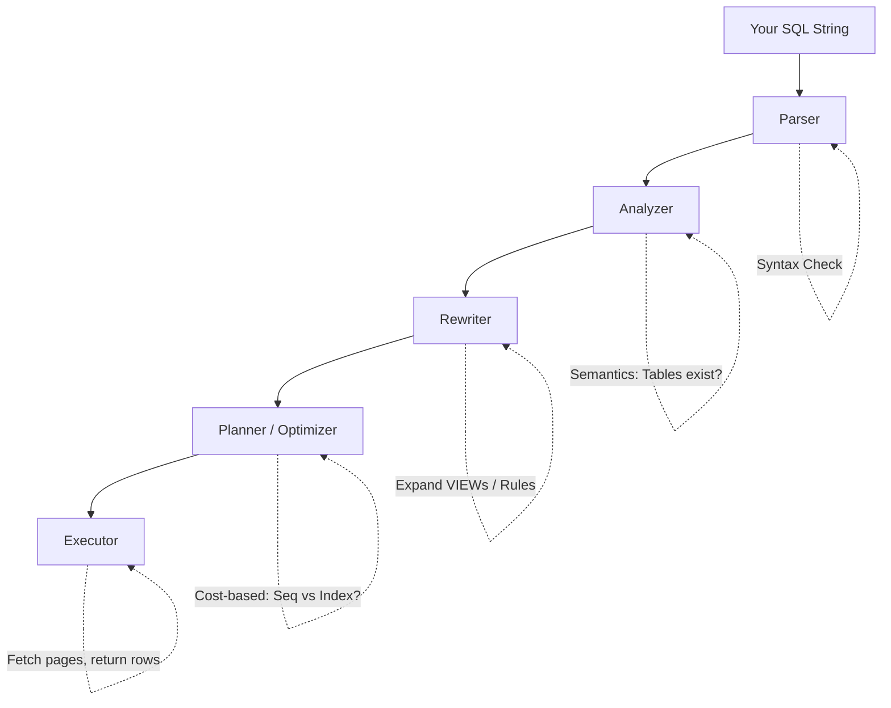
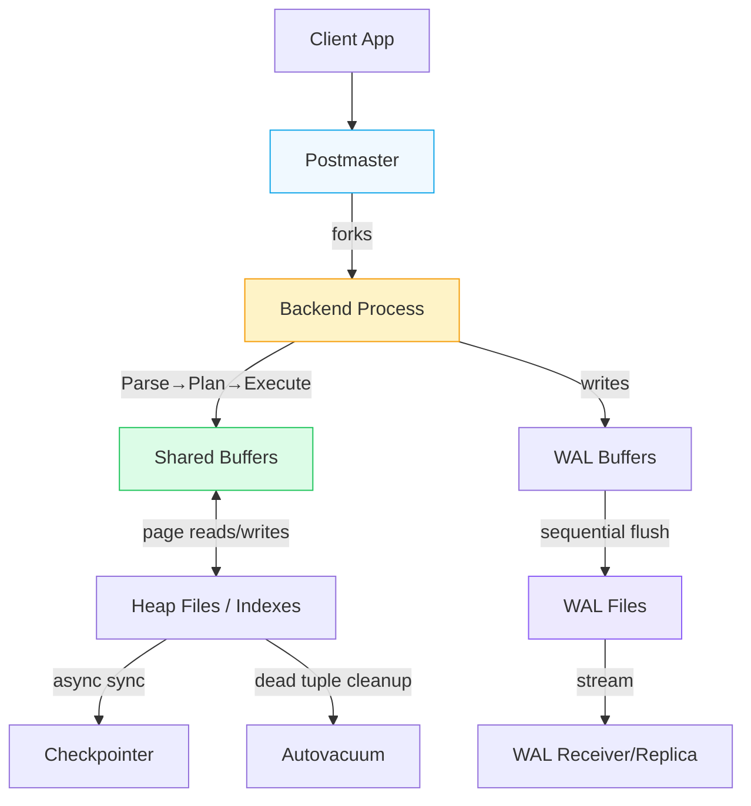

import { Aside, Badge, Card, CardGrid, Code, LinkCard, Steps, TabItem, Tabs } from '@astrojs/starlight/components';

## 🏛️ PostgreSQL — Architectural Fundamentals

> **PostgreSQL is a multi-process, file-based database where every query goes through a pipeline: Parse → Plan → Execute → Return.**

<Aside type="tip">
**Mental Model**: Think of Postgres not as a "smart bucket", but as a **query execution factory**. Your SQL enters, gets optimized by a cost-based planner, touches cached pages in RAM, writes to a sequential log for safety, and streams results back — all while multiple workers operate concurrently without stepping on each other.
</Aside>

---

## 🗺️ The Full Architecture — Bird's Eye View

```text
┌─────────────────────────────────────────────────────────┐
│                    CLIENT (Your App)                    │
│              (Node.js / Java / psql CLI)                │
└────────────────────────┬────────────────────────────────┘
                         │  TCP Connection (port 5432)
                         ▼
┌─────────────────────────────────────────────────────────┐
│                  POSTMASTER PROCESS                     │
│           (The master guardian of Postgres)             │
│      Listens for connections, spawns worker processes   │
└────────────────────────┬────────────────────────────────┘
                         │  forks
                         ▼
┌─────────────────────────────────────────────────────────┐
│              BACKEND PROCESS (per client)               │
│                                                         │
│  ┌──────────┐  ┌──────────┐  ┌──────────────────────┐  │
│  │  Parser  │─►│ Planner  │─►│      Executor        │  │
│  └──────────┘  └──────────┘  └──────────────────────┘  │
│       │              │                  │               │
│   Syntax          Best Plan         Run it!             │
│   Check           (cost-based)                          │
└──────────────────────────┬──────────────────────────────┘
                           │
              ┌────────────┼────────────────────┐
              ▼            ▼                    ▼
┌─────────────────┐   ┌─────────────────┐   ┌──────────────────┐
│  SHARED MEMORY  │   │  STORAGE ENGINE │   │ BACKGROUND PROCS │
│ Shared Buffers  │   │  Heap Files     │   │ WAL Writer       │
│ (page cache)    │   │  (actual data)  │   │ Checkpointer     │
│ WAL Buffers     │   │  Index Files    │   │ Autovacuum       │
│ (write-ahead)   │   │  (B-Tree etc.)  │   │ Stats Collector  │
└─────────────────┘   └─────────────────┘   └──────────────────┘
```

<Aside type="note">
**Key Insight**: Postgres uses a **multi-process** architecture (not multi-thread). Each client connection gets its own OS process. This improves isolation and crash safety, but makes connection pooling essential at scale.
</Aside>

---

## 🔍 Breaking It Down — Layer by Layer

### 1️⃣ Connection Layer — How Your App Talks to Postgres

```text
App ──TCP──► Postmaster ──fork──► Backend Process
                                       │
                              One process per client
                              (not one thread — full OS process!)
```

- Every client gets its **own OS process**
- Default port: **5432**
- This is why Postgres uses **connection poolers** like `PgBouncer` in production — spawning thousands of processes consumes significant RAM and CPU

<Code lang="text" title="Interview Q: Why PgBouncer?" code={`Q: "Why do we use PgBouncer with Postgres?"
A: Postgres forks a new process per connection. At scale (thousands of 
   concurrent clients), this is expensive in RAM and context-switching. 
   PgBouncer pools connections — reuses a small set of Postgres 
   backend processes for many app clients.`} />

---

### 2️⃣ Query Processing Pipeline — The Brain



<CardGrid>
  <Card title="Parser" icon="information">
    Checks syntax and builds a **Parse Tree** (AST).  
    `SELECT * FORM orders;` → syntax error caught here.
  </Card>
  
  <Card title="Analyzer" icon="shield">
    Checks semantics against catalog.  
    `"Does table 'orders' exist? Does column 'user_id' exist?"`
  </Card>

  <Card title="Rewriter" icon="backspace">
    Applies rewrite rules (e.g., expands `VIEW`s into their underlying queries, applies row-level security policies).
  </Card>

  <Card title="Planner / Optimizer" icon="rocket">
    **The smartest part**. Reads table statistics (`pg_statistic`), estimates costs, and picks the cheapest execution plan: Seq Scan? Index Scan? Hash Join? Merge Join? Nested Loop?
  </Card>

  <Card title="Executor" icon="approve-check">
    Actually runs the plan. Fetches pages from Shared Buffers or disk, applies filters, joins, sorts, and streams results back to the client.
  </Card>
</CardGrid>

#### 🔬 Planner Deep Dive (Interview Gold)

The planner uses **statistics** (updated via `ANALYZE` or autovacuum) to estimate costs:

<Code lang="sql" title="EXPLAIN — See the planner's decision" code={`-- Shows planned cost estimates
EXPLAIN SELECT * FROM orders WHERE user_id = 42;

-- Output (example):
-- Seq Scan on orders  (cost=0.00..230.00 rows=1500)
--   Filter: (user_id = 42)

-- With a good index, planner chooses Index Scan:
-- Index Scan using idx_orders_user on orders  (cost=0.43..8.45 rows=1)
--   Index Cond: (user_id = 42)

-- PRO TIP: Always use EXPLAIN ANALYZE in dev
-- It actually runs the query and shows REAL timing & row counts!
EXPLAIN ANALYZE SELECT * FROM orders WHERE user_id = 42;`} />

<Aside type="caution">
**Real-World SDE Note**: Adding an index doesn't always make queries faster. If your query returns 80% of the table, the planner correctly chooses a **Sequential Scan** over an index scan — random I/O for index lookups would be slower than reading pages sequentially. Always verify with `EXPLAIN ANALYZE`.
</Aside>

---

### 3️⃣ Memory Architecture — What Lives in RAM

```text
┌──────────────────────────────────────────────┐
│              SHARED MEMORY                   │
│         (shared across ALL processes)        │
│                                              │
│  ┌────────────────────────────────────┐      │
│  │        SHARED BUFFERS              │      │
│  │  Cache of disk pages (default 128MB│      │
│  │  Production: ~25% of total RAM)    │      │
│  │                                    │      │
│  │  [Page][Page][Page][Page][Page]... │      │
│  └────────────────────────────────────┘      │
│                                              │
│  ┌────────────────────────────────────┐      │
│  │         WAL BUFFERS                │      │
│  │  Temporary store for write-ahead   │      │
│  │  log before flushing to disk       │      │
│  └────────────────────────────────────┘      │
└──────────────────────────────────────────────┘

┌──────────────────────────────────────────────┐
│           LOCAL MEMORY (per backend)         │
│                                              │
│  work_mem           → Sort/Hash join buffer  │
│  maintenance_work_mem → VACUUM, index build  │
│  temp_buffers       → Temp table storage     │
└──────────────────────────────────────────────┘
```

#### 🔑 Most Important Config Knobs

| Setting | Purpose | Default → Production |
|---|---|---|
| `shared_buffers` | Main page cache (RAM) | 128MB → 25% of RAM |
| `work_mem` | Per-operation sort/hash buffer | 4MB → 16–64MB (watch total!) |
| `max_connections` | Max client connections | 100 → Keep low, use PgBouncer |
| `effective_cache_size` | Planner hint for OS cache | 4GB → ~75% of RAM |

<Aside type="tip">
**Tuning Warning**: `work_mem` is **per operation, per connection**.  
If you set `work_mem = 1GB` and run 50 concurrent complex sorts, you could easily consume 50GB RAM! Tune conservatively and monitor.
</Aside>

---

### 4️⃣ Storage — How Data Lives on Disk

```text
PostgreSQL Data Directory (PGDATA)
│
├── base/               ← All databases live here
│   └── 16384/          ← One folder per database (OID)
│       ├── 24601       ← Table file (heap data)
│       ├── 24601_fsm   ← Free Space Map (tracks empty space)
│       └── 24601_vm    ← Visibility Map (tracks all-visible pages)
│
├── pg_wal/             ← Write-Ahead Log files
├── pg_stat/            ← Runtime statistics
└── postgresql.conf     ← Main config file
```

#### 📄 Pages — The Fundamental I/O Unit

```text
┌──────────────────────────────┐
│         PAGE (8KB)           │
│                              │
│  Header (24 bytes)           │
│  ┌────┬────┬────┬────┐       │
│  │Item│Item│Item│Item│       │  ← Item pointers (top-down)
│  │ ptr│ ptr│ ptr│ ptr│       │
│  └────┴────┴────┴────┘       │
│       ↕ free space ↕         │
│  ┌────────────────────────┐  │
│  │  Actual Row Data       │  │  ← Tuples grow bottom-up
│  │  (tuples)              │  │
│  └────────────────────────┘  │
└──────────────────────────────┘
```

> 🎯 **DSA Connection**: A page = a fixed-size block in a linked list of table blocks. Postgres reads data in **8KB page units**, not row units. Reading 1 row often loads its entire 8KB page into `shared_buffers`. This is why **index-only scans** and **table partitioning** dramatically reduce I/O.

---

### 5️⃣ WAL — Write-Ahead Log (Durability Secret)

<Steps>
1. Write to WAL Buffer:
    Change is written sequentially to `WAL Buffers` in shared memory. Fast!

2. Mark Page as Dirty:
    The actual row is updated in `Shared Buffers` (RAM cache). Page marked "dirty".

3. WAL Flushed to Disk:
    `WAL Writer` background process forces WAL to disk. **This guarantees durability**.

4. COMMIT Returned:
    Client receives `COMMIT` confirmation. Query considered successful.

5. Checkpointer Syncs to Data Files:
    `Checkpointer` writes dirty pages from RAM to actual table files on disk (async, batched).

</Steps>

<Aside type="note">
**Why WAL?**  
- Sequential writes to WAL = **extremely fast** (disks/SSDs love sequential I/O)  
- Random writes to heap files happen lazily in background  
- If server crashes before step 5, Postgres **replays WAL** from last checkpoint → zero data loss for committed transactions  
- WAL is also the foundation for **streaming replication** to read replicas
</Aside>

---

### 6️⃣ Background Processes — The Maintenance Crew

<CardGrid>
  <Card title="🔄 WAL Writer" icon="backspace">
    Periodically flushes `WAL Buffers` to `pg_wal/` files on disk. Ensures sequential durability without blocking transactions.
  </Card>
  
  <Card title="📸 Checkpointer" icon="approve-check">
    Writes dirty pages from `Shared Buffers` to actual table files on disk. Creates "checkpoints" so WAL replay doesn't need to go back to the beginning of time.
  </Card>

  <Card title="🧹 Autovacuum" icon="rocket">
    Cleans up **dead tuples** left behind by MVCC (UPDATE/DELETE create new row versions, don't overwrite). Reclaims space, updates statistics for planner.
  </Card>

  <Card title="📊 Stats Collector" icon="information">
    Tracks table/index usage, dead tuples, cache hits. Feeds data to `pg_stat_*` views and the query planner.
  </Card>

  <Card title="🔁 WAL Receiver / Sender" icon="shield">
    On replicas: `WAL Receiver` streams WAL from primary. On primary: `WAL Sender` pushes WAL to replicas. Enables streaming replication.
  </Card>
</CardGrid>

---

### 7️⃣ MVCC — Multi-Version Concurrency Control

> **MVCC** is Postgres's concurrency superpower. It allows readers and writers to operate simultaneously without blocking each other.

```text
Timeline:

User A: BEGIN → reads row (sees version 1) ──────────────► COMMIT
                                                   │
User B:         BEGIN → UPDATE row (creates version 2) → COMMIT

Result: User A never sees User B's mid-transaction change.
        No locks needed for reads! ✅
```

#### 🔍 How MVCC Works Under the Hood

- Every row has **hidden system columns**: `xmin` (transaction ID that created it) and `xmax` (transaction ID that deleted/updated it)
- Each transaction gets a **snapshot** of the database as of its start time
- Readers only see rows where `xmin <= snapshot_id` and `xmax > snapshot_id` (or is null)
- **UPDATE/DELETE don't overwrite** — they insert a **new row version** and mark the old one with `xmax`
- Old versions become **dead tuples** → reclaimed by `Autovacuum`

<Code lang="sql" title="Interview Q: How does Postgres handle concurrent reads/writes?" code={`Q: "How does Postgres handle concurrent reads and writes without locking?"
A: MVCC. Each transaction sees a consistent snapshot of data. Writers 
   create new row versions instead of overwriting. Readers never wait 
   for writers, and writers never wait for readers (for non-conflicting 
   rows). Locks are only used for actual conflicts (e.g., two transactions 
   updating the exact same row).`} />

---

## 🧠 Full Mental Model — One Diagram



---

## 🎯 SDE Interview Cheat Sheet

| Concept | One-line Answer | When It Matters |
|---|---|---|
| **Multi-process model** | One OS process per connection → needs PgBouncer at scale | High-traffic APIs, connection limits |
| **Shared Buffers** | RAM page cache → tune to ~25% of system RAM | Query performance, reducing disk I/O |
| **WAL (Write-Ahead Log)** | Sequential log written before data → guarantees durability + enables replication | Crash recovery, point-in-time recovery, replicas |
| **Query Planner** | Cost-based optimizer using statistics → picks cheapest execution plan | Debugging slow queries, index design |
| **MVCC** | Row versioning → readers don't block writers | High concurrency, OLTP workloads |
| **Autovacuum** | Background process reclaiming dead tuples & updating stats | Preventing table bloat, maintaining planner accuracy |
| **8KB Page** | Smallest I/O unit → Postgres reads/writes pages, not individual rows | Understanding index efficiency, `TOAST` behavior |

<Aside type="caution">
**Final Architecture Checklist**:
1. ✅ Connection pooling is **mandatory** for production workloads
2. ✅ `shared_buffers` ≠ OS page cache — they work together
3. ✅ `EXPLAIN ANALYZE` is your #1 debugging tool — never guess query performance
4. ✅ WAL is the source of truth for durability & replication
5. ✅ MVCC means UPDATE/DELETE are **append-only** operations — vacuum is required
6. ✅ Planner decisions depend on **fresh statistics** (`ANALYZE` or autovacuum)
</Aside>

---

## 🧪 Test Your Understanding

<Code lang="text" title="Predict the behavior" code={`Q1: What happens when a client commits a transaction?
A) WAL is flushed to disk first, then COMMIT is returned
B) Data file is updated first, then COMMIT is returned
C) Both happen simultaneously
D) COMMIT is returned immediately, background threads do the rest

Q2: Why might EXPLAIN show "Seq Scan" even with an index on the column?
A) The index is corrupt
B) The planner estimates reading most rows via seq scan is cheaper
C) PostgreSQL ignores indexes on large tables
D) The table lacks a primary key

Q3: What does MVCC use to track row visibility?
A) Row locks
B) Hidden xmin/xmax columns + transaction snapshots
C) Table-level version counters
D) WAL sequence numbers

Q4: What is the primary purpose of the Checkpointer?
A) Delete old WAL files
B) Write dirty pages from Shared Buffers to disk
C) Spawn new backend processes
D) Compress table files
`} />

<details>
<summary>✅ Click to reveal answers</summary>

```text
Q1: A) WAL is flushed to disk first, then COMMIT is returned
   → Guarantees durability before acknowledging success

Q2: B) The planner estimates reading most rows via seq scan is cheaper
   → Random I/O for index lookups > sequential disk reads when returning many rows

Q3: B) Hidden xmin/xmax columns + transaction snapshots
   → Core of MVCC isolation without read locks

Q4: B) Write dirty pages from Shared Buffers to disk
   → Creates checkpoints so WAL replay doesn't span entire history
```
</details>

<Aside type="tip">
**Next Steps for Deep Mastery**:
1. ✅ Run `EXPLAIN (ANALYZE, BUFFERS) SELECT ...` on your own queries
2. ✅ Monitor `pg_stat_user_tables` for dead tuple accumulation
3. ✅ Read PostgreSQL docs on **Storage Layout** & **MVCC** internals
4. ✅ Practice tuning `work_mem`, `shared_buffers`, and `checkpoint_timeout` in a test DB
5. ✅ Explore `pg_stat_statements` extension for production query profiling

Understanding Postgres architecture turns you from a "query writer" into a **performance engineer**. 🐘⚡
</Aside>