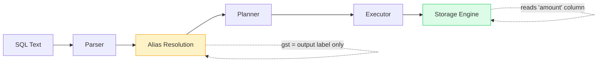

import { Aside, Badge, Card, CardGrid, Code, LinkCard, TabItem, Tabs } from '@astrojs/starlight/components';

## 📄 Aliases (AS) — Complete Guide

> **An alias is a temporary rename — it exists only for the duration of the query. Column aliases rename output, table aliases shorten references, and subquery aliases are mandatory. All of them are invisible to the database engine until SELECT runs.**

<Aside type="tip">
**🧠 Mental Model**: Aliases are **compile-time metadata**. They guide logical resolution and output formatting, but never reach the storage engine. They disappear after the query finishes.
</Aside>

---

## ⚙️ Execution Order — Why Aliases Behave Weirdly

```text
1. FROM      ← table aliases available from here ✅
2. WHERE     ← column aliases NOT available ❌
3. GROUP BY  ← column aliases NOT available ❌
4. HAVING    ← column aliases NOT available ❌
5. SELECT    ← column aliases DEFINED here
6. ORDER BY  ← column aliases available ✅ (runs after SELECT)
7. LIMIT

[SQL Text] → Parser → [Alias Resolution] → Planner → Executor
   ↓              ↓
(You write)   (PG maps names to columns/tables)
Aliases are compile-time metadata. They don't change execution plans, indexes, or storage. They only guide logical resolution and output formatting. They disappear after the query finishes.
```

<Code lang="sql" title="The root of all alias confusion" code={`-- ❌ ERROR: column "gst" doesn't exist in WHERE phase
SELECT amount * 0.18 AS gst     -- alias defined here (step 5)
FROM   orders
WHERE  gst > 100;               -- WHERE runs BEFORE SELECT

-- ✅ Fix 1: Repeat the expression
SELECT amount * 0.18 AS gst
FROM   orders
WHERE  amount * 0.18 > 100;

-- ✅ Fix 2: Use a subquery / CTE
SELECT * FROM (
  SELECT amount * 0.18 AS gst FROM orders
) t
WHERE gst > 100;  -- ✅ alias visible inside outer query`} />

<Aside type="caution">
**🎯 #1 Interview Trap**: Every candidate hits this once in production. Knowing **WHY** it fails (execution order) separates you from those who just memorize the fix.
</Aside>

---

## 1️⃣ Column Aliases

### 🔑 Basic Syntax

<Code lang="sql" title="AS keyword is optional but recommended" code={`
-- Explicit AS (preferred for readability)
SELECT amount * 0.18 AS gst FROM orders;

-- Implicit (works but less clear)
SELECT amount * 0.18 gst FROM orders;

-- Both are identical to Postgres internals
-- AS is purely for human readability`} />

### 🎯 When Column Aliases Are Essential

<Code lang="sql" title="Computed columns need names" code={`
-- Computed columns have no natural name — alias gives them one
SELECT
  first_name || ' ' || last_name        AS full_name,
  EXTRACT(YEAR FROM AGE(date_of_birth)) AS age_years,
  salary * 12                           AS annual_salary,
  salary * 0.10                         AS bonus,
  salary + (salary * 0.10)              AS total_comp,
  CASE
    WHEN salary > 100000 THEN 'senior'
    ELSE 'junior'
  END                                   AS level
FROM employees;`} />

### 🔤 Aliases with Special Characters — Quote Rules

<CardGrid>
  <Card title="Quote Rules Reference" icon="information">
    ```text
    ┌──────────────────────┬────────────────────────────────┐
    │ Alias style          │ Quotes needed?                 │
    ├──────────────────────┼────────────────────────────────┤
    │ lowercase_no_spaces  │ No  → AS total_amount          │
    │ UPPERCASE            │ Yes → AS "TOTAL" (else lowered)│
    │ has spaces           │ Yes → AS "Total Amount"        │
    │ starts with number   │ Yes → AS "1st_place"           │
    │ reserved word        │ Yes → AS "select"              │
    └──────────────────────┴────────────────────────────────┘
    ```
  </Card>
  
  <Card title="Postgres Identifier Quoting" icon="shield">
    ```sql
    -- ✅ Double quotes for aliases with special chars
    SELECT
      amount * 0.18 AS "GST Amount",  -- spaces → double quotes
      user_id       AS "User ID",     -- space in alias
      created_at    AS "Created At";  -- readable for reports
    
    -- ❌ Single quotes = string literals (WRONG for aliases)
    SELECT amount AS 'tax';   -- ❌ syntax error in Postgres
    
    -- ✅ Correct options:
    SELECT amount AS tax;     -- no quotes (lowercase, no spaces)
    SELECT amount AS "tax";   -- double quotes (preserves case)
    ```
  </Card>
</CardGrid>

<Aside type="danger">
**🎯 Postgres auto-lowercases unquoted identifiers**. `AS Total` becomes `total` in output. `AS "Total"` stays `Total`. This matters when your app code reads column names by exact string match.
</Aside>

---

## 2️⃣ Table Aliases

### 🔑 Basic Syntax

<Code lang="sql" title="Shorten table references" code={`
-- Full form (verbose)
SELECT users.id, users.name FROM users;

-- With alias (cleaner)
SELECT u.id, u.name FROM users u;

-- AS is optional for tables too
SELECT u.id, u.name FROM users AS u;`} />

### 🎯 Why Table Aliases Matter — JOINs

<Code lang="sql" title="Disambiguate columns in joins" code={`
-- ❌ Without aliases — verbose, ambiguous
SELECT
    users.id,
    users.name,
    orders.id,          -- ❌ ambiguous if both tables have 'id'
    orders.amount
FROM users
JOIN orders ON users.id = orders.user_id;

-- ✅ With aliases — clean, unambiguous
SELECT
    u.id   AS user_id,
    u.name,
    o.id   AS order_id,
    o.amount
FROM users u
JOIN orders o ON u.id = o.user_id;`} />

### ⚠️ Subquery Aliases Are MANDATORY

<Code lang="sql" title="Every subquery in FROM needs an alias" code={`-- ✅ Correct: subquery has alias 'order_counts'
SELECT *
    FROM (
        SELECT user_id, COUNT(*) AS total
        FROM   orders
        GROUP BY user_id
    ) order_counts            -- ← MANDATORY alias
WHERE total > 5;

-- ❌ Missing alias → immediate syntax error
SELECT * FROM (
    SELECT id FROM users
);  
-- ERROR: subquery in FROM must have an alias`} />

<Aside type="caution">
**🎯 Interview Trap**: Forget the alias on a subquery → immediate syntax error. It's **mandatory**, not optional. Postgres needs a name to reference the subquery's output in the outer query.
</Aside>

### 🔁 Self-Join — Table Aliases Are the Only Way

<Code lang="sql" title="Same table, two roles" code={`-- Find all employees and their managers
-- Same table used twice → must alias both instances
SELECT
    e.name    AS employee,
    m.name    AS manager
FROM employees e           -- e = the employee
JOIN employees m           -- m = the manager (same table!)
    ON e.manager_id = m.id;

-- Without aliases, this is impossible to write clearly`} />

---

## 3️⃣ Aliases in CTEs — Named Result Sets

<Code lang="sql" title="CTE aliases chain queries together" code={`
WITH
    active_users AS (                          -- CTE alias #1
        SELECT id, name FROM users
        WHERE is_active = true
    ),
    big_orders AS (                            -- CTE alias #2
        SELECT user_id, SUM(amount) AS total
        FROM orders
        GROUP BY user_id
        HAVING SUM(amount) > 10000
    )
SELECT
    u.name,
    b.total
FROM active_users u                          -- table alias on CTE
JOIN big_orders   b ON u.id = b.user_id;

-- CTE aliases are usable in:
-- • Subsequent CTEs in the same WITH clause
-- • The final SELECT query
-- • NOT outside the entire WITH statement`} />

---

## 4️⃣ Internals — What Postgres Does With Aliases
Aliases exist ONLY in the query planning layer.
They never reach the storage engine.


```
SELECT amount * 0.18 AS gst FROM orders;

Parser sees:      "gst" as output column name
Planner sees:     compute (amount * 0.18), label result "gst"
Executor sees:    multiply amount by 0.18
Storage sees:     read 'amount' column from 'orders' heap
Disk sees:        read 8KB pages containing 'amount' values

"gst" never touches disk. It's a projection label.
```
<Code lang="text" title="Alias resolution per clause" code={`
FROM   orders o          → 'o' registered as alias for 'orders'
                           all subsequent clauses can use 'o'

WHERE  o.amount > 100    → 'o' resolved → 'orders.amount'
                           column alias NOT available here

SELECT o.amount * 0.18   → expression evaluated
       AS gst            → output column labeled 'gst'

ORDER BY gst             → 'gst' resolved from SELECT output
                           ✅ available because ORDER BY is post-SELECT`} />

<Aside type="note">
**Key Insight**: `"gst"` never touches disk. It's a **projection label** applied after data is fetched, computed, and before results are returned to the client.
</Aside>

---

## 5️⃣ Aliases in EXPLAIN — Debugging Alias Resolution

<Code lang="sql" title="EXPLAIN shows original names, not aliases" code={`EXPLAIN
SELECT u.name, o.amount AS order_total
FROM   users  u
JOIN   orders o ON u.id = o.user_id
WHERE  o.amount > 500;

-- EXPLAIN output uses ORIGINAL column names, not aliases:
-- Hash Join
--   Hash Cond: (o.user_id = u.id)    ← original names
--   -> Seq Scan on orders o          ← shows alias 'o'
--        Filter: (amount > 500)      ← original column, not alias
--   -> Hash
--        -> Seq Scan on users u

-- 🎯 Real-life SDE: When debugging slow queries with EXPLAIN ANALYZE,
-- Postgres shows the table aliases you gave — but always uses
-- original column names in filter conditions. Knowing this helps
-- you read query plans without confusion.`} />

---

## 6️⃣ Real-Life SDE Patterns

<CardGrid>
  <Card title="Pattern 1: API Response Shaping" icon="rocket">
    ```sql
    -- Database column names → API field names
    SELECT
      id                                    AS "userId",
      first_name || ' ' || last_name        AS "fullName",
      email                                 AS "emailAddress",
      created_at                            AS "joinedAt",
      is_active                             AS "isActive"
    FROM users
    WHERE id = 42;
    
    -- Output maps directly to your JSON response keys
    -- No transformation needed in application code ✅
    ```
  </Card>
  
  <Card title="Pattern 2: Report Column Headers" icon="shield">
    ```sql
    -- Finance report — alias as readable headers
    SELECT
      DATE_TRUNC('month', created_at)       AS "Month",
      COUNT(*)                              AS "Total Orders",
      SUM(amount)                           AS "Revenue (₹)",
      AVG(amount)                           AS "Avg Order Value",
      COUNT(DISTINCT user_id)               AS "Unique Customers"
    FROM orders
    WHERE created_at >= '2024-01-01'
    GROUP BY 1
    ORDER BY 1;
    ```
  </Card>

  <Card title="Pattern 3: Disambiguate JOIN Columns" icon="information">
    ```sql
    -- Without aliases: which 'id' is which? Which 'created_at'?
    SELECT
      u.id          AS user_id,
      u.name        AS user_name,
      u.created_at  AS user_joined,
      o.id          AS order_id,
      o.amount      AS order_amount,
      o.created_at  AS order_date,       -- same column name, different table
      p.id          AS product_id,
      p.name        AS product_name
    FROM users  u
    JOIN orders o ON u.id = o.user_id
    JOIN products p ON o.product_id = p.id;
    ```
  </Card>

  <Card title="Pattern 4: Reuse Expression via CTE Alias" icon="approve-check">
    ```sql
    -- Problem: can't use SELECT alias in WHERE/HAVING
    -- Solution: wrap in CTE, alias the expression there
    WITH order_stats AS (
      SELECT
        user_id,
        COUNT(*)     AS order_count,
        SUM(amount)  AS lifetime_value,
        AVG(amount)  AS avg_order
      FROM orders
      GROUP BY user_id
    )
    SELECT
      u.name,
      s.order_count,
      s.lifetime_value,
      s.avg_order
    FROM users u
    JOIN order_stats s ON u.id = s.user_id
    WHERE s.lifetime_value > 50000          -- ✅ alias usable here
      AND s.order_count    > 10;
    ```
  </Card>

  <Card title="Pattern 5 — Dynamic Ranking with Alias" icon="approve-check">
    ```sql
    -- Window function result aliased and filtered via subquery
    SELECT *
        FROM (
            SELECT
                u.name,
                SUM(o.amount)                                    AS total_spent,
                RANK() OVER (ORDER BY SUM(o.amount) DESC)        AS spending_rank
            FROM users u
            JOIN orders o ON u.id = o.user_id
            GROUP BY u.id, u.name
        ) ranked_users
    WHERE spending_rank <= 10;              -- ✅ alias usable in outer query
    ```
  </Card>
</CardGrid>

---

## 7️⃣ Common Alias Mistakes — All in One Place

<CardGrid>
  <Card title="Mistake 1: Column alias in WHERE" icon="error">
    ```sql
    -- ❌ Fails: alias not yet defined
    SELECT amount * 0.18 AS tax
    FROM orders
    WHERE tax > 50;               -- ERROR: column "tax" does not exist
    
    -- ✅ Fix: repeat expression or use subquery
    WHERE amount * 0.18 > 50;
    ```
  </Card>
  
  <Card title="Mistake 2: Wrong quote style" icon="error">
    ```sql
    -- ❌ Single quotes = string literal, not alias
    SELECT name AS 'username' FROM users;   -- ERROR in Postgres
    
    -- ✅ Correct: double quotes or no quotes
    SELECT name AS username FROM users;     -- lowercase, no spaces
    SELECT name AS "username" FROM users;   -- preserves case
    ```
  </Card>

  <Card title="Mistake 3: Missing subquery alias" icon="error">
    ```sql
    -- ❌ Missing alias on subquery → syntax error
    SELECT * FROM (SELECT id FROM users);
    
    -- ✅ Fix: add alias
    SELECT * FROM (SELECT id FROM users) u;
    ```
  </Card>

  <Card title="Mistake 4: Expecting uppercase without quotes" icon="caution">
    ```sql
    -- ❌ Unquoted alias gets lowercased
    SELECT amount AS Total FROM orders;
    -- Output column name: "total" (not "Total"!)
    
    -- ✅ Fix: double quotes to preserve case
    SELECT amount AS "Total" FROM orders;
    -- Output column name: "Total" ✅
    ```
  </Card>

  <Card title="Mistake 5: Scope confusion with subqueries" icon="caution">
    ```sql
    -- ❌ Outer alias not visible inside subquery
    SELECT o.amount 
    FROM orders o
    JOIN (SELECT * FROM o) sub;  -- ❌ 'o' not visible inside subquery
    
    -- ✅ Fix: subqueries have their own scope
    JOIN (SELECT * FROM orders) sub ON ...
    ```
  </Card>
</CardGrid>

---

## 🎯 Interview Cheat Sheet

<CardGrid>
  <Card title="Column Alias Scope" icon="information">
    ```text
    Q: Can I use a column alias in WHERE?
    A: ❌ NO — WHERE runs before SELECT, alias doesn't exist yet.
    
    Q: Can I use a column alias in ORDER BY?
    A: ✅ YES — ORDER BY runs after SELECT, alias is available.
    
    Q: Can I use a column alias in GROUP BY?
    A: ❌ Not in standard SQL. Postgres allows it as an extension,
       but don't rely on it for portability.
    ```
  </Card>
  
  <Card title="Table & Subquery Aliases" icon="shield">
    ```text
    Q: Is AS keyword required for aliases?
    A: ❌ No — optional for both columns and tables.
       SELECT name AS n  ≡  SELECT name n
    
    Q: Is alias mandatory for subqueries in FROM?
    A: ✅ YES — FROM (SELECT ...) alias is required syntax.
    
    Q: Can I use a table alias inside its own subquery?
    A: ❌ NO — subqueries have independent scope.
       Outer aliases are not visible inside.
    ```
  </Card>

  <Card title="Quoting & Case Sensitivity" icon="rocket">
    ```text
    Q: Single vs double quotes for aliases?
    A: Single = string literal. Double = identifier/alias.
       SELECT name AS 'x'  → ❌ error
       SELECT name AS "x"  → ✅ alias named "x"
    
    Q: Does Postgres preserve alias case?
    A: Only with double quotes. Unquoted aliases are lowercased.
       AS Total  → output: "total"
       AS "Total" → output: "Total" ✅
    
    Q: Self-join without aliases?
    A: ❌ Impossible — same table needs two different names
       in the same query scope.
    ```
  </Card>
</CardGrid>

---

## 🔑 Quick Reference Summary

### Alias Scope Map

```text
WITH cte_alias AS (...)    
  → usable in subsequent CTEs + main query

SELECT col AS col_alias    
  → usable in ORDER BY only (not WHERE/GROUP BY/HAVING)

FROM table AS tbl_alias    
  → usable in WHERE, JOIN, SELECT, ORDER BY
  → NOT inside subqueries (they have own scope)

Subquery AS sub_alias      
  → sub_alias usable in outer query
  → outer aliases NOT visible inside subquery
```

### Quote Rules Quick Guide

| Alias Format | Quote Needed? | Example |
|-------------|---------------|---------|
| `lowercase_no_spaces` | ❌ No | `AS total_amount` |
| `UPPERCASE` | ✅ Yes | `AS "TOTAL"` |
| `has spaces` | ✅ Yes | `AS "Total Amount"` |
| `starts_with_number` | ✅ Yes | `AS "1st_place"` |
| `reserved_word` | ✅ Yes | `AS "select"` |

### Common Errors & Fixes

| Mistake | Error | Fix |
|---------|-------|-----|
| Alias in WHERE | `column "x" does not exist` | Repeat expression or use CTE |
| Single quotes for alias | `syntax error at or near "'"` | Use double quotes or no quotes |
| Missing subquery alias | `subquery in FROM must have an alias` | Add `) alias_name` |
| Expecting case preservation | Output is lowercase | Use `"QuotedAlias"` |
| Outer alias in subquery | `relation "x" does not exist` | Reference table directly inside subquery |

<Aside type="caution">
**Final Checklist for Aliases**:
1. ✅ Remember execution order: aliases defined in SELECT aren't available in WHERE
2. ✅ Use `AS` for readability even when optional
3. ✅ Double-quote aliases with spaces, uppercase, or reserved words
4. ✅ Always alias subqueries in FROM clause
5. ✅ Use table aliases in JOINs to disambiguate columns
6. ✅ Test alias behavior with `EXPLAIN` to see resolution
7. ✅ Prefer CTEs when you need to reuse computed aliases in filtering
</Aside>

---

## 🧪 Test Your Understanding

<Code lang="text" title="Predict the behavior" code={`Q1: What's wrong with this query?
SELECT price * 1.2 AS marked_up 
FROM products 
WHERE marked_up > 100;

Q2: What will be the output column name?
SELECT amount AS Total FROM orders;

Q3: Why does this fail?
SELECT * FROM (SELECT id FROM users);

Q4: Can you use a table alias in a correlated subquery?
SELECT u.name 
FROM users u
WHERE EXISTS (
  SELECT 1 FROM orders WHERE user_id = u.id  -- is 'u' visible here?
);

Q5: What's the fix for this?
SELECT name AS 'username' FROM users;
`} />

<details>
<summary>✅ Click to reveal answers</summary>

```text
Q1: Alias "marked_up" used in WHERE → fails. WHERE runs before SELECT.
   Fix: WHERE price * 1.2 > 100  OR wrap in CTE/subquery.

Q2: "total" (lowercase) — unquoted identifiers are auto-lowercased in Postgres.
   Fix for "Total": SELECT amount AS "Total" FROM orders;

Q3: Missing mandatory alias on subquery in FROM clause.
   Fix: SELECT * FROM (SELECT id FROM users) u;

Q4: ✅ YES — table aliases from outer query ARE visible in correlated subqueries.
   This is different from non-correlated subqueries in FROM.

Q5: Single quotes denote string literals, not identifiers.
   Fix: SELECT name AS username FROM users;  OR  SELECT name AS "username" FROM users;
```
</details>

<Aside type="tip">
**Next Steps**:
1. ✅ Practice writing queries with explicit `AS` for clarity
2. ✅ Use table aliases in every JOIN — future-proofs your code
3. ✅ Remember: column aliases work in `ORDER BY`, not `WHERE`
4. ✅ Double-quote aliases when you need case preservation or special chars
5. ✅ Always alias subqueries — it's mandatory, not optional

Mastering aliases turns messy SQL into clean, maintainable, production-ready code. 🐘✨
</Aside>