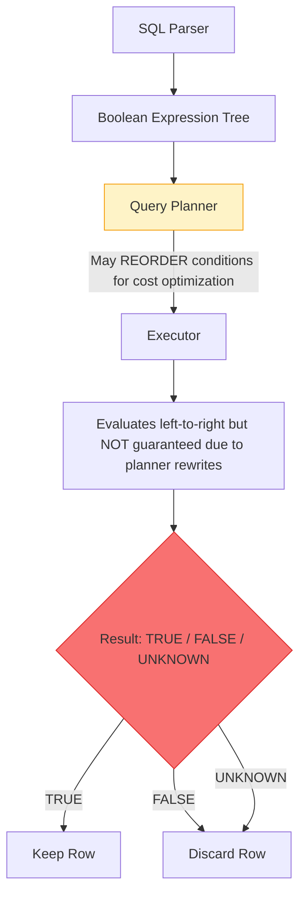

import { Aside, Badge, Card, Steps, CardGrid, Code, LinkCard, TabItem, Tabs } from '@astrojs/starlight/components';

## 📄 AND, OR, NOT — Complete Guide

> **`AND` narrows results (must satisfy all), `OR` widens results (satisfy any one), `NOT` flips results (exclude matches) — but SQL uses three-value logic (`TRUE` / `FALSE` / `NULL`), and `NULL` breaks every assumption you have from traditional programming.**

<Aside type="tip">
**🧠 Mental Model**: Think of PostgreSQL's logic engine as a **ternary evaluator**. It doesn't just return true/false — it returns `UNKNOWN` when `NULL` is involved. Rows are only kept when the final evaluation is strictly `TRUE`.
</Aside>

---

## ⚙️ Execution Order — Where They Live

```
FROM      ← load table into memory.
WHERE     ← AND / OR / NOT live here ✅. Filters rows before grouping.
GROUP BY
HAVING    ← AND / OR / NOT work here too ✅. Filters aggregated groups.
SELECT
ORDER BY
LIMIT

Final projection, sorting, and truncation.
```


### 🔬 How PostgreSQL Evaluates Logic



<Code lang="sql" title="Logical operators in action" code={`
SELECT * FROM orders
WHERE  status = 'shipped'          -- condition 1
  AND  amount > 500                -- condition 2
  AND  NOT is_cancelled;           -- condition 3`} />

<Aside type="caution">
**⚠️ Short-Circuit is NOT guaranteed.** The planner may reorder conditions to hit indexes first. Never rely on evaluation order for side effects. However, in practice, PostgreSQL evaluates left-to-right when indexes aren't involved.

</Aside>
<Aside type="tip">
Insight: PostgreSQL uses Three-Valued Logic. UNKNOWN (NULL) behaves differently than FALSE. Also, short-circuit evaluation is NOT guaranteed because the planner may reorder conditions to hit indexes first.
</Aside>

---

## 1️⃣ AND — All Conditions Must Be True

<Code lang="sql" title="AND chaining examples" code={`-- Both must be true to include the row
SELECT * FROM users
WHERE  city = 'Mumbai'
  AND  is_active = true;

-- Three conditions — all must pass
SELECT * FROM orders
WHERE  status    = 'pending'
  AND  amount    > 1000
  AND  created_at >= '2024-01-01';

-- Heavy filtering
SELECT * FROM products
WHERE  category  = 'electronics'
  AND  price     < 50000
  AND  stock     > 0
  AND  is_listed = true;`} />

<CardGrid>
  <Card title="AND Truth Table" icon="information">
    ```text
    ┌─────────┬─────────┬──────────────┐
    │    A    │    B    │   A AND B    │
    ├─────────┼─────────┼──────────────┤
    │  TRUE   │  TRUE   │    TRUE  ✅  │
    │  TRUE   │  FALSE  │    FALSE     │
    │  FALSE  │  TRUE   │    FALSE     │
    │  FALSE  │  FALSE  │    FALSE     │
    │  TRUE   │  NULL   │    NULL  ⚠️  │
    │  FALSE  │  NULL   │    FALSE     │  ← FALSE wins over NULL
    │  NULL   │  NULL   │    NULL  ⚠️  │
    └─────────┴─────────┴──────────────┘
    Key: FALSE AND NULL = FALSE. TRUE AND NULL = NULL.
    Rows returned ONLY when result = TRUE.
    ```
  </Card>
</CardGrid>

<Aside type="tip">
**🎯 Key Insight**: `FALSE AND NULL = FALSE` — when one side is already `FALSE`, the `NULL` doesn't matter. But `TRUE AND NULL = NULL` — `NULL` poisons the result, excluding the row.
</Aside>

---

## 2️⃣ OR — At Least One Condition Must Be True

<Code lang="sql" title="OR chaining examples" code={`-- Either condition passes → row included
SELECT * FROM users
WHERE  city = 'Mumbai'
  OR   city = 'Delhi';

-- Mix of conditions
SELECT * FROM orders
WHERE  status = 'cancelled'
  OR   amount < 0;              -- refunds might be negative

-- OR across different columns
SELECT * FROM products
WHERE  is_featured = true
  OR   discount_pct > 50;`} />

<CardGrid>
  <Card title="OR Truth Table" icon="information">
    ```text
    ┌─────────┬─────────┬──────────────┐
    │    A    │    B    │   A OR B     │
    ├─────────┼─────────┼──────────────┤
    │  TRUE   │  TRUE   │    TRUE  ✅  │
    │  TRUE   │  FALSE  │    TRUE  ✅  │
    │  FALSE  │  TRUE   │    TRUE  ✅  │
    │  FALSE  │  FALSE  │    FALSE     │
    │  TRUE   │  NULL   │    TRUE  ✅  │  ← TRUE wins over NULL
    │  FALSE  │  NULL   │    NULL  ⚠️  │
    │  NULL   │  NULL   │    NULL  ⚠️  │
    └─────────┴─────────┴──────────────┘
    Key: TRUE OR anything = TRUE (even NULL!). FALSE OR NULL = NULL.
    ```
  </Card>
</CardGrid>

<Aside type="tip">
> 🎯 **Key insight:** `TRUE OR NULL = TRUE` — when one side is already TRUE, NULL doesn't matter. Mirror of AND's behavior.
</Aside>
---

## 3️⃣ NOT — Flip the Condition

<Code lang="sql" title="NOT usage patterns" code={`-- Negate a boolean column
SELECT * FROM users WHERE NOT is_active;
SELECT * FROM users WHERE NOT is_deleted;

-- NOT with equality (equivalent to != or <>)
SELECT * FROM orders WHERE NOT status = 'cancelled';

-- NOT with IN
SELECT * FROM users WHERE city NOT IN ('Mumbai', 'Delhi');

-- NOT with LIKE
SELECT * FROM users WHERE email NOT LIKE '%@gmail.com';

-- NOT with EXISTS
SELECT * FROM users u
WHERE NOT EXISTS (
    SELECT 1 FROM orders o WHERE o.user_id = u.id
);`} />

<CardGrid>
  <Card title="NOT Truth Table" icon="caution">
    ```text
    ┌─────────┬──────────┐
    │    A    │  NOT A   │
    ├─────────┼──────────┤
    │  TRUE   │  FALSE   │
    │  FALSE  │  TRUE    │
    │  NULL   │  NULL ⚠️ │  ← NOT NULL = NULL, not TRUE!
    └─────────┴──────────┘
    Critical trap: NOT NULL = NULL. Always use IS NULL / IS NOT NULL.
    ```
  </Card>
</CardGrid>

---

## 4️⃣ Three-Value Logic — The Heart of SQL

> **This is what makes SQL different from every programming language.** `NULL` isn't a value — it's the *absence* of a value. Any comparison with `NULL` yields `UNKNOWN`.

<Code lang="sql" title="The NULL propagation problem" code={`-- Table: users
-- ┌────┬───────┬───────┐
-- │ id │ name  │ phone │
-- ├────┼───────┼───────┤
-- │  1 │ Raj   │ NULL  │
-- │  2 │ Priya │ 9999  │
-- │  3 │ Sam   │ 8888  │
-- └────┴───────┴───────┘

-- Question: find users whose phone is NOT 9999
SELECT name FROM users WHERE phone != 9999;
-- Expected: Raj, Sam
-- Actual:   Sam only 😱
-- Why? For Raj: NULL != 9999 → NULL (not TRUE) → row excluded

-- ✅ Fix: explicitly handle NULL
SELECT name FROM users
WHERE  phone != 9999
  OR   phone IS NULL;       -- ✅ Raj, Sam`} />

<Code lang="sql" title="NULL in AND / OR chains" code={`-- Scenario: find active users in Mumbai
-- Some users have NULL city, some have NULL is_active
WHERE city = 'Mumbai' AND is_active = true

-- For user with NULL city:
--   NULL = 'Mumbai'   → NULL
--   NULL AND true     → NULL   ← row excluded (usually correct)

-- For user with NULL is_active:
--   city = 'Mumbai'   → TRUE
--   TRUE AND NULL     → NULL   ← row excluded (maybe unintended!)

-- ✅ If you want NULL is_active treated as "not inactive":
WHERE city = 'Mumbai'
  AND (is_active = true OR is_active IS NULL)`} />

<Aside type="danger">
**🚨 Production Rule**: `WHERE col != 'value'` silently excludes `NULL` rows. If `NULL` means "not set" and should be included, always add `OR col IS NULL` or use `COALESCE(col, 'default') != 'value'`.
</Aside>

---

## 5️⃣ Operator Precedence — The Silent Bug Maker

```text
Precedence (high to low):
1. NOT       ← evaluated first
2. AND       ← evaluated second
3. OR        ← evaluated last
```

<Code lang="sql" title="Precedence traps & fixes" code={`
-- ❌ Ambiguous intent (relies on precedence)
WHERE status = 'cancelled'
  OR status = 'pending'
  AND amount > 1000

-- But Postgres reads it as:
-- status = 'cancelled' OR (status = 'pending' AND amount > 1000)
--                          ↑
--                   AND binds tighter than OR
--
-- This is actually CORRECT here by coincidence —
-- but relying on precedence is dangerous!

-- ✅ ALWAYS use parentheses to be explicit:
WHERE status = 'cancelled'
  OR (status = 'pending' AND amount > 1000)

-- Different intent:
WHERE (status = 'cancelled' OR status = 'pending')
  AND amount > 1000
-- Find cancelled or pending orders, but only high-value ones
-- Parentheses completely change the meaning!
  `} />

<CardGrid>
  <Card title="Real-World Bug Example" icon="danger">
    ```sql
    -- Intent: find VIP users in Mumbai OR Delhi who are active
    WHERE city = 'Mumbai' OR city = 'Delhi' AND is_active = true
    
    -- What Postgres runs:
    -- city = 'Mumbai' OR (city = 'Delhi' AND is_active = true)
    -- = ALL Mumbai users (including inactive!) + active Delhi users
    -- 💀 Wrong! Inactive Mumbai users slip through.
    
    -- ✅ Fix:
    WHERE (city = 'Mumbai' OR city = 'Delhi') AND is_active = true
    ```
  </Card>
</CardGrid>

<Aside type="caution">
**🎯 Interview Trap**: Operator precedence bugs are silent — no error, just wrong data. They often only appear in edge cases. **Always parenthesize `OR` conditions** when mixing with `AND`.
</Aside>

---

## 6️⃣ Short-Circuit Evaluation — Performance Lever

PostgreSQL evaluates `AND`/`OR` left-to-right and stops early when the result is determined.

<CardGrid>
  <Card title="AND Short-Circuit" icon="rocket">
    ```text
    WHERE cond_A AND cond_B AND cond_C
            │           │           │
          false?      false?      check
          STOP ✋     STOP ✋
    
    Row is rejected as soon as ANY condition is FALSE.
    Remaining conditions are skipped entirely.
    ```
  </Card>
  
  <Card title="OR Short-Circuit" icon="shield">
    ```text
    WHERE cond_A OR cond_B OR cond_C
            │          │          │
          true?       true?     check
          STOP ✋     STOP ✋
    
    Row is accepted as soon as ANY condition is TRUE.
    ```
  </Card>
</CardGrid>

<Code lang="sql" title="Using short-circuit for performance" code={`-- ❌ Slow: expensive function called on ALL rows
WHERE calculate_risk_score(user_id) > 80
  AND is_active = true

-- ✅ Fast: cheap filter first, expensive function only on survivors
WHERE is_active = true
  AND calculate_risk_score(user_id) > 80
  -- ↑ eliminates inactive users first
  -- ↑ expensive function called only on active users`} />

<Aside type="tip">
**📏 Rule of Thumb**: Put the **cheapest** and **most selective** condition first in `AND` chains. 
- Cheap = simple equality, indexed column. 
- Costly = function call, `LIKE`, subquery. 
- Selective = eliminates most rows.
- Unselective = few rows eliminated

> 🎯 **DSA connection:** Short-circuit evaluation = early termination in a loop. Just like breaking out of a for-loop the moment you find what you need — fewer iterations, faster result.
</Aside>

---

## 7️⃣ AND / OR with Indexes — How Postgres Decides

<CardGrid>
  <Card title="AND — Bitmap Intersection" icon="approve-check">
    ```sql
    -- Table: orders
    -- Indexes: idx_status on (status), idx_user on (user_id)
    WHERE status = 'shipped' AND user_id = 42
    
    Plan:
    BitmapAnd
    ├── Bitmap Index Scan on idx_status → set of pages with 'shipped'
    └── Bitmap Index Scan on idx_user   → set of pages with user_id=42
    Result: intersection of both sets ✅
    ```
  </Card>
  
  <Card title="OR — Bitmap Union (Harder to Optimize)" icon="caution">
    ```sql
    WHERE status = 'shipped' OR user_id = 42
    
    Plan:
    BitmapOr
    ├── Bitmap Index Scan on idx_status → set of pages
    └── Bitmap Index Scan on idx_user   → set of pages
    Result: union of both sets
    
    ⚠️ Critical rule: If ANY condition in OR has no index:
    Postgres falls back to Seq Scan for the ENTIRE query.

    -- If one side of OR has no index:
    WHERE status = 'shipped' OR notes LIKE '%urgent%'
                                      ↑ no index possible (leading %)
    Plan: Seq Scan on orders  ← entire index benefit lost! 💀


    Critical rule for OR + indexes:

    If ANY condition in an OR chain has no index:
      Postgres falls back to Seq Scan for the ENTIRE OR
      Because it has no choice — must check every row anyway

    Fix options:
      1. Add index on the unindexed column
      2. Rewrite with UNION (each branch gets own index)
      3. Redesign the query
    ```
  </Card>

  <Card title="Fix: Rewrite OR with UNION" icon="rocket">
    ```sql
    -- ❌ OR kills index on second condition
    SELECT * FROM orders
    WHERE user_id = 42
      OR status = 'priority';
    
    -- ✅ UNION lets each branch use its own index
    SELECT * FROM orders WHERE user_id = 42
    UNION
    SELECT * FROM orders WHERE status = 'priority';
    
    -- Each SELECT uses its own index scan ✅
    -- UNION deduplicates the combined result
    -- Use UNION ALL if you know there are no overlapping rows (faster)
    ```
  </Card>
</CardGrid>

---

## 8️⃣ NOT and Index Usage
NOT EQUAL — can still use index (range scan)
<CardGrid>
  <Card title="NOT EQUAL (`!=` / `<>`)" icon="information">
    ```sql
    WHERE status != 'cancelled'
    -- Can still use index (range scan excluding one value) ✅
    -- But if 'cancelled' is rare, Seq Scan might be faster anyway
    ```
  </Card>
  
  <Card title="NOT IN" icon="shield">
    ```sql
    WHERE status NOT IN ('cancelled', 'refunded')
    -- Translated to: status != 'cancelled' AND status != 'refunded'
    -- Index range scan possible ✅
    ```
  </Card>

  <Card title="NOT LIKE" icon="caution">
    ```sql
    WHERE name NOT LIKE '%admin%'
    -- Seq scan always — can't index middle-of-string search ❌
    ```
  </Card>

  <Card title="NOT EXISTS" icon="rocket">
    ```sql
    WHERE NOT EXISTS (
        SELECT 1 FROM orders WHERE user_id = u.id
    )
    -- Postgres uses index on orders.user_id ✅
    -- Stops at first match per user (short-circuits)
    ```
  </Card>
</CardGrid>

---

## 9️⃣ Real-Life SDE Patterns

<CardGrid>
  <Card title="Pattern 1: Role-Based Access Filter" icon="shield">
    ```sql
    -- Show content based on user permissions
    SELECT p.id, p.title, p.content
    FROM   posts p
    WHERE  p.is_published = true
      AND  (
           p.visibility = 'public'
           OR (p.visibility = 'members'  AND :is_member  = true)
           OR (p.visibility = 'premium'  AND :is_premium = true)
           OR p.author_id = :current_user_id
           );
    ```
  </Card>
  
  <Card title="Pattern 2: Optional Filters (Dynamic Query)" icon="rocket">
    ```sql
    -- E-commerce filter panel
    -- All filters optional — only applied when value provided
    SELECT * FROM products
    WHERE  is_listed = true
      AND  (:category  IS NULL OR category  = :category)
      AND  (:min_price IS NULL OR price    >= :min_price)
      AND  (:max_price IS NULL OR price    <= :max_price)
      AND  (:in_stock  IS NULL OR stock    >  0)
    ORDER BY created_at DESC;

    -- If :category = NULL → condition skipped (always true)
    -- If :category = 'phones' → filters to phones only
    -- Each filter independently optional ✅
    ```
  </Card>

  <Card title="Pattern 3: Soft Delete + Active Check" icon="backspace">
    ```sql
    -- The most common AND pattern in production
    SELECT id, name, email
    FROM   users
    WHERE  deleted_at IS NULL           -- not soft-deleted
      AND  is_active  = true            -- account active
      AND  email_verified_at IS NOT NULL
      AND (suspended_until < NOW() OR suspended_until IS NULL);
    ```
  </Card>

  <Card title="Pattern 4: Status Machine Filter" icon="approve-check">
    ```sql
    -- Orders that need attention
    SELECT id, status, created_at
    FROM   orders
    WHERE  (status = 'pending'    AND created_at < NOW() - INTERVAL '2 days')
      OR   (status = 'processing' AND created_at < NOW() - INTERVAL '7 days')
      OR   (status = 'payment_failed')
    ORDER BY created_at ASC;
    -- ← parentheses critical here to separate OR groups
    ```
  </Card>

  <Card title="Pattern 5: Notification Eligibility" icon="approve-check">
    ```sql
    -- Send notification if user opted in AND hasn't been notified today
    SELECT u.id, u.email, u.name
    FROM   users u
    WHERE  u.email_notifications = true
      AND  u.is_active = true
      AND  NOT EXISTS (
        SELECT 1 FROM notifications n
        WHERE  n.user_id = u.id
          AND  n.sent_at >= CURRENT_DATE   -- sent today already
          AND  n.type = 'daily_digest'
      );
    ```
  </Card>
</CardGrid>

---

## 🔬 Verify NULL Behavior Yourself

<Code lang="sql" title="Run these in psql to see three-value logic in action" code={`SELECT true  AND NULL;    -- NULL
SELECT false AND NULL;    -- false
SELECT true  OR  NULL;    -- true
SELECT false OR  NULL;    -- NULL
SELECT NOT NULL;           -- NULL

-- Practical test
CREATE TEMP TABLE t (val INTEGER);
INSERT INTO t VALUES (1), (2), (NULL);

SELECT * FROM t WHERE val != 1;
-- Returns: 2 only (NULL excluded silently)

SELECT * FROM t WHERE val != 1 OR val IS NULL;
-- Returns: 2, NULL (explicitly include NULLs)

SELECT * FROM t WHERE NOT (val = 1);
-- Returns: 2 only (NOT NULL = NULL, excluded)

-- ⚠️ Trap: excludes rows where deleted IS NULL
SELECT * FROM orders WHERE paid = TRUE AND deleted != TRUE;

-- ✅ Safe: explicitly handle NULL
SELECT * FROM orders
WHERE paid = TRUE
  AND (deleted IS FALSE OR deleted IS NULL);

-- 💡 Or use COALESCE:
SELECT * FROM orders WHERE paid = TRUE AND COALESCE(deleted, FALSE) = FALSE;`} />

---

## 🎯 Interview Cheat Sheet

| Question | Answer |
|---|---|
| **Precedence order?** | `NOT` → `AND` → `OR` (always parenthesize `OR` with `AND`) |
| `TRUE AND NULL`? | `NULL` — row excluded |
| `FALSE AND NULL`? | `FALSE` — row excluded (`FALSE` wins) |
| `TRUE OR NULL`? | `TRUE` — row included (`TRUE` wins) |
| `FALSE OR NULL`? | `NULL` — row excluded |
| `NOT NULL`? | `NULL` — not `TRUE`, row excluded |
| `WHERE col != 5` includes `NULL`s? | No — `NULL != 5` = `NULL` → excluded |
| `OR` with one unindexed column? | Entire `OR` falls back to `Seq Scan` |
| How to optimize `OR` queries? | Rewrite as `UNION` (each branch uses own index) |
| Short-circuit rule for `AND`? | Most selective + cheapest condition first |
| `AND` with two indexes? | `Bitmap AND` — intersects both index result sets |
| `OR` with two indexes? | `Bitmap OR` — unions both index result sets |

### NULL & Three-Valued Logic Summary

| Expression | Result | Row Kept? |
|------------|--------|-----------|
| `TRUE AND NULL` | `NULL` | ❌ |
| `FALSE OR NULL` | `NULL` | ❌ |
| `NOT NULL` | `NULL` | ❌ |
| `NULL IS NULL` | `TRUE` | ✅ |
| `NULL != 5` | `NULL` | ❌ |

---

## 🧠 Full Mental Model

```text
Three-Value Logic Summary:

AND │ TRUE  │ FALSE │ NULL
─────┼───────┼───────┼──────
TRUE │ TRUE  │ FALSE │ NULL
FALSE│ FALSE │ FALSE │ FALSE  ← FALSE dominates AND
NULL │ NULL  │ FALSE │ NULL

OR  │ TRUE  │ FALSE │ NULL
─────┼───────┼───────┼──────
TRUE │ TRUE  │ TRUE  │ TRUE   ← TRUE dominates OR
FALSE│ TRUE  │ FALSE │ NULL
NULL │ TRUE  │ NULL  │ NULL

NOT │ Result
─────┼────────
TRUE │ FALSE
FALSE│ TRUE
NULL │ NULL   ← NOT NULL is still NULL

Execution Flow:
FROM → WHERE (AND/OR/NOT) → GROUP BY → HAVING → SELECT → ORDER BY
Rows kept ONLY when final WHERE evaluation = TRUE
```

<Aside type="tip">
**Next Steps**:
1. ✅ Always parenthesize mixed `AND`/`OR` conditions
2. ✅ Handle `NULL` explicitly with `IS NULL` / `COALESCE`
3. ✅ Place cheapest, most selective filters first in `AND` chains
4. ✅ Rewrite heavy `OR` queries as `UNION` for index utilization
5. ✅ Use `EXPLAIN (ANALYZE)` to verify Bitmap vs Seq Scan decisions

Mastering three-valued logic turns silent data bugs into predictable, secure queries. 🐘✨
</Aside>