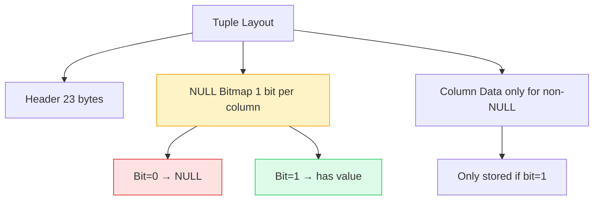

import { Aside, Badge, Card, CardGrid, Code, Tabs, TabItem } from '@astrojs/starlight/components';

## 📄 IS NULL & IS NOT NULL — Complete Guide

> **`NULL` is not a value — it's the absence of a value. You can never compare it with `=` or `!=`. `NULL` compared to anything always returns `NULL`, which is why SQL gives you `IS NULL` and `IS NOT NULL` as the only safe way to check for it.**

<Aside type="tip">
**🧠 Mental Model**: Think of `NULL` as **"unknown"**. In SQL's three-valued logic (`TRUE` / `FALSE` / `UNKNOWN`), any comparison with `NULL` yields `UNKNOWN`, which `WHERE` treats as `FALSE` → row is filtered out.
</Aside>

---

## ⚙️ Execution Order — Where NULL Checks Live

```
FROM
WHERE     ← IS NULL / IS NOT NULL live here ✅
GROUP BY
HAVING    ← IS NULL / IS NOT NULL work here too ✅
SELECT
ORDER BY
```


<Code lang="sql" title="NULL checks in the query pipeline" code={`
-- IS NULL filters rows before they reach SELECT
SELECT name, email
FROM   users
WHERE  email IS NOT NULL    -- step 1: filter out NULL emails
ORDER BY name;              -- step 2: sort filtered results
`} />

---

## 1️⃣ What NULL Actually Is

<CardGrid>
  <Card title="NULL Is NOT" icon="error">
    ```text
    ❌ zero           (0 is a value)
    ❌ empty string   ('' is a value — 2-byte varlena header)
    ❌ false          (false is a boolean value)
    ❌ 'NULL'         (the literal 4-character string)
    ❌ unknown / Missing / Not Applicable    (conceptually yes, but not a Postgres type)
    ```
  </Card>
  
  <Card title="NULL IS" icon="approve-check">
    ```text
    ✅ The absence of any value
    ✅ "We don't know what this is"
    ✅ A third state beyond TRUE / FALSE
    ✅ Storage:
        NULL costs almost nothing — 1 bit in the tuple's NULL bitmap
        The actual column space is skipped entirely (no bytes used)
    ```
  </Card>
</CardGrid>


<Code lang="sql" title="Proving NULL is unique" code={`
-- These are ALL different things in Postgres
SELECT
  NULL,          -- absence of value
  0,             -- integer zero
  '',            -- empty string (2-byte header, 0 data)
  false,         -- boolean false
  'NULL'         -- the literal string "NULL" (4 characters)
;`} />

<Aside type="caution">
**Key Insight**: SQL uses **Three-Valued Logic**. Any comparison with `NULL` (`=`, `!=`, `>`, `<`, `+`, `||`) evaluates to `NULL` (unknown), which `WHERE` treats as `FALSE` → row is filtered out.
</Aside>

---

## 2️⃣ Why `= NULL` Never Works

<Code lang="sql" title="The fundamental rule: comparisons with NULL return NULL" code={`-- ANY comparison with NULL returns NULL (not TRUE, not FALSE)
SELECT NULL =    NULL;   -- NULL  (not TRUE!)
SELECT NULL !=   NULL;   -- NULL
SELECT NULL =    1;      -- NULL
SELECT NULL !=   1;      -- NULL
SELECT NULL >    0;      -- NULL
SELECT NULL +    5;      -- NULL  (arithmetic too!)
SELECT NULL ||  'x';     -- NULL  (string concat too!)

-- WHERE only returns rows where condition = TRUE
-- NULL condition → row silently excluded`} />

```text
Three-value logic reminder:

  col = NULL        →  NULL  →  row excluded  ❌
  col != NULL       →  NULL  →  row excluded  ❌
  col IS NULL       →  TRUE  →  row included  ✅  (when col is NULL)
  col IS NOT NULL   →  TRUE  →  row included  ✅  (when col has value)
```

<Code lang="sql" title="Prove it yourself" code={`-- Create test table
CREATE TEMP TABLE t (val INTEGER);
INSERT INTO t VALUES (1), (2), (NULL);

-- These return 0 rows — WRONG!
SELECT * FROM t WHERE val = NULL;     -- 0 rows  ❌
SELECT * FROM t WHERE val != NULL;    -- 0 rows  ❌

-- These work correctly
SELECT * FROM t WHERE val IS NULL;    -- 1 row   ✅ (NULL row)
SELECT * FROM t WHERE val IS NOT NULL;-- 2 rows  ✅ (1 and 2)`} />

<Aside type="danger">
**🚨 #1 NULL Mistake in Production**: `WHERE deleted_at = NULL` — returns nothing. Always `WHERE deleted_at IS NULL`. Every developer hits this at least once in real life.
</Aside>

---

## 3️⃣ IS NULL — Find Missing Values

<Code lang="sql" title="Basic IS NULL usage" code={`-- Find rows with missing data
SELECT * FROM users  WHERE phone     IS NULL;
SELECT * FROM orders WHERE shipped_at IS NULL;
SELECT * FROM posts  WHERE deleted_at IS NULL;   -- soft delete pattern

-- Combined with other conditions
SELECT id, name, email
FROM   users
WHERE  phone      IS NULL          -- no phone on file
    AND  is_active  = true           -- still active account
    AND  created_at < NOW() - INTERVAL '30 days';  -- old account

-- In HAVING (after GROUP BY)
SELECT user_id, COUNT(*) AS total
FROM   orders
GROUP BY user_id
HAVING MAX(delivered_at) IS NULL;  -- users with no delivered orders`} />

---

## 4️⃣ IS NOT NULL — Find Present Values

<Code lang="sql" title="Basic IS NOT NULL usage" code={`-- Find rows with complete data
SELECT * FROM users  WHERE phone       IS NOT NULL;
SELECT * FROM orders WHERE delivered_at IS NOT NULL;

-- Very common: filter out incomplete records
SELECT id, name, email, phone
FROM   users
WHERE  email IS NOT NULL
    AND  phone IS NOT NULL
    AND  name  IS NOT NULL;

-- Find verified users (email_verified_at was set)
SELECT * FROM users
WHERE  email_verified_at IS NOT NULL
    AND  deleted_at         IS NULL;     -- and not deleted`} />

---

## 5️⃣ NULL in Aggregations — The Silent Ignorer

<Code lang="sql" title="Aggregates silently ignore NULLs" code={`-- Setup test data
CREATE TEMP TABLE scores (
  student TEXT,
  score   INTEGER
);
INSERT INTO scores VALUES
  ('Raj',   85),
  ('Priya', 90),
  ('Sam',   NULL),   -- absent, no score
  ('Ankit', NULL);   -- absent, no score

-- Aggregates SILENTLY IGNORE NULLs
SELECT
  COUNT(*)        AS total_rows,      -- 4  (counts everything)
  COUNT(score)    AS scored_students, -- 2  (ignores NULLs!)
  SUM(score)      AS total,           -- 175 (ignores NULLs)
  AVG(score)      AS average,         -- 87.5 (175/2, not 175/4!)
  MAX(score)      AS highest,         -- 90
  MIN(score)      AS lowest           -- 85
FROM scores;`} />

```text
AVG trap:

  AVG(score) = 87.5   ← average of students WHO HAVE scores
                          NOT average of all students
  
  If you want "class average" treating absent = 0:
  AVG(COALESCE(score, 0)) = 43.75   ← includes absent students
```

<CardGrid>
  <Card title="COUNT(*) vs COUNT(col)" icon="information">
    ```sql
    SELECT
      COUNT(*)     AS all_rows,      -- includes NULL rows
      COUNT(score) AS non_null_rows  -- excludes NULL rows
    FROM scores;
    -- all_rows = 4, non_null_rows = 2
    ```
  </Card>
  
  <Card title="Interview Answer" icon="shield">
    ```text
    Q: "What does AVG(salary) return if some salaries are NULL?"
    A: It averages only non-NULL salaries. If 3 out of 5 employees 
       have salaries (100, 200, 300) and 2 are NULL, AVG returns 200 
       — not 120. This silently skews your analytics.
    ```
  </Card>
</CardGrid>

---

## 6️⃣ NULL in JOINs — The Hidden Data Loss

<Code lang="sql" title="INNER JOIN silently drops NULL foreign keys" code={`-- Users table          Orders table
-- id | name            user_id | amount
-- 1  | Raj             1       | 500
-- 2  | Priya           NULL    | 300   ← bad data, NULL foreign key
-- 3  | Sam             3       | 800

-- INNER JOIN silently drops the NULL foreign key row
SELECT u.name, o.amount
FROM   users u
JOIN   orders o ON u.id = o.user_id;
-- Returns: Raj+500, Sam+800
-- The NULL user_id order DISAPPEARS silently 💀

-- Find orphaned rows (NULL foreign key)
SELECT * FROM orders
WHERE user_id IS NULL;           -- find the data problem

-- LEFT JOIN shows NULLs explicitly
SELECT u.name, o.amount
FROM   users u
LEFT JOIN orders o ON u.id = o.user_id;
-- Returns: Raj+500, Priya+NULL, Sam+800
-- Priya has no orders → NULL in amount column (expected)
-- The broken order (NULL user_id) still missing though`} />

<Aside type="caution">
**🎯 Real-Life SDE**: Always add `NOT NULL` constraints on foreign key columns in your schema. If `orders.user_id` is `NOT NULL`, the bad data above never enters the database. Constraints > application-level checks.
</Aside>

---

## 7️⃣ NULL in ORDER BY — Positioning Control

<Code lang="sql" title="Postgres default NULL sorting behavior" code={`-- Postgres default:
-- ASC  → NULLs sort LAST
-- DESC → NULLs sort FIRST

SELECT name, score FROM students ORDER BY score ASC;
-- 75, 85, 90, NULL   ← NULL at end ✅ (makes sense for scores)

SELECT name, score FROM students ORDER BY score DESC;
-- NULL, 90, 85, 75   ← NULL at top ❌ (wrong for leaderboard!)

-- Override NULL position explicitly
SELECT name, score FROM students
ORDER BY score DESC NULLS LAST;
-- 90, 85, 75, NULL   ← correct leaderboard ✅

SELECT name, last_login FROM users
ORDER BY last_login ASC NULLS FIRST;
-- NULL, 2024-01-01, 2024-06-01  ← never-logged-in users first`} />

---

## 8️⃣ COALESCE — Handling NULL with a Default

<Code lang="sql" title="COALESCE returns first non-NULL value" code={`-- COALESCE(val1, val2, val3, ...)
-- Returns first non-NULL value in the list

SELECT
  name,
  COALESCE(phone, 'Not provided')      AS phone,
  COALESCE(city,  'Unknown')           AS city,
  COALESCE(score, 0)                   AS score   -- treat absent as 0
FROM users;

-- Chain fallbacks
SELECT
  COALESCE(nickname, first_name, 'Anonymous') AS display_name
FROM users;
-- Try nickname first → fall back to first_name → fall back to 'Anonymous'

-- In calculations (prevent NULL propagation)
SELECT
  price * COALESCE(discount_pct, 0) / 100  AS discount_amount
FROM products;
-- Without COALESCE: NULL discount_pct → entire expression = NULL 💀
-- With COALESCE:    NULL discount_pct → treated as 0 ✅`} />

---

## 9️⃣ NULLIF — The Reverse of COALESCE

<Code lang="sql" title="NULLIF returns NULL if values match" code={`-- NULLIF(val1, val2)
-- Returns NULL if val1 = val2, else returns val1

-- Division by zero protection
SELECT
  total_sales / NULLIF(total_orders, 0) AS avg_sale
FROM summary;
-- If total_orders = 0:
--   NULLIF(0, 0) = NULL
--   total_sales / NULL = NULL  (not an error!) ✅

-- Turn empty strings into NULL (clean up bad data)
SELECT NULLIF(phone, '')   AS phone   -- '' → NULL
FROM   users;

-- Turn sentinel values into NULL
SELECT NULLIF(status, 'N/A') AS status  -- 'N/A' → NULL
FROM   legacy_data;`} />

<Aside type="tip">
**🎯 Interview Q**: *"How do you avoid division by zero in SQL?"*  
**A**: `NULLIF(denominator, 0)` — if denominator is 0, returns `NULL`, making the whole expression `NULL` instead of throwing an error.
</Aside>

---

## 🔟 IS DISTINCT FROM — NULL-Safe Comparison

<Code lang="sql" title="NULL-aware equality checks" code={`-- Regular = fails with NULL:
SELECT NULL = NULL;       -- NULL  (not TRUE!)

-- IS DISTINCT FROM = NULL-aware inequality check
SELECT NULL IS DISTINCT FROM NULL;      -- false  (they ARE equal)
SELECT NULL IS DISTINCT FROM 1;         -- true   (they ARE different)
SELECT 1    IS DISTINCT FROM 1;         -- false  (same value)
SELECT 1    IS DISTINCT FROM 2;         -- true   (different values)

-- IS NOT DISTINCT FROM = NULL-safe equality (opposite)
SELECT NULL IS NOT DISTINCT FROM NULL;  -- true  ✅
SELECT 1    IS NOT DISTINCT FROM 1;     -- true  ✅
SELECT NULL IS NOT DISTINCT FROM 1;     -- false ✅`} />

### Real-World Use — Detecting Actual Changes

<Code lang="sql" title="Update only if value actually changed (NULL-safe)" code={`-- Update only if value actually changed
-- Problem: regular != misses NULL transitions

-- ❌ Misses: old=NULL new='Delhi' (NULL != 'Delhi' = NULL → no update)
UPDATE users SET city = :new_city
WHERE  id = :id AND city != :new_city;

-- ✅ Handles all cases including NULL transitions
UPDATE users SET city = :new_city
WHERE  id   = :id
  AND  city IS DISTINCT FROM :new_city;
-- NULL → 'Delhi'   → IS DISTINCT = true → updates ✅
-- 'Mumbai' → NULL  → IS DISTINCT = true → updates ✅
-- 'Delhi'  → 'Delhi' → IS DISTINCT = false → skips ✅`} />

<Aside type="note">
**🎯 Real-Life SDE**: `IS DISTINCT FROM` is critical in audit systems, change-detection triggers, and upsert logic where columns can transition to/from `NULL`. Regular `!=` silently misses these transitions.
</Aside>

---

## 1️⃣1️⃣ NULL in Indexes — The Invisible Entry Problem

<CardGrid>
  <Card title="B-Tree Indexes DO Index NULLs (Postgres)" icon="approve-check">
    ```sql
    CREATE INDEX idx_orders_shipped ON orders(shipped_at);

    -- This CAN use the index ✅
    SELECT * FROM orders WHERE shipped_at IS NULL;
    -- Postgres stores NULLs at one end of the B-Tree (by sort order)
    ```
  </Card>
  
  <Card title="Partial Indexes for NULL Filtering" icon="rocket">
    ```sql
    -- Partial index — index ONLY the NULLs (great for queues)
    CREATE INDEX idx_unshipped ON orders(id)
    WHERE shipped_at IS NULL;
    -- Tiny index — only unshipped orders
    -- WHERE shipped_at IS NULL → tiny index scan ✅

    -- Partial index — index ONLY non-NULLs
    CREATE INDEX idx_shipped ON orders(shipped_at)
    WHERE shipped_at IS NOT NULL;
    -- Skips NULL entries → smaller index → faster range scans
    ```
  </Card>
</CardGrid>

<Aside type="tip">
**🎯 DSA Connection**: Partial index on `IS NULL` = a filtered subset of your data structure. Like maintaining a separate smaller list of just the items matching a condition — **O(k) lookup where k \<\< n**. Classic space-time trade-off.
</Aside>

---

## 1️⃣2️⃣ Internals — How Postgres Stores and Checks NULL



<Code lang="sql" title="NULL storage is extremely cheap" code={`-- IS NULL check is O(1) — just a bitmap bit check
-- No data page needed for the column value itself

-- Prove NULL costs no column storage:
SELECT
  pg_column_size(1::INTEGER)    AS int_size,    -- 4 bytes
  pg_column_size(NULL::INTEGER) AS null_size;   -- 0 bytes! (bitmap only)`} />

```text
Tuple (row) layout:

┌──────────────────────────────────────────────┐
│  TUPLE HEADER (23 bytes)                     │
│  xmin, xmax, ctid, infomask...               │
├──────────────────────────────────────────────┤
│  NULL BITMAP (1 bit per column)              │
│  [1][0][1][1][0]                             │
│   ↑  ↑  ↑  ↑  ↑                             │
│   │  │  │  │  └── col5: NULL (bit=0)         │
│   │  │  │  └───── col4: has value (bit=1)    │
│   │  │  └──────── col3: has value (bit=1)    │
│   │  └─────────── col2: NULL (bit=0)         │
│   └────────────── col1: has value (bit=1)    │
├──────────────────────────────────────────────┤
│  COLUMN DATA (only for non-NULL columns)     │
│  [col1 value][col3 value][col4 value]        │
│  col2 and col5 not stored at all             │
└──────────────────────────────────────────────┘
```

---

## 1️⃣3️⃣ NOT NULL Constraint — Prevention Over Cure

<Code lang="sql" title="Schema design with NOT NULL" code={`-- The best NULL handling is preventing unexpected NULLs

CREATE TABLE users (
  id         BIGSERIAL    PRIMARY KEY,
  name       TEXT         NOT NULL,          -- never NULL
  email      TEXT         NOT NULL UNIQUE,   -- never NULL, must be unique
  phone      TEXT,                           -- nullable (optional)
  city       TEXT         NOT NULL DEFAULT 'Unknown', -- never NULL, has default
  created_at TIMESTAMPTZ  NOT NULL DEFAULT NOW(),     -- never NULL
  deleted_at TIMESTAMPTZ                     -- nullable (soft delete)
);

-- Add NOT NULL to existing column (careful — will fail if NULLs exist)
ALTER TABLE users ALTER COLUMN city SET NOT NULL;

-- First backfill NULLs, then add constraint:
UPDATE users SET city = 'Unknown' WHERE city IS NULL;
ALTER TABLE users ALTER COLUMN city SET NOT NULL;  -- now safe ✅

-- Remove NOT NULL constraint
ALTER TABLE users ALTER COLUMN city DROP NOT NULL;`} />

```text
Schema design rule:
  Column that should ALWAYS have a value → NOT NULL constraint
  Column that is genuinely optional      → allow NULL
  Column with a sensible default         → NOT NULL + DEFAULT

  NOT NULL columns:
    name, email, created_at, status, user_id (FK)

  Nullable columns:
    phone, middle_name, deleted_at, completed_at, avatar_url
```

---

## 1️⃣4️⃣ Real-Life SDE Patterns

<CardGrid>
  <Card title="Pattern 1: Soft Delete (Industry Standard)" icon="shield">
    ```sql
    -- The most common IS NULL pattern in production
    SELECT id, name, email
    FROM   users
    WHERE  deleted_at IS NULL;        -- only live users

    -- Partial index makes this blazing fast
    CREATE INDEX idx_users_active
    ON users(id)
    WHERE deleted_at IS NULL;

    -- "Delete"
    UPDATE users SET deleted_at = NOW() WHERE id = 42;

    -- Restore
    UPDATE users SET deleted_at = NULL WHERE id = 42;
    ```
  </Card>
  
  <Card title="Pattern 2: Job / Queue Processing" icon="rocket">
    ```sql
    -- Find unprocessed jobs
    SELECT id, payload, created_at
    FROM   jobs
    WHERE  started_at  IS NULL        -- not picked up yet
      AND  deleted_at  IS NULL        -- not cancelled
    ORDER BY created_at ASC
    LIMIT  10
    FOR UPDATE SKIP LOCKED;           -- safe for concurrent workers

    -- Mark as started
    UPDATE jobs SET started_at = NOW() WHERE id = :job_id;

    -- Mark as completed
    UPDATE jobs SET completed_at = NOW() WHERE id = :job_id;

    -- Find stuck jobs (started but never completed)
    SELECT * FROM jobs
    WHERE  started_at   IS NOT NULL
      AND  completed_at IS NULL
      AND  started_at   < NOW() - INTERVAL '1 hour';
    ```
  </Card>

  <Card title="Pattern 3: Profile Completeness Check" icon="information">
    ```sql
    -- Find users with incomplete profiles
    SELECT
      id,
      name,
      CASE WHEN phone    IS NULL THEN 'phone, '    ELSE '' END ||
      CASE WHEN city     IS NULL THEN 'city, '     ELSE '' END ||
      CASE WHEN avatar   IS NULL THEN 'avatar, '   ELSE '' END
        AS missing_fields,
      -- Completeness score
      (CASE WHEN phone  IS NOT NULL THEN 25 ELSE 0 END +
       CASE WHEN city   IS NOT NULL THEN 25 ELSE 0 END +
       CASE WHEN avatar IS NOT NULL THEN 25 ELSE 0 END +
       25)  -- base: name always present
        AS profile_pct
    FROM users
    WHERE deleted_at IS NULL
    ORDER BY profile_pct ASC;
    ```
  </Card>

  <Card title="Pattern 4: Analytics: NULL-Aware Reporting" icon="chart">
    ```sql
    -- Revenue by region (some orders have NULL region)
    SELECT
      COALESCE(region, 'Unassigned')  AS region,
      COUNT(*)                         AS orders,
      SUM(amount)                      AS revenue
    FROM orders
    GROUP BY region           -- NULLs group together as one group
    ORDER BY revenue DESC;

    -- Users acquired by channel (NULL = organic / direct)
    SELECT
      COALESCE(acquisition_channel, 'Organic') AS channel,
      COUNT(*)    AS users,
      AVG(ltv)    AS avg_ltv
    FROM users
    WHERE deleted_at IS NULL
    GROUP BY acquisition_channel
    ORDER BY users DESC;
    ```
  </Card>

  <Card title="Pattern 5: Data Quality Audit" icon="backspace">
    ```sql
    -- Find data quality issues across all nullable columns
    SELECT
      COUNT(*)                                        AS total_rows,
      COUNT(*) FILTER (WHERE email IS NULL)           AS missing_email,
      COUNT(*) FILTER (WHERE phone IS NULL)           AS missing_phone,
      COUNT(*) FILTER (WHERE city  IS NULL)           AS missing_city,
      COUNT(*) FILTER (WHERE avatar IS NULL)          AS missing_avatar,
      ROUND(
        COUNT(*) FILTER (WHERE email IS NOT NULL)
        * 100.0 / COUNT(*), 1
      )                                               AS email_completeness_pct
    FROM users
    WHERE deleted_at IS NULL;
    ```
  </Card>

  <Card title="Pattern 6: Change Detection (Audit Log)" icon="approve-check">
    ```sql
    -- Trigger to log changes, NULL-aware comparison
    CREATE OR REPLACE FUNCTION log_user_changes()
    RETURNS TRIGGER AS $$
    BEGIN
      IF NEW.email IS DISTINCT FROM OLD.email THEN
        INSERT INTO audit_log (table_name, row_id, field, old_val, new_val)
        VALUES ('users', NEW.id, 'email',
                OLD.email, NEW.email);   -- handles NULL→value, value→NULL
      END IF;

      IF NEW.city IS DISTINCT FROM OLD.city THEN
        INSERT INTO audit_log (table_name, row_id, field, old_val, new_val)
        VALUES ('users', NEW.id, 'city',
                OLD.city, NEW.city);
      END IF;

      RETURN NEW;
    END;
    $$ LANGUAGE plpgsql;

    CREATE TRIGGER trg_user_audit
    AFTER UPDATE ON users
    FOR EACH ROW EXECUTE FUNCTION log_user_changes();
    ```
  </Card>
</CardGrid>

---

## 🔬 Verify Everything Yourself

<Code lang="sql" title="Run these in psql to see NULL behavior live" code={`-- 1. The = NULL trap
SELECT 1 = NULL;          -- NULL
SELECT NULL = NULL;       -- NULL (not TRUE!)
SELECT NULL IS NULL;      -- true  ✅

-- 2. Arithmetic NULL propagation
SELECT NULL + 5;          -- NULL
SELECT NULL || 'hello';   -- NULL
SELECT COALESCE(NULL, 'default');  -- 'default' ✅

-- 3. COUNT difference
SELECT COUNT(*), COUNT(NULL) FROM generate_series(1,5);
-- COUNT(*) = 5, COUNT(NULL) = 0

-- 4. NULLIF
SELECT NULLIF(0, 0);      -- NULL
SELECT NULLIF(5, 0);      -- 5

-- 5. IS DISTINCT FROM
SELECT NULL IS DISTINCT FROM NULL;   -- false (NULLs equal here)
SELECT NULL IS DISTINCT FROM 1;      -- true

-- 6. NULL in ORDER BY
SELECT * FROM (VALUES (3),(NULL),(1),(NULL),(2)) AS t(v)
ORDER BY v ASC;            -- 1, 2, 3, NULL, NULL (NULLs last in ASC)
ORDER BY v DESC;           -- NULL, NULL, 3, 2, 1 (NULLs first in DESC)
ORDER BY v DESC NULLS LAST;-- 3, 2, 1, NULL, NULL ✅`} />

---

## 🎯 Interview Cheat Sheet

<CardGrid>
  <Card title="Basic NULL Logic" icon="information">
    ```text
    Q: WHERE col = NULL?
    A: Always 0 rows — use IS NULL

    Q: NULL = NULL?
    A: NULL — not TRUE. Use IS NOT DISTINCT FROM for NULL-safe equality

    Q: COUNT(col) vs COUNT(*)?
    A: COUNT(col) ignores NULLs. COUNT(*) counts all rows

    Q: AVG() with NULLs?
    A: Ignores NULLs — averages only non-NULL values (can skew results)
    ```
  </Card>
  
  <Card title="NULL Functions & Operators" icon="rocket">
    ```text
    Q: COALESCE use case?
    A: Replace NULL with default value in output or calculation

    Q: NULLIF use case?
    A: Turn a specific value into NULL — classic: NULLIF(denominator, 0)

    Q: IS DISTINCT FROM?
    A: NULL-safe !=. Treats NULL = NULL as equal

    Q: NOT NULL constraint purpose?
    A: Prevent unexpected NULLs at DB level — strongest guarantee
    ```
  </Card>

  <Card title="NULL in Queries & Indexes" icon="shield">
    ```text
    Q: NULL in ORDER BY ASC?
    A: NULLs last (Postgres default). Override with NULLS FIRST

    Q: NULL in ORDER BY DESC?
    A: NULLs first (Postgres default). Override with NULLS LAST

    Q: NULL in B-Tree index?
    A: Postgres indexes NULLs (unlike Oracle/MySQL). IS NULL can use index

    Q: Partial index for IS NULL?
    A: WHERE col IS NULL in index definition — tiny, fast index for queues
    ```
  </Card>
</CardGrid>

---

## 🔑 Quick Reference Summary

### NULL Behavior Map

```text
Comparison:   col = NULL        →  NULL  → row out ❌
              col IS NULL       →  TRUE  → row in  ✅

Arithmetic:   NULL + 5          →  NULL  → propagates ⚠️
              COALESCE(NULL, 0) + 5 → 5  ✅

Aggregation:  COUNT(col)        →  skips NULLs silently
              SUM / AVG         →  skips NULLs (skews results!)
              COUNT(*)          →  counts everything including NULLs

Sorting:      ASC  → NULLs last   (use NULLS FIRST to override)
              DESC → NULLs first  (use NULLS LAST to override)

Equality:     col != val        →  NULL rows excluded ⚠️
              IS DISTINCT FROM  →  NULL-safe, handles transitions ✅

Storage:      NULL = 1 bit in NULL bitmap
              0 bytes for column data
              Cheapest possible representation

Prevention:   NOT NULL constraint → best NULL handling is no NULL at all
              DEFAULT value       → removes need for NULL in most cases
```

### NULL Handling Decision Tree

```text
Need to check for NULL?
├─ Find NULL rows          → WHERE col IS NULL
├─ Find non-NULL rows      → WHERE col IS NOT NULL
├─ Replace NULL with value → COALESCE(col, default)
├─ Turn value into NULL    → NULLIF(col, sentinel_value)
├─ NULL-safe comparison    → col IS [NOT] DISTINCT FROM val
├─ Prevent NULLs           → NOT NULL constraint + DEFAULT
└─ Index NULL queries      → Partial index WHERE col IS [NOT] NULL
```

### Common Errors & Fixes

| Mistake | Error | Fix |
|---------|-------|-----|
| `WHERE col = NULL` | 0 rows returned | `WHERE col IS NULL` |
| `AVG(col)` with NULLs | Skewed average | `AVG(COALESCE(col, 0))` if NULL = 0 |
| `COUNT(col)` vs `COUNT(*)` | Different results | Use `COUNT(*)` for total rows |
| `ORDER BY col DESC` with NULLs | NULLs at top | `ORDER BY col DESC NULLS LAST` |
| Division by zero | Error | `denom / NULLIF(num, 0)` |
| `!=` with NULL transitions | Misses NULL→value changes | `IS DISTINCT FROM` |

<Aside type="caution">
**Final Checklist for NULL Handling**:
1. ✅ Always use `IS NULL` / `IS NOT NULL` — never `= NULL` or `!= NULL`
2. ✅ Use `COALESCE` to provide defaults for NULL values in output/calculations
3. ✅ Use `NULLIF(denom, 0)` to avoid division by zero errors
4. ✅ Use `IS DISTINCT FROM` for NULL-safe change detection
5. ✅ Add `NOT NULL` constraints + `DEFAULT` values to prevent unexpected NULLs
6. ✅ Use partial indexes for frequent `IS NULL` / `IS NOT NULL` filters
7. ✅ Remember: aggregates ignore NULLs — verify this won't skew your analytics
8. ✅ Test NULL behavior explicitly — don't assume it works like other languages
</Aside>

---

## 🧪 Test Your Understanding

<Code lang="text" title="Predict the behavior" code={`Q1: What does this return?
SELECT * FROM users WHERE email = NULL;

Q2: What is the result?
SELECT AVG(score) FROM (VALUES (100),(NULL),(50)) AS t(score);

Q3: How do you safely divide by a column that might be zero?
SELECT revenue / users AS avg_revenue FROM metrics;

Q4: What's the difference?
SELECT COUNT(*) FROM users;
SELECT COUNT(email) FROM users;

Q5: How do you check if two columns are equal, including when both are NULL?
SELECT * FROM orders WHERE old_status = new_status;
`} />

<details>
<summary>✅ Click to reveal answers</summary>

```text
Q1: 0 rows — = NULL always returns NULL, which WHERE treats as FALSE.
   Fix: WHERE email IS NULL

Q2: 75 — AVG ignores NULLs, so (100 + 50) / 2 = 75, not (100 + 0 + 50) / 3 = 50.

Q3: Use NULLIF to avoid division by zero:
   SELECT revenue / NULLIF(users, 0) AS avg_revenue FROM metrics;
   If users = 0, NULLIF returns NULL → entire expression = NULL (no error)

Q4: COUNT(*) counts all rows including those with NULL email.
   COUNT(email) counts only rows where email IS NOT NULL.

Q5: Use IS NOT DISTINCT FROM for NULL-safe equality:
   SELECT * FROM orders WHERE old_status IS NOT DISTINCT FROM new_status;
   This treats NULL = NULL as equal, unlike regular = which returns NULL.
```
</details>

<Aside type="tip">
**Next Steps**:
1. ✅ Audit your queries for `= NULL` / `!= NULL` — replace with `IS [NOT] NULL`
2. ✅ Add `NOT NULL` constraints to critical columns in your schema
3. ✅ Use `COALESCE` in reports to handle NULLs gracefully for end users
4. ✅ Use `IS DISTINCT FROM` in audit/change-detection logic
5. ✅ Test aggregate queries with NULLs — verify they don't skew your metrics
6. ✅ Explore partial indexes for frequent NULL filters to improve performance

Mastering NULL handling turns silent data bugs into predictable, production-safe queries. 🐘✨
</Aside>