import { Aside, Badge, Card, CardGrid, Code, Tabs, TabItem } from '@astrojs/starlight/components';

## 📄 INNER JOIN — Complete Guide

> **`INNER JOIN` returns only rows where a matching record exists in BOTH tables — it's the intersection of two sets, implemented as a graph edge traversal between related entities, and the most common JOIN you'll write in every real application.**

<Aside type="tip">
**🧠 Mental Model**: Think of `INNER JOIN` as a **filter that keeps only connected nodes**. If a row in Table A has no matching row in Table B (or vice versa), it's dropped. It's a strict intersection.
</Aside>

---

## ⚙️ Execution Order & Planner Flow

```
FROM      ← JOIN happens here, as part of FROM ✅
  └── INNER JOIN evaluated before anything else
WHERE     ← filters the already-joined result
GROUP BY
HAVING
SELECT
ORDER BY
LIMIT
```

```
[Table A] ──┐
            ↓ (Query Planner picks algorithm based on stats/indexes)
[Table B] ──┘
            ↓
   [Matched Rows Only] → [SELECT Projection]
```

<Code lang="sql" title="JOIN is part of FROM, WHERE filters after" code={`
-- JOIN is logically part of FROM
-- WHERE filters AFTER the join is computed

SELECT u.name, o.amount        -- 3. pick columns
FROM   users  u                -- 1. start with users
INNER JOIN orders o            -- 1. join orders (still FROM phase)
  ON u.id = o.user_id          -- 1. match condition
WHERE  o.amount > 500;         -- 2. filter joined result
`} />

---

## 1️⃣ What INNER JOIN Actually Does

```text
Two tables:

users                          orders
┌────┬────────┬──────────┐     ┌────┬─────────┬────────┐
│ id │ name   │ city     │     │ id │ user_id │ amount │
├────┼────────┼──────────┤     ├────┼─────────┼────────┤
│  1 │ Raj    │ Mumbai   │     │ 1  │    1    │  500   │
│  2 │ Priya  │ Delhi    │     │ 2  │    1    │  900   │
│  3 │ Sam    │ Raipur   │     │ 3  │    2    │  300   │
│  4 │ Ankit  │ Pune     │     │ 4  │    9    │  700   │ ← user 9 missing!
└────┴────────┴──────────┘     └────┴─────────┴────────┘

INNER JOIN ON users.id = orders.user_id:
┌─────────┬────────┬──────────┬──────────┬────────┐
│ user_id │ name   │ city     │ order_id │ amount │
├─────────┼────────┼──────────┼──────────┼────────┤
│    1    │ Raj    │ Mumbai   │    1     │  500   │
│    1    │ Raj    │ Mumbai   │    2     │  900   │ ← Raj appears twice (1:N)
│    2    │ Priya  │ Delhi    │    3     │  300   │
└─────────┴────────┴──────────┴──────────┴────────┘

Sam (id=3)      → no orders               → EXCLUDED ❌
Ankit (id=4)    → no orders               → EXCLUDED ❌
Order id=4      → user_id=9 missing       → EXCLUDED ❌
```



<Aside type="note">

```mermaid
venn-beta
    title INNER JOIN = A ∩ B
    set A ["users"]
    set B ["orders"]
    union A,B ["✅ Match"]
    style A fill:#ffff
    style B fill:#ffff
    style A,B fill: #000
```

**🎯 DSA Connection**: `INNER JOIN` = set intersection connected by a foreign key edge. Orphan nodes (no connecting edge) are dropped. This is why data integrity constraints matter — dangling foreign keys silently disappear in `INNER JOIN` results.
</Aside>

---

## 2️⃣ Basic Syntax — Three Forms

<CardGrid>
  <Card title="Form 1: Explicit INNER JOIN (Preferred)" icon="approve-check">
    ```sql
    SELECT u.name, o.amount
    FROM   users u
    INNER JOIN orders o ON u.id = o.user_id;
    ```
    ✅ Clear, readable, explicit intent.
  </Card>
  
  <Card title="Form 2: Implicit INNER JOIN" icon="information">
    ```sql
    SELECT u.name, o.amount
    FROM   users u
    JOIN   orders o ON u.id = o.user_id;   -- INNER is implied
    ```
    ✅ Identical to Form 1. `INNER` is optional.
  </Card>

  <Card title="Form 3: Comma Syntax (Legacy)" icon="error">
    ```sql
    SELECT u.name, o.amount
    FROM   users u, orders o
    WHERE  u.id = o.user_id;
    ```
    ❌ Avoid in production. Mixes join logic with filters, hard to read.
  </Card>
</CardGrid>

---

## 3️⃣ ON vs USING vs NATURAL — Join Condition Variants

<Code lang="sql" title="Choose the right condition syntax" code={`
-- ON: explicit, flexible, always safe ✅
SELECT u.name, o.amount
FROM   users u
JOIN   orders o ON u.id = o.user_id;

-- USING: shorthand when BOTH tables share exact column name ✅
SELECT name, amount
FROM   users
JOIN   orders USING (user_id);  
-- Note: 'user_id' appears ONCE in output, not duplicated

-- NATURAL JOIN: auto-matches ALL same-named columns ❌ DANGER
SELECT * FROM users NATURAL JOIN orders;
-- Postgres finds ALL matching column names automatically
-- If both have 'created_at' → joins on created_at too! Surprise! 💀
-- Never use in production — fragile, breaks on schema changes
`} />

<Aside type="danger">
**🚨 Interview Trap**: `NATURAL JOIN` looks clean but is a landmine. If someone adds `created_at` to both tables, your join silently adds another condition and returns wrong/empty data — no error, no warning. **Never use in production**.
</Aside>

---

## 4️⃣ Multi-Table JOIN — Chaining

<Code lang="sql" title="Join 3+ tables cleanly" code={`-- Start from central entity, expand outward
SELECT
  u.name          AS customer,
  o.id            AS order_id,
  o.amount,
  p.name          AS product,
  p.category
FROM       users     u
JOIN       orders    o  ON u.id         = o.user_id
JOIN       products  p  ON o.product_id = p.id
WHERE      o.status = 'delivered'
ORDER BY   o.created_at DESC;

Execution flow — left to right, step by step:

users (u)
    │
    ├── JOIN orders (o) ON u.id = o.user_id
    │   Result: user+order pairs
    │
    └── JOIN products (p) ON o.product_id = p.id
        Result: user+order+product triples
        │
        └── WHERE filters
            └── SELECT projects columns

-- 5-table e-commerce query (real-world scale)
SELECT
  u.name                                AS customer,
  o.id                                  AS order_id,
  p.name                                AS product,
  c.name                                AS category,
  oi.quantity,
  oi.quantity * p.price                 AS line_total
FROM       users         u
JOIN       orders        o   ON u.id          = o.user_id
JOIN       order_items   oi  ON o.id          = oi.order_id
JOIN       products      p   ON oi.product_id = p.id
JOIN       categories    c   ON p.category_id = c.id
WHERE      o.status     = 'delivered'
  AND      u.deleted_at IS NULL
ORDER BY   o.created_at DESC
LIMIT      50;`} />

<Aside type="tip">
**Real-Life SDE Pattern**: Most production queries join 3-5 tables. Always start from the **central entity** (e.g., `orders`), expand outward to dimensions (`users`, `products`, `categories`), and filter early.
</Aside>

---

## 5️⃣ JOIN with Aggregation — The Most Common Pattern

<Code lang="sql" title="Aggregating joined data" code={`
-- Total spend per user
SELECT
    u.id,
    u.name,
    COUNT(o.id)    AS total_orders,
    SUM(o.amount)  AS total_spent,
    AVG(o.amount)  AS avg_order,
    MAX(o.amount)  AS biggest_order
FROM   users  u
JOIN   orders o ON u.id = o.user_id
WHERE  o.status = 'delivered'
GROUP BY u.id, u.name
ORDER BY total_spent DESC
LIMIT  10;
`} />

<CardGrid>
  <Card title="⚠️ GROUP BY Rule" icon="caution">
    ```text
    GROUP BY must include all non-aggregated SELECT columns.
    
    SELECT u.id, u.name, u.email ...
    GROUP BY u.id  ← ❌ ERROR in strict SQL mode
    
    ✅ Fix 1: GROUP BY u.id, u.name, u.email
    ✅ Fix 2: GROUP BY u.id (if u.id is PRIMARY KEY — PG allows it
              due to functional dependency)
    ```
  </Card>
</CardGrid>

---

## 6️⃣ Duplicate Rows — The 1:N Multiplier

> `INNER JOIN` on a one-to-many relationship **multiplies rows** on the "many" side. This is correct but often surprises developers.

```text
users            orders
Raj    ──────── order #1 (500)
       ──────── order #2 (900)
       ──────── order #3 (200)

JOIN result: Raj appears 3 times (once per order)
```

<Code lang="sql" title="Fixing unexpected duplicates" code={`-- ❌ Wrong: trying to get unique users who ordered
SELECT u.name
FROM   users u
JOIN   orders o ON u.id = o.user_id;
-- Returns: Raj, Raj, Raj, Priya, Priya (duplicates!)

-- ✅ Fix 1: DISTINCT (simple, but sorts/hashes result)
SELECT DISTINCT u.name
FROM   users u
JOIN   orders o ON u.id = o.user_id;

-- ✅ Fix 2: EXISTS (no join multiplication — often faster)
SELECT u.name
FROM   users u
WHERE  EXISTS (SELECT 1 FROM orders o WHERE o.user_id = u.id);

-- ✅ Fix 3: Aggregate (if you need counts anyway)
SELECT u.name, COUNT(o.id) AS order_count
FROM   users u
JOIN   orders o ON u.id = o.user_id
GROUP BY u.id, u.name;`} />

<Aside type="caution">
**🎯 Interview Trap**: `INNER JOIN` on 1:N multiplies rows. If you `SUM(amount)` after joining users to orders, you might accidentally double-count if another join is involved. Always verify row counts with `COUNT(*)` before aggregating.
</Aside>

---

## 7️⃣ Internals — Three Join Algorithms

PostgreSQL picks one of three algorithms based on table size, indexes, and statistics. You can see the choice in `EXPLAIN` output.

<Tabs>
  <TabItem label="1. Nested Loop Join" icon="loop">
    ```text
    For each row in outer table:
      Scan inner table for matching rows
    
    Cost:  O(n × m) without index
           O(n × log m) with index on inner table ✅
    Best:  Small outer table OR index exists on inner table
    EXPLAIN: Nested Loop
    ```
    ```sql
    -- Example with index:
    -- Scans users (outer), probes orders index (inner) per user
    ```
  </TabItem>
  
  <TabItem label="2. Hash Join" icon="database">
    ```text
    Phase 1 (Build): Read smaller table → build hash table
    Phase 2 (Probe): For each row in larger table, lookup hash table
    
    Cost:  O(n + m) ✅
    Memory: O(smaller table) → spills to disk if > work_mem
    Best:  Large tables, no useful index, enough RAM
    EXPLAIN: Hash Join → Hash
    ```
  </TabItem>

  <TabItem label="3. Merge Join" icon="git-merge">
    ```text
    Both inputs sorted on join key → scan simultaneously
    
    Cost:  O(n log n + m log m) if sort needed
           O(n + m) if already sorted/indexed ✅
    Best:  Both tables large + sorted/indexed on join key
    EXPLAIN: Merge Join
    ```
  </TabItem>
</Tabs>

<Code lang="sql" title="Verify join algorithm in EXPLAIN" code={`EXPLAIN (ANALYZE, BUFFERS)
SELECT u.name, o.amount
FROM   users u
JOIN   orders o ON u.id = o.user_id
WHERE  o.amount > 500;

-- Small tables     → Nested Loop
-- Large, no index  → Hash Join
-- Large, indexed   → Merge Join or Nested Loop (index)
`} />

<Aside type="note">
**🎯 DSA Connection**:  
- Nested Loop = Brute force `O(n²)`, optimized to `O(n log n)` with index  
- Hash Join = `HashMap` probe `O(n+m)` — fastest for unsorted large data  
- Merge Join = Merge step from MergeSort `O(n+m)` when pre-sorted
</Aside>

---

## 8️⃣ Index Impact on JOIN Performance

```sql
-- ❌ No index on join column → Hash Join or slow Nested Loop
SELECT u.name, o.amount
FROM   users u
JOIN   orders o ON u.id = o.user_id;

-- ✅ Add index on foreign key (ALWAYS do this)
CREATE INDEX idx_orders_user_id ON orders(user_id);

-- Now Postgres uses:
-- Nested Loop (index scan on orders per user) ← fast
-- or Merge Join (both sorted) ← fast
```

<CardGrid>
  <Card title="Golden Rule" icon="shield">
    ```text
    Primary Key  → auto-indexed ✅
    Foreign Key  → NOT auto-indexed in Postgres ⚠️
    
    Every JOIN condition:
      ON parent.id = child.parent_id
                     ↑
             needs index on child's FK column
    ```
  </Card>
  
  <Card title="Audit Missing FK Indexes" icon="backspace">
    ```sql
    -- Run on production to find slow join culprits
    SELECT tc.table_name, kcu.column_name
    FROM information_schema.table_constraints tc
    JOIN information_schema.key_column_usage kcu
      ON tc.constraint_name = kcu.constraint_name
    WHERE tc.constraint_type = 'FOREIGN KEY'
      AND NOT EXISTS (
        SELECT 1 FROM pg_indexes
        WHERE tablename = tc.table_name
          AND indexdef LIKE '%' || kcu.column_name || '%'
      );
    -- Any row returned = missing FK index = slow JOINs 💀
    ```
  </Card>
</CardGrid>

<Aside type="danger">
**🚨 Real-Life SDE**: Missing FK indexes are the **#1 cause of slow JOIN queries** in production. Every time you add a foreign key column, immediately create an index on it. Non-negotiable.
</Aside>

---

## 9️⃣ Real-Life SDE Patterns

<CardGrid>
  <Card title="Pattern 1: User Order History" icon="user">
    ```sql
    SELECT
      o.id             AS order_id,
      o.created_at     AS ordered_at,
      o.status,
      o.amount,
      p.name           AS product_name,
      p.image_url
    FROM   orders    o
    JOIN   products  p  ON o.product_id = p.id
    WHERE  o.user_id    = :user_id
      AND  o.deleted_at IS NULL
    ORDER BY o.created_at DESC
    LIMIT  20;
    ```
  </Card>
  
  <Card title="Pattern 2: Dashboard Metrics" icon="chart">
    ```sql
    SELECT
      p.category,
      COUNT(o.id)       AS orders_today,
      SUM(o.amount)     AS revenue_today,
      AVG(o.amount)     AS avg_order
    FROM   orders   o
    JOIN   products p ON o.product_id = p.id
    WHERE  o.created_at >= CURRENT_DATE
      AND  o.status      = 'confirmed'
    GROUP BY p.category
    ORDER BY revenue_today DESC;
    ```
  </Card>

  <Card title="Pattern 3: Access Control Check" icon="lock">
    ```sql
    SELECT r.id, r.name
    FROM   resources    r
    JOIN   permissions  p  ON r.id      = p.resource_id
    JOIN   user_roles   ur ON p.role_id = ur.role_id
    WHERE  ur.user_id  = :current_user_id
      AND  r.id        = :resource_id
      AND  p.action    = 'read'
    LIMIT  1;
    -- Returns row = access granted. No row = denied.
    ```
  </Card>

  <Card title="Pattern 4: Leaderboard" icon="trophy">
    ```sql
    SELECT
      ROW_NUMBER() OVER (ORDER BY SUM(o.amount) DESC) AS rank,
      u.name,
      u.avatar_url,
      COUNT(o.id)    AS order_count,
      SUM(o.amount)  AS total_revenue
    FROM   users  u
    JOIN   orders o ON u.id = o.user_id
    WHERE  o.created_at >= DATE_TRUNC('month', NOW())
      AND  o.status      = 'delivered'
    GROUP BY u.id, u.name, u.avatar_url
    ORDER BY total_revenue DESC
    LIMIT  10;
    ```
  </Card>
</CardGrid>

---

## 🔬 Verify Yourself

<Code lang="sql" title="Run these in psql" code={`-- Setup
CREATE TEMP TABLE t_users  (id INT, name TEXT);
CREATE TEMP TABLE t_orders (id INT, user_id INT, amount INT);

INSERT INTO t_users  VALUES (1,'Raj'),(2,'Priya'),(3,'Sam');
INSERT INTO t_orders VALUES (1,1,500),(2,1,900),(3,2,300),(4,9,700);

-- 1. Basic INNER JOIN
SELECT u.name, o.amount
FROM   t_users u
JOIN   t_orders o ON u.id = o.user_id;
-- Raj 500, Raj 900, Priya 300
-- Sam excluded (no orders) ✅
-- order 4 excluded (no user 9) ✅

-- 2. Row multiplication
SELECT COUNT(*) FROM t_users;                          -- 3
SELECT COUNT(*) FROM t_orders;                         -- 4
SELECT COUNT(*) FROM t_users u
JOIN t_orders o ON u.id = o.user_id;                  -- 3 (only matches)

-- 3. Aggregation after JOIN
SELECT u.name, SUM(o.amount) AS total
FROM   t_users u
JOIN   t_orders o ON u.id = o.user_id
GROUP BY u.id, u.name;
-- Raj: 1400, Priya: 300

-- 4. NATURAL JOIN danger
ALTER TABLE t_users  ADD COLUMN created_at TIMESTAMPTZ DEFAULT NOW();
ALTER TABLE t_orders ADD COLUMN created_at TIMESTAMPTZ DEFAULT NOW();
SELECT * FROM t_users NATURAL JOIN t_orders;
-- Now joins on BOTH id AND created_at → probably 0 rows 💀`} />

---

## 🎯 Interview Cheat Sheet

| Question | Answer |
|---|---|
| What does INNER JOIN return? | Only rows with matches in **BOTH** tables — strict intersection |
| `JOIN` vs `INNER JOIN`? | Identical — `INNER` is default, can be omitted |
| ON vs USING vs NATURAL? | `ON` = always safe. `USING` = same column name. `NATURAL` = never use |
| Why do rows multiply? | One-to-many: each parent matches multiple children → multiple output rows |
| Fix for duplicates? | `DISTINCT`, `EXISTS`, or `GROUP BY` depending on intent |
| Three join algorithms? | Nested Loop, Hash Join, Merge Join |
| When Hash Join? | Large tables, no index, enough `work_mem` |
| When Nested Loop? | Small outer table OR index on inner join column |
| FK needs index? | **YES** — Postgres does NOT auto-index FKs. Add manually. |
| JOIN + GROUP BY rule? | Include all non-aggregated SELECT columns in GROUP BY |
| INNER JOIN vs EXISTS? | JOIN = need columns from both. EXISTS = check membership only, no duplicates |

---

## 🧠 Full Mental Model Summary

```text
INNER JOIN — Complete Picture

   Table A          JOIN         Table B
  (left/outer)    ON condition  (right/inner)
┌───────────┐                  ┌───────────┐
│  row 1    │──────match───────│  row X    │  → output row ✅
│  row 2    │──────match───────│  row Y    │  → output row ✅
│  row 2    │──────match───────│  row Z    │  → output row ✅ (multiplied!)
│  row 3    │   no match       │           │  → DROPPED ❌
│           │       no match   │  row W    │  → DROPPED ❌
└───────────┘                  └───────────┘

Algorithm chosen by planner:
  tiny tables          → Nested Loop (simple)
  large, no index      → Hash Join (build hashtable, probe)
  large, sorted/index  → Merge Join (two-pointer scan)

Performance checklist:
  ✅ FK column indexed on child table
  ✅ JOIN condition on indexed columns
  ✅ WHERE filters reduce rows before aggregation
  ✅ EXPLAIN shows Index Scan not Seq Scan on large tables
  ✅ work_mem sufficient for Hash Join in memory
```

<Aside type="tip">
**Next Steps**:
1. ✅ Always index foreign key columns immediately after creation
2. ✅ Use `EXPLAIN (ANALYZE, BUFFERS)` to verify join algorithm choice
3. ✅ Prefer `EXISTS` over `JOIN` when you only need to check membership
4. ✅ Watch for 1:N row multiplication before aggregating
5. ✅ Avoid `NATURAL JOIN` in all production code

Mastering `INNER JOIN` turns accidental Cartesian products into predictable, high-performance relational queries. 🐘✨
</Aside>