import { Aside, Badge, Card, CardGrid, Code, LinkCard, Steps, TabItem, Tabs } from '@astrojs/starlight/components';

## 📄 LEFT JOIN — Complete Guide

> **`LEFT JOIN` returns ALL rows from the left table, and matched rows from the right — unmatched right side becomes `NULL`, making it the essential tool for finding missing relationships, optional data, and gaps in your database.**

<Aside type="tip">
**🧠 Mental Model**: Think of `LEFT JOIN` as a **guaranteed scan of the left table**. Every left row appears at least once. If a right match exists, it's attached. If not, the right columns are padded with `NULL`.
</Aside>

---

## ⚙️ Execution Order & Flow

```
FROM      ← LEFT JOIN happens here, part of FROM ✅
    └── evaluated before WHERE
WHERE     ← filters AFTER join (critical difference from ON)
GROUP BY
HAVING
SELECT
ORDER BY
LIMIT
```

```
[Left Table (Driving)] → ALL rows preserved
        ↓ (Probe with ON condition)
[Right Table (Probed)] → Matches attached | No match → NULL padding
        ↓ (Final filtering)
[WHERE Clause] → Applies to ENTIRE result set (including NULLs)
        ↓
[SELECT] → Projects columns
```

<Code lang="sql" title="LEFT JOIN execution sequence" code={`SELECT u.name, o.amount        -- 3. pick columns
FROM   users  u                -- 1. ALL users loaded
LEFT JOIN orders o             -- 1. match orders if exist
  ON u.id = o.user_id          -- 1. match condition
WHERE  o.amount > 500;         -- 2. ⚠️ filters AFTER join (critical!)`} />

<Aside type="note">
**Key Rule**: `LEFT JOIN` guarantees every row from the left table appears at least once. Unmatched right columns become `NULL`.
</Aside>

---

## 1️⃣ What LEFT JOIN Actually Does

```text
users                          orders
┌────┬────────┬──────────┐     ┌────┬─────────┬────────┐
│ id │ name   │ city     │     │ id │ user_id │ amount │
├────┼────────┼──────────┤     ├────┼─────────┼────────┤
│  1 │ Raj    │ Mumbai   │     │ 1  │    1    │  500   │
│  2 │ Priya  │ Delhi    │     │ 2  │    1    │  900   │
│  3 │ Sam    │ Raipur   │     │ 3  │    2    │  300   │
│  4 │ Ankit  │ Pune     │     │ 4  │    9    │  700   │ ← user 9 missing!
└────┴────────┴──────────┘     └────┴─────────┴────────┘

LEFT JOIN ON users.id = orders.user_id:
┌─────────┬────────┬──────────┬──────────┬────────┐
│ user_id │ name   │ city     │ order_id │ amount │
├─────────┼────────┼──────────┼──────────┼────────┤
│    1    │ Raj    │ Mumbai   │    1     │  500   │
│    1    │ Raj    │ Mumbai   │    2     │  900   │ ← Raj matched twice
│    2    │ Priya  │ Delhi    │    3     │  300   │
│    3    │ Sam    │ Raipur   │   NULL   │  NULL  │ ← no orders → NULL ✅
│    4    │ Ankit  │ Pune     │   NULL   │  NULL  │ ← no orders → NULL ✅
└─────────┴────────┴──────────┴──────────┴────────┘

order id=4 (user_id=9) → EXCLUDED (not in left table) ❌
```

<Aside type="tip">

```mermaid
venn-beta
    title INNER JOIN = A - B
    set A ["users"]
    set B ["orders"]
    union A,B ["✅ Match"]
    style A fill:#ffff
    style B fill:#ffff
    style A,B fill: #000
```

**🎯 DSA Connection**: `LEFT JOIN` = union of `(matched pairs)` + `(unmatched left nodes with NULL right)`. Like graph traversal where you keep all source nodes regardless of outgoing edges, marking edgeless nodes with `NULL`.
</Aside>

---

## 2️⃣ Basic Syntax

<Code lang="sql" title="Standard LEFT JOIN syntax" code={`-- LEFT JOIN = LEFT OUTER JOIN (OUTER is optional)
SELECT u.name, o.id AS order_id, o.amount
FROM   users  u
LEFT JOIN orders o ON u.id = o.user_id;

-- Explicit OUTER keyword (identical result)
SELECT u.name, o.id AS order_id, o.amount
FROM   users  u
LEFT OUTER JOIN orders o ON u.id = o.user_id;

-- Best practice: use aliases for clarity
SELECT
    u.name,
    u.email,
    o.id     AS order_id,
    o.amount,
    o.status
FROM   users  u
LEFT JOIN orders o ON u.id = o.user_id
ORDER BY u.id, o.created_at;`} />

---

## 3️⃣ The Most Important Pattern — Find Missing Relationships

> **This is the #1 reason `LEFT JOIN` exists in real applications.**

<Code lang="sql" title="Anti-Join: Find rows with NO match" code={`-- Find users who have NEVER placed an order
SELECT u.id, u.name, u.email
FROM   users  u
LEFT JOIN orders o ON u.id = o.user_id
WHERE  o.id IS NULL;               -- ← the magic line

-- How it works:
-- Raj   → order_id=1,2  → o.id NOT NULL → excluded ❌
-- Priya → order_id=3    → o.id NOT NULL → excluded ❌
-- Sam   → order_id=NULL → o.id IS NULL  → included ✅
-- Ankit → order_id=NULL → o.id IS NULL  → included ✅
Result: Sam, Ankit ← users with no orders ✅
`} />

<CardGrid>
  <Card title="The Pattern" icon="shield">
    ```text
    LEFT JOIN + WHERE right.id IS NULL
    = "give me left rows with NO matching right row"
    = Anti-join / set difference (A - B)
    ```
  </Card>
  
  <Card title="Real Examples" icon="rocket">
    ```sql
    -- Products never ordered
    SELECT p.id, p.name FROM products p
    LEFT JOIN order_items oi ON p.id = oi.product_id
    WHERE oi.id IS NULL;

    -- Users who never logged in (7+ days old)
    SELECT u.id, u.email FROM users u
    LEFT JOIN login_history lh ON u.id = lh.user_id
    WHERE lh.id IS NULL
        AND u.created_at < NOW() - INTERVAL '7 days';

    -- Categories with no active products
    SELECT c.id, c.name
    FROM   categories c
    LEFT JOIN products p ON c.id = p.category_id
    AND p.is_active = true          -- ⚠️ condition in ON not WHERE
    WHERE  p.id IS NULL;              -- (explained in section 5)
    ```
  </Card>
</CardGrid>

<Aside type="caution">
**Interview Q**: *"Find all customers who haven't placed an order in the last 30 days."*
```sql
SELECT u.id, u.name
FROM   users u
LEFT JOIN orders o
  ON  u.id = o.user_id
  AND o.created_at >= NOW() - INTERVAL '30 days'  -- ← in ON!
WHERE  o.id IS NULL;
```
The condition goes in `ON` (not `WHERE`) to ensure we only look for *recent* orders, not all orders.
</Aside>

---

## 4️⃣ LEFT JOIN vs INNER JOIN — Choosing Correctly

<CardGrid>
  <Card title="INNER JOIN (Required)" icon="approve-check">
    ```text
    Right table data is MANDATORY.
    • Schema: NOT NULL foreign key
    • Example: Orders MUST have a user
    ```
  </Card>
  
  <Card title="LEFT JOIN (Optional)" icon="information">
    ```text
    Right table data is OPTIONAL.
    • Schema: NULLABLE foreign key
    • Example: Users MAY have a phone number
    ```
  </Card>
</CardGrid>

<Code lang="sql" title="Schema-driven join selection" code={`-- Orders MUST have a user → INNER JOIN ✅
SELECT o.id, u.name
FROM   orders o
JOIN   users u ON o.user_id = u.id;

-- Orders MAY have a coupon → LEFT JOIN ✅
SELECT o.id, o.amount, c.code, c.discount_pct
FROM   orders o
LEFT JOIN coupons c ON o.coupon_id = c.id;

-- Products MUST belong to category → INNER JOIN ✅
SELECT p.name, c.name AS category
FROM   products  p
JOIN   categories c ON p.category_id = c.id;`} />

```sql
Schema design tells you which to use:

Column is NOT NULL FK → INNER JOIN  (value guaranteed to exist)
Column is NULLABLE FK → LEFT JOIN   (value might be absent)

orders.user_id    NOT NULL → JOIN users  (must have user)
orders.coupon_id  NULLABLE → LEFT JOIN coupons (coupon optional)
```


<Aside type="danger">
**🚨 Real-Life SDE**: Using `INNER JOIN` where `LEFT JOIN` is correct = silently dropping valid rows. If one order has a `NULL coupon_id` and you `INNER JOIN coupons`, that order vanishes from your report. No error, wrong totals.
</Aside>

---

## 5️⃣ ON vs WHERE — The Critical Difference

> **This is the most misunderstood concept in all of JOINs.**

<CardGrid>
  <Card title="❌ WHERE on Right Table" icon="error">
    ```sql
    SELECT u.name, o.amount
    FROM   users u
    LEFT JOIN orders o ON u.id = o.user_id
    WHERE  o.status = 'delivered';  -- ⚠️ Converts LEFT to INNER!
    
    -- Why?
    -- LEFT JOIN runs → Sam gets NULL order row
    -- WHERE o.status = 'delivered' runs → NULL = 'delivered' → NULL → excluded
    -- Sam is dropped! LEFT JOIN effect destroyed. 💀
    ```
  </Card>
  
  <Card title="✅ ON Filter on Right Table" icon="approve-check">
    ```sql
    SELECT u.name, o.amount
    FROM   users u
    LEFT JOIN orders o
      ON  u.id   = o.user_id
      AND o.status = 'delivered'; -- ✅ filters BEFORE joining
    
    -- Why this works:
    -- ON filter runs FIRST: only 'delivered' orders brought in
    -- Sam finds no delivered order → gets NULL row (still included) ✅
    -- LEFT JOIN behavior preserved ✅
    ```
  </Card>
</CardGrid>

<Aside type="tip">
**Golden Rule**:
```sql
Timeline comparison:

WHERE filter:                   ON filter:
──────────────                  ──────────
1. LEFT JOIN runs               1. Filter orders: keep only 'delivered'
   (all users + matched rows)   2. LEFT JOIN runs
2. WHERE filters result            (all users + filtered orders)
   NULL rows eliminated 💀      3. Unmatched users → NULL ✅
   = behaves like INNER JOIN    = true LEFT JOIN behavior ✅
```
- Filter the **RIGHT** table? → put in `ON` clause
- Filter the **LEFT** table? → put in `WHERE` (safe)
- `ON` filters BEFORE join (restricts what joins)
- `WHERE` filters AFTER join (restricts what's returned)
</Aside>

```
┌────────────────────────────────────────────────────────┐
│  RULE                                                  │
│                                                        │
│  Filter the RIGHT table?  → put in ON clause           │
│  Filter the LEFT table?   → put in WHERE (safe)        │
│  Filter joined result?    → put in WHERE               │
│                                                        │
│  ON filters BEFORE join   (restricts what joins)       │
│  WHERE filters AFTER join (restricts what's returned)  │
└────────────────────────────────────────────────────────┘
```

```sql
-- Real example: users with their DELIVERED orders (if any)
SELECT
    u.name,
    COUNT(o.id)   AS delivered_orders,   -- 0 if none
    SUM(o.amount) AS delivered_revenue   -- NULL if none
FROM   users u
LEFT JOIN orders o
    ON  u.id     = o.user_id
    AND o.status = 'delivered'           -- ✅ in ON clause
WHERE  u.deleted_at IS NULL            -- ✅ left table filter → WHERE is fine
GROUP BY u.id, u.name
ORDER BY delivered_revenue DESC NULLS LAST;
```

> 🎯 **Interview trap:** *"Why is my LEFT JOIN returning the same as INNER JOIN?"*
> **A:** You have a `WHERE` condition on the right table's column. `WHERE right.col = value` eliminates NULL rows (unmatched rows), effectively converting LEFT JOIN to INNER JOIN. Move the condition to the `ON` clause.

---

## 6️⃣ Multiple LEFT JOINs — Chaining Optional Data

<Code lang="sql" title="Profile with optional related data" code={`
-- User profile with all optional related data
SELECT
    u.id,
    u.name,
    u.email,

    -- optional: phone (user may not have one)
    ph.number                                   AS phone,

    -- optional: last order (user may never have ordered)
    o.id                                        AS last_order_id,
    o.amount                                    AS last_order_amount,
    o.created_at                                AS last_order_date,

    -- optional: subscription (user may not be subscribed)
    s.plan                                      AS subscription_plan,
    s.expires_at                                AS subscription_expires,

    -- optional: profile completeness
    CASE WHEN pr.avatar_url IS NOT NULL
        THEN true ELSE false
    END                                         AS has_avatar

FROM       users          u
LEFT JOIN  phones         ph ON u.id = ph.user_id
LEFT JOIN  orders         o  ON u.id = o.user_id      -- may multiply rows!
LEFT JOIN  subscriptions  s  ON u.id = s.user_id
    AND      s.expires_at > NOW()                        -- active sub only (ON!)
LEFT JOIN  profiles       pr ON u.id = pr.user_id
WHERE      u.id = :user_id
    AND      u.deleted_at IS NULL;
`} />

### ⚠️ Row Multiplication Danger
Chaining `LEFT JOIN`s on one-to-many tables causes a Cartesian explosion.

<Code lang="sql" title="Fix: Aggregate first, then join" code={`
-- DANGER: chaining LEFT JOINs on one-to-many tables

-- users: 1 row (Raj)
-- orders: 3 rows (for Raj)
-- reviews: 2 rows (for Raj)

SELECT u.name, o.amount, r.rating
FROM   users   u
LEFT JOIN orders  o ON u.id = o.user_id    -- 1×3 = 3 rows
LEFT JOIN reviews r ON u.id = r.user_id;   -- 3×2 = 6 rows 💀
-- Cartesian explosion! 6 rows for 1 user

-- Fix: SAFE: Aggregate many-side first, then LEFT JOIN
WITH user_orders AS (
  SELECT user_id, COUNT(*) AS order_count, SUM(amount) AS total_spent
  FROM   orders GROUP BY user_id
),
user_reviews AS (
  SELECT user_id, AVG(rating) AS avg_rating, COUNT(*) AS review_count
  FROM   reviews GROUP BY user_id
)
SELECT
  u.name,
  uo.order_count,
  uo.total_spent,
  ur.avg_rating,
  ur.review_count
FROM   users        u
LEFT JOIN user_orders  uo ON u.id = uo.user_id   -- 1×1 = 1 row ✅
LEFT JOIN user_reviews ur ON u.id = ur.user_id;  -- 1×1 = 1 row ✅
`} />
<Aside type="tip">
> 🎯 **Real-life SDE:** Multiple LEFT JOINs on one-to-many tables = row explosion. Always aggregate many-side tables into one row per key first (using CTEs), then LEFT JOIN the aggregated result.
</Aside>
---

## 7️⃣ Internals — How Postgres Executes LEFT JOIN

`LEFT JOIN` uses the same three algorithms as `INNER JOIN`, but emits `NULL` for unmatched left rows.

<Tabs>
  <TabItem label="Hash Left Join" icon="database">
    ```text
    LEFT JOIN uses same three algorithms as INNER JOIN
    but with a key difference: unmatched rows emit NULL.

    Hash Left Join (most common for large tables):

    Phase 1 — Build:
    Read right table (orders)
    Build hash table: hash_table[user_id] = [order rows]

    Phase 2 — Probe:
    For each left row (user):
        lookup = hash_table[user.id]
        if found  → emit user + each matched order row
        if NOT found → emit user + NULL row  ← key difference!

    EXPLAIN output:
    Hash Left Join
        Hash Cond: (o.user_id = u.id)
        → Seq Scan on users u       ← probing side (left)
        → Hash                      ← build side
            → Seq Scan on orders o
    
    -- See it yourself
    EXPLAIN (ANALYZE, BUFFERS)
    SELECT u.name, o.amount
    FROM   users u
    LEFT JOIN orders o ON u.id = o.user_id;

    -- Typical output for larger tables:
    -- Hash Left Join
    --   Hash Cond: (o.user_id = u.id)
    --   -> Seq Scan on users u
    --   -> Hash
    --        -> Seq Scan on orders o

    -- With index on orders.user_id:
    -- Nested Loop Left Join
    --   -> Seq Scan on users u
    --   -> Index Scan on orders o
    --        Index Cond: (user_id = u.id)
    ```
  </TabItem>
  
  <TabItem label="Nested Loop Left Join" icon="loop">
    ```text
    For each left row:
      Probe right table (via index or seq scan)
      if found  → emit row(s)
      if NOT    → emit left + NULL row
    EXPLAIN: Nested Loop Left Join
    Best when: Small left table OR index exists on right join column
    ```
  </TabItem>
</Tabs>

<Code lang="sql" title="Verify join algorithm" code={`EXPLAIN (ANALYZE, BUFFERS)
SELECT u.name, o.amount
FROM   users u
LEFT JOIN orders o ON u.id = o.user_id;

-- Large tables, no index → Hash Left Join
-- Small tables or indexed → Nested Loop Left Join`} />

---

## 8️⃣ LEFT JOIN for Aggregation — NULLs in COUNT & SUM

<CardGrid>
  <Card title="Aggregate Behavior with NULLs" icon="information">
    ```sql
    -- Count orders per user INCLUDING users with zero orders
    SELECT
      u.name,
      COUNT(o.id)              AS order_count,   -- ✅ ignores NULL → 0
      COUNT(*)                 AS wrong_count,   -- ❌ counts NULL row → 1
      COALESCE(SUM(o.amount), 0) AS total_spent  -- NULL sum → 0 ✅
    FROM   users  u
    LEFT JOIN orders o ON u.id = o.user_id
    GROUP BY u.id, u.name;

    COUNT behavior with LEFT JOIN:

    Sam has no orders → gets NULL row after LEFT JOIN

    COUNT(o.id)  → o.id IS NULL → COUNT ignores NULL → 0 ✅
    COUNT(*)     → counts the row itself (NULL row exists) → 1 ❌
    SUM(o.amount)→ SUM of NULLs → NULL (not 0!) → use COALESCE ✅
    ```
  </Card>
  
  <Card title="Quick Reference Table" icon="shield">
    | Aggregate | Behavior with NULL rows | Fix |
    |---|---|---|
    | `COUNT(col)` | Ignores NULL → `0` for unmatched | ✅ Use `COUNT(right.id)` |
    | `COUNT(*)` | Counts NULL row → `1` for unmatched | ❌ Avoid after LEFT JOIN |
    | `SUM(col)` | Returns `NULL` if all unmatched | ✅ `COALESCE(SUM(...), 0)` |
    | `AVG(col)` | Returns `NULL` if all unmatched | ✅ `COALESCE(AVG(...), 0)` |
  </Card>
</CardGrid>

<Aside type="danger">
**🚨 Interview Trap**: After `LEFT JOIN`, always use `COUNT(right_table.id)` not `COUNT(*)`. `COUNT(*)` counts the `NULL` placeholder row, giving `1` instead of `0` for unmatched left rows.
</Aside>

---

## 9️⃣ Real-Life SDE Patterns

<CardGrid>
  <Card title="Pattern 1: User Dashboard" icon="user">
    ```sql
    -- Full user profile: required + optional data in one query
    SELECT
    u.id,
    u.name,
    u.email,
    u.created_at,
    COALESCE(stats.order_count,  0)    AS orders_placed,
    COALESCE(stats.total_spent,  0)    AS lifetime_value,
    COALESCE(stats.avg_order,    0)    AS avg_order_value,
    sub.plan                            AS subscription,
    sub.expires_at                      AS sub_expires
    FROM   users u
    LEFT JOIN (
    SELECT user_id,
            COUNT(*)    AS order_count,
            SUM(amount) AS total_spent,
            AVG(amount) AS avg_order
    FROM   orders
    WHERE  status = 'delivered'
    GROUP BY user_id
    ) stats ON u.id = stats.user_id
    LEFT JOIN subscriptions sub
    ON  u.id = sub.user_id
    AND sub.expires_at > NOW()         -- active only (ON clause ✅)
    WHERE u.id = :user_id
    AND u.deleted_at IS NULL;
    ```
  </Card>
  
  <Card title="Pattern 2: Churn Detection" icon="clock">
    ```sql
    -- Users who haven't ordered in 30 days (churned)
    SELECT
    u.id,
    u.name,
    u.email,
    MAX(o.created_at) AS last_order_date,
    NOW() - MAX(o.created_at) AS days_since_order
    FROM   users u
    LEFT JOIN orders o
    ON  u.id = o.user_id
    AND o.status = 'delivered'
    WHERE  u.deleted_at IS NULL
    AND  u.created_at < NOW() - INTERVAL '30 days'
    GROUP BY u.id, u.name, u.email
    HAVING MAX(o.created_at) < NOW() - INTERVAL '30 days'
        OR MAX(o.created_at) IS NULL      -- never ordered at all
    ORDER BY last_order_date ASC NULLS FIRST;
    ```
  </Card>

  <Card title="Pattern 3: Inventory Gap Report" icon="box">
    ```sql
    -- Products with low or zero sales this month
    SELECT
    p.id,
    p.name,
    p.stock,
    p.category,
    COALESCE(sales.units_sold, 0)    AS units_sold_this_month,
    COALESCE(sales.revenue,    0)    AS revenue_this_month
    FROM   products p
    LEFT JOIN (
    SELECT
        product_id,
        SUM(quantity)              AS units_sold,
        SUM(quantity * unit_price) AS revenue
    FROM   order_items oi
    JOIN   orders o ON oi.order_id = o.id
    WHERE  o.created_at >= DATE_TRUNC('month', NOW())
        AND  o.status = 'delivered'
    GROUP BY product_id
    ) sales ON p.id = sales.product_id
    WHERE  p.is_active = true
    ORDER BY units_sold_this_month ASC;   -- worst sellers first
    ```
  </Card>

    <Card title="Pattern 4: Email Campaign Exclusion" icon="mail">
    ```sql
    -- Show menu items based on user's role (role is optional)
    SELECT
    m.id,
    m.label,
    m.route,
    CASE
        WHEN m.required_role IS NULL      THEN true   -- public item
        WHEN ur.role_id IS NOT NULL       THEN true   -- user has role
        ELSE                                   false  -- no access
    END AS can_access
    FROM   menu_items   m
    LEFT JOIN user_roles ur
    ON  ur.role_id = m.required_role
    AND ur.user_id = :current_user_id
    WHERE  m.is_active = true
    ORDER BY m.sort_order;
    ```
    </Card>
  <Card title="Pattern 4: Email Campaign Exclusion" icon="mail">
    ```sql
    -- Find users to email — exclude recent recipients
    SELECT u.id, u.email, u.name
    FROM   users u
    LEFT JOIN email_log el
    ON  u.id = el.user_id
    AND el.campaign_id = :campaign_id
    AND el.sent_at >= NOW() - INTERVAL '30 days'
    WHERE  u.is_active            = true
    AND  u.email_notifications  = true
    AND  u.deleted_at           IS NULL
    AND  el.id                  IS NULL    -- not emailed recently
    ORDER BY u.created_at ASC;
    ```
  </Card>
</CardGrid>

---

## 🔬 Verify Yourself

<Code lang="sql" title="Run these in psql" code={`
-- Setup
CREATE TEMP TABLE t_users  (id INT, name TEXT);
CREATE TEMP TABLE t_orders (id INT, user_id INT, amount INT, status TEXT);

INSERT INTO t_users  VALUES (1,'Raj'),(2,'Priya'),(3,'Sam'),(4,'Ankit');
INSERT INTO t_orders VALUES
    (1,1,500,'delivered'),
    (2,1,900,'pending'),
    (3,2,300,'delivered'),
    (4,9,700,'delivered');  -- user_id 9 doesn't exist

-- 1. Basic LEFT JOIN — all users preserved
SELECT u.name, o.amount
FROM   t_users u LEFT JOIN t_orders o ON u.id = o.user_id;
-- Raj:500, Raj:900, Priya:300, Sam:NULL, Ankit:NULL ✅

-- 2. Find users with NO orders (anti-join)
SELECT u.name FROM t_users u
LEFT JOIN t_orders o ON u.id = o.user_id
WHERE o.id IS NULL;
-- Sam, Ankit ✅

-- 3. ON vs WHERE difference
-- WHERE (converts to INNER JOIN):
SELECT u.name, o.amount
FROM t_users u LEFT JOIN t_orders o ON u.id = o.user_id
WHERE o.status = 'delivered';
-- Raj:500, Priya:300  ← Sam/Ankit GONE 💀

-- ON (preserves LEFT JOIN):
SELECT u.name, o.amount
FROM t_users u LEFT JOIN t_orders o
    ON u.id = o.user_id AND o.status = 'delivered';
-- Raj:500, Priya:300, Sam:NULL, Ankit:NULL ✅

-- 4. COUNT trap
SELECT u.name,
    COUNT(o.id) AS correct_count,   -- 0 for Sam/Ankit
    COUNT(*)    AS wrong_count       -- 1 for Sam/Ankit (counts NULL row!)
FROM t_users u LEFT JOIN t_orders o ON u.id = o.user_id
GROUP BY u.id, u.name;

-- 5. COALESCE for clean output
SELECT u.name,
    COALESCE(SUM(o.amount), 0) AS total_spent
FROM t_users u LEFT JOIN t_orders o ON u.id = o.user_id
GROUP BY u.id, u.name;
-- Sam: 0, Ankit: 0 ✅ (not NULL)
`} />

<details>
<summary>✅ Expected Results</summary>
```text
1. Raj:500, Raj:900, Priya:300, Sam:NULL, Ankit:NULL
2. Sam, Ankit
3. Raj:500, Priya:300, Sam:NULL, Ankit:NULL  (Sam/Ankit preserved!)
4. Raj:2/2, Priya:1/1, Sam:0/1, Ankit:0/1
```
</details>

---

## 🎯 Interview Cheat Sheet

| Question | Answer |
|---|---|
| What does LEFT JOIN guarantee? | ALL left rows appear — unmatched right = `NULL` |
| LEFT JOIN vs LEFT OUTER JOIN? | Identical — OUTER keyword is optional |
| Find rows with no match? | `LEFT JOIN ... WHERE right.id IS NULL` (anti-join) |
| WHERE on right table converts LEFT JOIN to? | INNER JOIN — silently drops unmatched rows |
| ON vs WHERE on right table? | `ON` = filter before join (preserves `LEFT`). `WHERE` = filter after (kills `LEFT JOIN`!) |
| `COUNT(*)` after LEFT JOIN? | Counts `NULL` placeholder row → use `COUNT(right.id)` instead |
| `SUM/AVG` after LEFT JOIN? | Returns `NULL` for unmatched → wrap with `COALESCE(..., 0)` |
| Multiple LEFT JOINs on many-side? | Row explosion → aggregate each many-side first (CTE), then join |
| LEFT vs INNER JOIN rule? | `INNER` = data required. `LEFT` = data optional (nullable FK) |
| Algorithm used? | `Hash Left Join` (large) or `Nested Loop Left Join` (small/indexed) |
| LEFT JOIN + GROUP BY HAVING IS NULL? | Find groups with no matching right rows — churn/gap detection |
| Condition in ON clause purpose? | Restricts what rows JOIN without eliminating unmatched left rows |

---

## 🧠 Full Mental Model Summary

```text
LEFT JOIN — Complete Picture

  LEFT table          RIGHT table
  (guaranteed)        (optional)
┌────────────┐       ┌────────────┐
│  row A  ───┼──────►│  row X     │ → A + X  ✅
│  row B  ───┼──►┌───┼──row Y     │ → B + Y  ✅
│            │   └───┼──row Z     │ → B + Z  ✅ (multiplied)
│  row C  ───┼──► NO MATCH       │ → C + NULL ✅ (preserved!)
│  row D  ───┼──► NO MATCH       │ → D + NULL ✅ (preserved!)
└────────────┘       │  row W     │ → DROPPED ❌ (not in left)
                     └────────────┘

Key rules:
  ON  condition → filter right BEFORE join  → preserves NULLs ✅
  WHERE condition on right → filter AFTER  → destroys NULLs ❌

Anti-join pattern:
  LEFT JOIN + WHERE right.id IS NULL
  = "left rows with no match on right"
  = Set difference: A - B

Aggregation rules:
  COUNT(right.id) → 0 for unmatched    ✅
  COUNT(*)        → 1 for unmatched    ❌
  SUM/AVG         → NULL for unmatched → COALESCE(..., 0) ✅
```

<Aside type="tip">
**Next Steps**:
1. ✅ Always use `COUNT(right.id)` after `LEFT JOIN`, never `COUNT(*)`
2. ✅ Wrap `SUM/AVG` with `COALESCE(..., 0)` to prevent `NULL` totals
3. ✅ Put right-table filters in `ON`, left-table filters in `WHERE`
4. ✅ Aggregate one-to-many tables in CTEs before chaining `LEFT JOIN`s
5. ✅ Use `LEFT JOIN ... WHERE right.id IS NULL` for gap/churn detection

Mastering `LEFT JOIN` turns silent data drops into reliable, gap-aware analytics. 🐘✨
</Aside>