import { Aside, Badge, Card, CardGrid, Code, LinkCard, Steps, TabItem, Tabs } from '@astrojs/starlight/components';

## 📄 RIGHT JOIN — Complete Guide

> **`RIGHT JOIN` is the mirror of `LEFT JOIN` — it guarantees ALL rows from the right table appear, with `NULL`s on the left for unmatched rows. In practice, almost every `RIGHT JOIN` should be rewritten as a `LEFT JOIN` by swapping table order — cleaner, more readable, and mentally consistent.**

<Aside type="tip">
**🧠 Mental Model**: Think of `RIGHT JOIN` as a **guaranteed scan of the right table**. Every right row appears at least once. If a left match exists, it's attached. If not, the left columns are padded with `NULL`. It's functionally identical to `LEFT JOIN` with tables swapped.
</Aside>

---

## ⚙️ Execution Order — Where It Lives

```
FROM      ← RIGHT JOIN happens here, part of FROM ✅
    └── evaluated before WHERE
WHERE     ← filters AFTER join (same trap as LEFT JOIN)
GROUP BY
HAVING
SELECT
ORDER BY
LIMIT
```
```
[Right Table (Driving)] → ALL rows preserved
        ↓ (Probe with ON condition)
[Left Table (Probed)] → Matches attached | No match → NULL padding
        ↓ (Final filtering)
[WHERE Clause] → Applies to entire result set
        ↓
[SELECT] → Projects columns
```

## 1️⃣ What RIGHT JOIN Actually Does

```text
users                          orders
┌────┬────────┬──────────┐     ┌────┬─────────┬────────┐
│ id │ name   │ city     │     │ id │ user_id │ amount │
├────┼────────┼──────────┤     ├────┼─────────┼────────┤
│  1 │ Raj    │ Mumbai   │     │ 1  │    1    │  500   │
│  2 │ Priya  │ Delhi    │     │ 2  │    1    │  900   │
│  3 │ Sam    │ Raipur   │     │ 3  │    2    │  300   │
│  4 │ Ankit  │ Pune     │     │ 4  │    9    │  700   │← user_id=9 no user!
└────┴────────┴──────────┘     └────┴─────────┴────────┘

RIGHT JOIN result — ALL orders, matched users or NULL:
┌─────────┬────────┬──────────┬──────────┬────────┐
│ user_id │ name   │ city     │ order_id │ amount │
├─────────┼────────┼──────────┼──────────┼────────┤
│    1    │ Raj    │ Mumbai   │    1     │  500   │
│    1    │ Raj    │ Mumbai   │    2     │  900   │
│    2    │ Priya  │ Delhi    │    3     │  300   │
│  NULL   │ NULL   │ NULL     │    4     │  700   │← user_id=9 → NULL ✅
└─────────┴────────┴──────────┴──────────┴────────┘

Sam   → no orders → EXCLUDED ❌ (not in right table)
Ankit → no orders → EXCLUDED ❌ (not in right table)
order #4 → no user → NULL on left ✅ (RIGHT table guaranteed)
```



<Aside type="note">

```mermaid
venn-beta
    title INNER JOIN = A ∩ B
    set A ["users"]
    set B ["orders"]
    union A,B ["✅ Match"]
    style A fill:#ffff
    style B fill:#ffff
    style A,B fill: #000
```

**🎯 DSA Connection**: `RIGHT JOIN` = `LEFT JOIN` with tables swapped. Same graph traversal logic — just guarantees all right nodes appear instead of left. Set operation: `all right rows ∪ matched pairs`, with unmatched left = `NULL`.
</Aside>

---

## 2️⃣ Basic Syntax

<Code lang="sql" title="Standard RIGHT JOIN syntax" code={`-- RIGHT JOIN = RIGHT OUTER JOIN (OUTER is optional)
SELECT u.name, o.id AS order_id, o.amount
FROM   users  u
RIGHT JOIN orders o ON u.id = o.user_id;

-- Explicit OUTER keyword (identical result)
SELECT u.name, o.id AS order_id, o.amount
FROM   users  u
RIGHT OUTER JOIN orders o ON u.id = o.user_id;`} />

---

## 3️⃣ The Core Truth — RIGHT JOIN is Just a Flipped LEFT JOIN

> **This is the most important thing to understand about `RIGHT JOIN`.**

<CardGrid>
  <Card title="Identical Results" icon="approve-check">
    ```sql
    -- RIGHT JOIN version
    SELECT u.name, o.id, o.amount
    FROM   users  u
    RIGHT JOIN orders o ON u.id = o.user_id;

    -- LEFT JOIN version (tables swapped)
    SELECT u.name, o.id, o.amount
    FROM   orders o
    LEFT JOIN users u ON u.id = o.user_id;

    -- 100% identical result ✅
    ```
  </Card>
  
  <Card title="Why LEFT JOIN is Preferred" icon="information">
    ```text
    LEFT JOIN reads naturally:
    "Start with orders, optionally add users"
    
    RIGHT JOIN forces mental reversal:
    "Start with users, but actually guarantee orders... wait what?"
    
    ✅ LEFT JOIN is cognitively cleaner.
    ✅ Industry standard: swap tables, use LEFT JOIN.
    ```
  </Card>
</CardGrid>

<Aside type="caution">
**🎯 Interview Q**: *"When would you use RIGHT JOIN over LEFT JOIN?"*  
**A**: Almost never. Every `RIGHT JOIN` can be rewritten as `LEFT JOIN` by swapping table order — identical result, better readability. Only use `RIGHT JOIN` when modifying legacy code where swapping tables breaks too many references.
</Aside>

---

## 4️⃣ Finding Orphaned Records — RIGHT JOIN's Real Use Case

<Code lang="sql" title="Anti-Join: Find right rows with no left match" code={`-- Find orders with no valid user (data integrity problem)
SELECT u.name, o.id AS order_id, o.amount, o.user_id AS orphan_user_id
FROM   users  u
RIGHT JOIN orders o ON u.id = o.user_id
WHERE  u.id IS NULL;              -- ← left side NULL = no matching user

-- Returns: order #4 (user_id=9, no user exists)
-- These are orphaned records — FK constraint violation
-- Should never happen if FK constraint is enforced ✅

-- Equivalent LEFT JOIN version (preferred):
SELECT u.name, o.id AS order_id, o.amount, o.user_id
FROM   orders o
LEFT JOIN users u ON o.user_id = u.id
WHERE  u.id IS NULL;              -- same result, cleaner mentally ✅`} />

<Aside type="tip">
**Anti-Join Pattern**: `RIGHT JOIN + WHERE left.id IS NULL` = "right rows with NO matching left row" = Orphaned records = Set difference `B - A`.
</Aside>

---

## 5️⃣ ON vs WHERE — Same Trap as LEFT JOIN

<CardGrid>
  <Card title="❌ WHERE on Left Table" icon="error">
    ```sql
    SELECT u.name, o.amount
    FROM   users u
    RIGHT JOIN orders o ON u.id = o.user_id
    WHERE  u.city = 'Mumbai';     -- eliminates NULL left rows!
    -- order #4 (NULL user) → u.city IS NULL → NULL = 'Mumbai' → NULL → excluded
    -- RIGHT JOIN converted to INNER JOIN 💀
    ```
  </Card>
  
  <Card title="✅ ON Filter on Left Table" icon="approve-check">
    ```sql
    SELECT u.name, o.amount
    FROM   users u
    RIGHT JOIN orders o
      ON  u.id   = o.user_id
      AND u.city = 'Mumbai';      -- filters before join
    -- order #4 → no Mumbai user match → u.name = NULL ✅ (still included)
    -- RIGHT JOIN behavior preserved ✅
    ```
  </Card>
</CardGrid>

<Aside type="note">
**Filter Rules (Mirror of LEFT JOIN)**:
```
RIGHT JOIN filter rules (mirror of LEFT JOIN):

Filter the LEFT table?   → put in ON clause  (preserves NULLs)
Filter the RIGHT table?  → WHERE is safe
Filter joined result?    → WHERE is fine

LEFT JOIN rule:  protect right table filters → put in ON
RIGHT JOIN rule: protect left table filters  → put in ON
```

- Filter the **LEFT** table? → put in `ON` clause (preserves `NULL`s)
- Filter the **RIGHT** table? → `WHERE` is safe
- `ON` filters BEFORE join → restricts what joins
- `WHERE` filters AFTER join → restricts what's returned
</Aside>

---

## 6️⃣ RIGHT JOIN vs LEFT JOIN vs INNER JOIN — Complete Comparison

```
Same data, three JOINs:

users: Raj(1), Priya(2), Sam(3), Ankit(4)
orders: #1(user=1), #2(user=1), #3(user=2), #4(user=9)

INNER JOIN:                    LEFT JOIN:
┌────────┬────────┐            ┌────────┬────────┐
│ Raj    │ 500    │            │ Raj    │ 500    │
│ Raj    │ 900    │            │ Raj    │ 900    │
│ Priya  │ 300    │            │ Priya  │ 300    │
└────────┴────────┘            │ Sam    │ NULL   │← preserved
3 rows                         │ Ankit  │ NULL   │← preserved
                               └────────┴────────┘
                               5 rows

RIGHT JOIN:                    FULL OUTER JOIN:
┌────────┬────────┐            ┌────────┬────────┐
│ Raj    │ 500    │            │ Raj    │ 500    │
│ Raj    │ 900    │            │ Raj    │ 900    │
│ Priya  │ 300    │            │ Priya  │ 300    │
│ NULL   │ 700    │← preserved │ Sam    │ NULL   │
└────────┴────────┘            │ Ankit  │ NULL   │
4 rows                         │ NULL   │ 700    │
                               └────────┴────────┘
                               6 rows (next topic)
```

| JOIN Type | Left Rows Kept | Right Rows Kept | Unmatched Handling |
|-----------|----------------|-----------------|-------------------|
| `INNER JOIN` | Matched only | Matched only | Dropped ❌ |
| `LEFT JOIN` | **ALL** | Matched only | Left preserved, Right → `NULL` ✅ |
| `RIGHT JOIN` | Matched only | **ALL** | Right preserved, Left → `NULL` ✅ |
| `FULL OUTER JOIN` | **ALL** | **ALL** | Both preserved, unmatched side → `NULL` ✅ |

```text
Same data, three JOINs:
users: Raj(1), Priya(2), Sam(3), Ankit(4)
orders: #1(user=1), #2(user=1), #3(user=2), #4(user=9)

INNER JOIN: 3 rows (Raj×2, Priya×1)
LEFT JOIN:  5 rows (+ Sam, Ankit with NULL orders)
RIGHT JOIN: 4 rows (+ order #4 with NULL user)
```

---

## 7️⃣ Internals — How Postgres Executes RIGHT JOIN

> **Postgres internally REWRITES `RIGHT JOIN` as `LEFT JOIN`.**

`RIGHT JOIN` is syntactic sugar — the planner immediately flips the table order and runs `LEFT JOIN` logic. You will **never** see `"Right Join"` in Postgres `EXPLAIN` output. It's always `"Left Join"` with the tables flipped.

<Code lang="sql" title="Proof in EXPLAIN" code={`EXPLAIN
SELECT u.name, o.amount
FROM   users u
RIGHT JOIN orders o ON u.id = o.user_id;

-- Output:
-- Hash Left Join                ← "Left Join" even though we wrote RIGHT JOIN!
--   Hash Cond: (o.user_id = u.id)
--   -> Seq Scan on orders o     ← orders is now the "left" (driving) table
--   -> Hash
--        -> Seq Scan on users u`} />

<Aside type="tip">
**🎯 Interview Gold**: *"How does Postgres execute RIGHT JOIN internally?"*  
**A**: Postgres rewrites every `RIGHT JOIN` into a `LEFT JOIN` by swapping table roles in the plan. This is why they're perfectly equivalent and why `LEFT JOIN` is universally preferred in production code.
</Aside>

---

## 8️⃣ Aggregation with RIGHT JOIN

<Code lang="sql" title="Counting & Summing with guaranteed right rows" code={`-- Count orders per user INCLUDING orders with no valid user
SELECT
  COALESCE(u.name, 'Unknown User')   AS customer,
  COUNT(o.id)                         AS order_count,
  SUM(o.amount)                       AS total_amount
FROM   users  u
RIGHT JOIN orders o ON u.id = o.user_id
GROUP BY u.id, u.name
ORDER BY total_amount DESC;

-- Equivalent (preferred) LEFT JOIN version:
SELECT
  COALESCE(u.name, 'Unknown User')   AS customer,
  COUNT(o.id)                         AS order_count,
  SUM(o.amount)                       AS total_amount
FROM   orders o
LEFT JOIN users u ON o.user_id = u.id
GROUP BY u.id, u.name
ORDER BY total_amount DESC;`} />

<CardGrid>
  <Card title="NULL Handling Rules (Mirrored)" icon="shield">
    ```text
    COUNT(left.col)  → 0 for unmatched right rows  ✅
    COUNT(*)         → 1 for unmatched right rows   ❌
    SUM(right.col)   → actual sum (right is guaranteed)
    SUM(left.col)    → NULL for unmatched → wrap with COALESCE ✅
    ```
  </Card>
</CardGrid>

---

## 9️⃣ Real-Life SDE Patterns

<CardGrid>
  <Card title="Pattern 1: Data Integrity Audit" icon="backspace">
    ```sql
    -- Find orphaned records across FK relationships
    SELECT
      'orders → users'      AS relationship,
      o.id                  AS orphan_id,
      o.user_id             AS missing_fk
    FROM   users u
    RIGHT JOIN orders o ON u.id = o.user_id
    WHERE  u.id IS NULL

    UNION ALL

    SELECT
      'order_items → orders' AS relationship,
      oi.id                  AS orphan_id,
      oi.order_id            AS missing_fk
    FROM   orders o
    RIGHT JOIN order_items oi ON o.id = oi.order_id
    WHERE  o.id IS NULL;
    -- Returns all data integrity violations in one query ✅
    ```
  </Card>
  
  <Card title="Pattern 2: Ensure All Reference Data Appears" icon="chart">
    ```sql
    -- Monthly sales report — ensure ALL categories appear
    -- even ones with zero sales this month

    SELECT
    c.name                             AS category,
    COALESCE(COUNT(o.id),   0)         AS orders_count,
    COALESCE(SUM(o.amount), 0)         AS revenue
    FROM   orders o
    JOIN   products p  ON o.product_id = p.id
    AND  o.created_at >= DATE_TRUNC('month', NOW())
    AND  o.status = 'delivered'
    RIGHT JOIN categories c ON p.category_id = c.id  -- ALL categories guaranteed
    WHERE  c.is_active = true
    GROUP BY c.id, c.name
    ORDER BY revenue DESC;

    -- Preferred LEFT JOIN version:
    SELECT
    c.name,
    COALESCE(COUNT(o.id),   0)    AS orders_count,
    COALESCE(SUM(o.amount), 0)    AS revenue
    FROM   categories c              -- start from categories (left)
    LEFT JOIN products  p  ON c.id = p.category_id
    LEFT JOIN orders    o  ON p.id = o.product_id
    AND o.created_at >= DATE_TRUNC('month', NOW())
    AND o.status = 'delivered'
    WHERE  c.is_active = true
    GROUP BY c.id, c.name
    ORDER BY revenue DESC;           -- ✅ cleaner, same result
    ```
  </Card>

  <Card title="Pattern 3: Schema Migration Validation" icon="shield">
    ```sql
    -- Find rows that didn't migrate to new table
    SELECT old.id AS unmigrated_id, old.data
    FROM   new_table  n
    RIGHT JOIN old_table old ON old.id = n.old_id
    WHERE  n.id IS NULL;             -- in old but not in new = gap

    -- ✅ Preferred: LEFT JOIN from old_table
    SELECT old.id, old.data
    FROM   old_table old
    LEFT JOIN new_table n ON old.id = n.old_id
    WHERE  n.id IS NULL;
    ```
  </Card>
</CardGrid>

---

## 🔬 Verify Yourself

<Code lang="sql" title="Run these in psql" code={`
-- Setup (reuse from LEFT JOIN chapter)
CREATE TEMP TABLE t_users  (id INT, name TEXT, city TEXT);
CREATE TEMP TABLE t_orders (id INT, user_id INT, amount INT);

INSERT INTO t_users  VALUES (1,'Raj','Mumbai'),(2,'Priya','Delhi'),
                            (3,'Sam','Raipur'),(4,'Ankit','Pune');
INSERT INTO t_orders VALUES (1,1,500),(2,1,900),(3,2,300),(4,9,700);

-- 1. Basic RIGHT JOIN
SELECT u.name, o.id, o.amount
FROM   t_users u
RIGHT JOIN t_orders o ON u.id = o.user_id;
-- Raj:500, Raj:900, Priya:300, NULL:700 ✅
-- Sam and Ankit excluded (not in right/orders table) ✅

-- 2. Find orphaned orders (no valid user)
SELECT u.name, o.id, o.user_id AS orphan_user
FROM   t_users u
RIGHT JOIN t_orders o ON u.id = o.user_id
WHERE  u.id IS NULL;
-- Returns: order #4, user_id=9 ✅

-- 3. RIGHT JOIN = LEFT JOIN with tables swapped (IDENTICAL)
SELECT u.name, o.amount
FROM t_users u RIGHT JOIN t_orders o ON u.id = o.user_id
EXCEPT
SELECT u.name, o.amount
FROM t_orders o LEFT JOIN t_users u ON u.id = o.user_id;
-- Returns 0 rows — they ARE identical ✅

-- 4. EXPLAIN shows LEFT JOIN internally
EXPLAIN SELECT u.name, o.amount
FROM t_users u RIGHT JOIN t_orders o ON u.id = o.user_id;
-- Look for: "Hash Left Join" — never "Right Join" ✅

-- 5. ON vs WHERE trap
-- WHERE on left (kills RIGHT JOIN):
SELECT u.name, o.amount
FROM t_users u RIGHT JOIN t_orders o ON u.id = o.user_id
WHERE u.city = 'Mumbai';
-- Only Raj's orders — order #4 (NULL user) gone 💀

-- ON on left (preserves RIGHT JOIN):
SELECT u.name, o.amount
FROM t_users u RIGHT JOIN t_orders o
  ON u.id = o.user_id AND u.city = 'Mumbai';
-- Raj:500, Raj:900, NULL:300, NULL:700 ✅
`} />

<details>
<summary>✅ Expected Results</summary>
```text
1. Raj:500, Raj:900, Priya:300, NULL:700
2. NULL:4, 9
3. Empty set (proves equivalence)
4. "Hash Left Join" or "Nested Loop Left Join"
5. First: Only Raj's rows (NULL user dropped). Second: Raj's rows + NULL:300, NULL:700
```
</details>

---

## 🎯 Interview Cheat Sheet

<CardGrid>
  <Card title="Core Concepts" icon="information">
    ```text
    Q: What does RIGHT JOIN guarantee?
    A: ALL rows from right table — unmatched left = NULL.

    Q: RIGHT JOIN vs LEFT JOIN?
    A: Mirrors — identical logic, tables swapped. LEFT JOIN always preferred.

    Q: Convert RIGHT to LEFT JOIN?
    A: Swap table order: A RIGHT JOIN B ≡ B LEFT JOIN A.

    Q: Postgres RIGHT JOIN internally?
    A: Rewritten as LEFT JOIN by planner. EXPLAIN always shows "Left Join".
    ```
  </Card>
  
  <Card title="Patterns & Pitfalls" icon="rocket">
    ```text
    Q: Find orphaned records?
    A: RIGHT JOIN ... WHERE left.id IS NULL (or LEFT JOIN with tables swapped).

    Q: ON vs WHERE on left table?
    A: WHERE on left kills unmatched right rows → move to ON clause.

    Q: COUNT after RIGHT JOIN?
    A: COUNT(left.col) → 0 for unmatched. COUNT(*) → 1 for unmatched ❌.

    Q: When to actually use RIGHT JOIN?
    A: Almost never — swap tables and use LEFT JOIN for consistency.
    ```
  </Card>
</CardGrid>

---

## 🧠 Full Mental Model Summary

```text
RIGHT JOIN — Complete Picture

  LEFT table          RIGHT table
  (optional)          (guaranteed)
┌────────────┐       ┌────────────┐
│  row A  ───┼──────►│  row X     │ → A + X  ✅
│  row B  ───┼──►┌───┼──row Y     │ → B + Y  ✅
│            │   └───┼──row Z     │ → B + Z  ✅
│  row C     │DROPPED│            │ → DROPPED ❌ (not in right)
│  row D     │DROPPED│            │ → DROPPED ❌ (not in right)
│   NULL  ───┼───────┼──row W     │ → NULL + W ✅ (preserved!)
└────────────┘       └────────────┘

The golden rule:
  RIGHT JOIN = LEFT JOIN with tables swapped
  A RIGHT JOIN B  ≡  B LEFT JOIN A
  Always rewrite as LEFT JOIN for consistency ✅

Planner reality:
  RIGHT JOIN → immediately rewritten to LEFT JOIN internally
  EXPLAIN output: always "Hash Left Join" or "Nested Loop Left Join"
  Never "Right Join" in any Postgres query plan

Anti-join pattern:
  RIGHT JOIN + WHERE left.id IS NULL
  = "right rows with no match on left"
  = Orphaned records, data integrity gaps
```

<Aside type="tip">
**Next Steps**:
1. ✅ Immediately rewrite `RIGHT JOIN` as `LEFT JOIN` by swapping tables in your codebase
2. ✅ Use `RIGHT JOIN ... WHERE left.id IS NULL` (or its `LEFT JOIN` equivalent) for orphan detection
3. ✅ Place left-table filters in `ON`, not `WHERE`, to preserve unmatched right rows
4. ✅ Verify plans with `EXPLAIN` — you'll never see "Right Join"
5. ✅ Remember: `COUNT(left.col)` correctly counts `0` for unmatched right rows

Mastering `RIGHT JOIN` means realizing you rarely need it — mastering `LEFT JOIN` covers all use cases cleanly. 🐘✨
</Aside>