```mermaid
venn-beta
    title INNER JOIN = A ∩ B
    set A ["users"]
    set B ["orders"]
    union A,B ["✅ Match"]
    style A fill:#ffff
    style B fill:#ffff
    style A,B fill: #000
```

import { Aside, Badge, Card, CardGrid, Code, LinkCard, Steps, TabItem, Tabs } from '@astrojs/starlight/components';

## 📄 FULL OUTER JOIN — Complete Guide

> **`FULL OUTER JOIN` returns ALL rows from BOTH tables — matched rows combined, unmatched left rows with `NULL` right, unmatched right rows with `NULL` left. It's the union of `LEFT JOIN` and `RIGHT JOIN`, and its killer use case is finding rows that exist in one table but not the other.**

<Aside type="tip">
**🧠 Mental Model**: Think of `FULL OUTER JOIN` as a **complete inventory audit**. You list every item from the warehouse (left) and every item from the manifest (right). If they match, great. If something is in the warehouse but not on the manifest, it shows up with a blank manifest entry. If something is on the manifest but missing from the warehouse, it shows up with a blank warehouse entry. Nothing is dropped.
</Aside>

---

## ⚙️ Execution Order & Planner Behavior


```
FROM      ← FULL OUTER JOIN happens here, part of FROM ✅
  └── evaluated before WHERE
WHERE     ← filters AFTER join (same NULL trap as LEFT/RIGHT)
GROUP BY
HAVING
SELECT
ORDER BY
LIMIT
```

```
[Table A] ──┐
            ↓ (Planner picks Hash or Merge algorithm)
[Table B] ──┘
            ↓
   [Matched Rows] (A ∩ B)
   + [Unmatched A Rows] (A - B) → NULLs for B columns
   + [Unmatched B Rows] (B - A) → NULLs for A columns
            ↓
   [Result: Full Key Union]
```

<Aside type="note">
**PostgreSQL Internals**: PostgreSQL cannot use B-Tree indexes efficiently for `FULL JOIN`. It defaults to **Hash Full Join** (builds hash table from smaller table, probes with larger) or **Merge Full Join** (requires pre-sorted inputs). This often leads to higher `work_mem` usage and full-table scans. Not OLTP-friendly.
</Aside>

---

## 1️⃣ What FULL OUTER JOIN Actually Does

```text
users                          orders
┌────┬────────┬──────────┐     ┌────┬─────────┬────────┐
│ id │ name   │ city     │     │ id │ user_id │ amount │
├────┼────────┼──────────┤     ├────┼─────────┼────────┤
│  1 │ Raj    │ Mumbai   │     │ 1  │    1    │  500   │
│  2 │ Priya  │ Delhi    │     │ 2  │    1    │  900   │
│  3 │ Sam    │ Raipur   │     │ 3  │    2    │  300   │
│  4 │ Ankit  │ Pune     │     │ 4  │    9    │  700   │ ← user 9 missing
└────┴────────┴──────────┘     └────┴─────────┴────────┘
       ↑                                 ↑
  Sam, Ankit have no orders        user_id=9 has no user

FULL OUTER JOIN result — EVERYTHING from BOTH sides:
┌─────────┬────────┬──────────┬──────────┬────────┐
│ user_id │ name   │ city     │ order_id │ amount │
├─────────┼────────┼──────────┼──────────┼────────┤
│    1    │ Raj    │ Mumbai   │    1     │  500   │ ← matched ✅
│    1    │ Raj    │ Mumbai   │    2     │  900   │ ← matched ✅
│    2    │ Priya  │ Delhi    │    3     │  300   │ ← matched ✅
│    3    │ Sam    │ Raipur   │   NULL   │  NULL  │ ← left only ✅
│    4    │ Ankit  │ Pune     │   NULL   │  NULL  │ ← left only ✅
│   NULL  │ NULL   │  NULL    │    4     │  700   │ ← right only ✅
└─────────┴────────┴──────────┴──────────┴────────┘
                                   ↑
                        Nobody dropped. Everyone appears.
```


```
FULL OUTER JOIN = LEFT JOIN ∪ RIGHT JOIN

   users (left)              orders (right)
┌──────────────────────────────────────────────┐
│  unmatched  ┌────────────┐  unmatched        │
│  left rows  │  matched   │  right rows       │
│  NULL right │  rows ✅   │  NULL left        │
│     ✅      └────────────┘     ✅            │
└──────────────────────────────────────────────┘

Everything. Always. From both sides.
```

<Aside type="tip">
**🎯 DSA Connection**: `FULL OUTER JOIN` = set union with join. In graph terms, every node from both graphs appears. Matched nodes are connected edges. Unmatched nodes appear as isolated vertices with `NULL` on the missing side. Worst-case result size: **O(n + m)**.
</Aside>

---

## 2️⃣ Basic Syntax

<Code lang="sql" title="Standard FULL OUTER JOIN syntax" code={`
-- FULL OUTER JOIN = FULL JOIN (OUTER is optional, same result)
SELECT u.name, o.id AS order_id, o.amount
FROM   users  u
FULL OUTER JOIN orders o ON u.id = o.user_id;

-- Without OUTER keyword (identical)
SELECT u.name, o.id AS order_id, o.amount
FROM   users  u
FULL JOIN orders o ON u.id = o.user_id;

-- With COALESCE for clean output
SELECT
    COALESCE(u.id::TEXT,   'NO USER')    AS user_ref,
    COALESCE(u.name,       'Unknown')    AS customer,
    COALESCE(o.id::TEXT,   'NO ORDER')   AS order_ref,
    COALESCE(o.amount::TEXT,'—')         AS amount
FROM   users  u
FULL OUTER JOIN orders o ON u.id = o.user_id;
`} />

---

## 3️⃣ FULL OUTER JOIN = LEFT JOIN + RIGHT JOIN Combined

<CardGrid>
  <Card title="Logical Equivalence" icon="information">
    ```sql
    -- These two are logically identical:

    -- 1. FULL OUTER JOIN
    SELECT u.name, o.amount
    FROM   users u
    FULL OUTER JOIN orders o ON u.id = o.user_id;

    -- 2. Manual equivalent using UNION
    SELECT u.name, o.amount
    FROM   users u
    LEFT JOIN orders o ON u.id = o.user_id  -- all users + matched orders
    UNION                                   -- deduplicate (removes overlap)
    SELECT u.name, o.amount
    FROM   users u
    RIGHT JOIN orders o ON u.id = o.user_id; -- all orders + matched users
    ```
  </Card>
  
  <Card title="Why UNION Works" icon="rocket">
    ```text
    LEFT JOIN gives:  matched rows + unmatched left (NULL right)
    RIGHT JOIN gives: matched rows + unmatched right (NULL left)
    UNION removes:    duplicate matched rows (appear in both)
    
    Result: matched + unmatched left + unmatched right
          = FULL OUTER JOIN ✅
    ```
  </Card>
</CardGrid>

<Aside type="note">
Postgres actually uses this logic internally. The planner rewrites `FULL JOIN` as a `LEFT JOIN` + `RIGHT JOIN` anti-probe pattern when using hash joins.
</Aside>

---

## 4️⃣ The Killer Pattern — Find Rows in One Table But Not Other

> **This is the most important real-world use of `FULL OUTER JOIN`.**

<Code lang="sql" title="Find ALL mismatches — rows exclusive to either table" code={`SELECT
    u.id        AS user_id,
    u.name      AS user_name,
    o.id        AS order_id,
    o.user_id   AS order_user_id,
    CASE
        WHEN o.id IS NULL THEN 'user has no orders'
        WHEN u.id IS NULL THEN 'order has no user'
    END         AS mismatch_type
FROM   users  u
FULL OUTER JOIN orders o ON u.id = o.user_id
WHERE  u.id IS NULL          -- order exists, no matching user
    OR o.id IS NULL;         -- user exists, no matching order`} />

```text
Visual explanation:

   users ──────── FULL OUTER JOIN ──────── orders
     │                                        │
  Sam(3) ────────── no order ─────────────► NULL    ← WHERE o.id IS NULL
  Ankit(4) ─────── no order ─────────────► NULL    ← WHERE o.id IS NULL
    NULL ◄───────── no user ──────────── order#4   ← WHERE u.id IS NULL

These are your data problems / gaps / mismatches.
```

<Code lang="sql" title="Symmetric difference: rows in A OR B but not BOTH" code={`SELECT u.id AS left_id, o.id AS right_id
FROM   users u
FULL OUTER JOIN orders o ON u.id = o.user_id
WHERE  u.id IS NULL OR o.id IS NULL;   -- exclude the matched middle`} />

<Aside type="danger">
**🚨 Real-Life SDE**: Data migration validation, sync checking between two systems, finding orphaned records on both sides, reconciling two data sources. `FULL OUTER JOIN` is your go-to for "what's different between these two tables?"
</Aside>

---

## 5️⃣ ON vs WHERE — Same Trap, Now Both Sides Vulnerable

<CardGrid>
  <Card title="❌ WHERE Kills Both Sides" icon="error">
    ```sql
    -- WHERE on left column kills unmatched right rows
    SELECT u.name, o.amount
    FROM   users u
    FULL OUTER JOIN orders o ON u.id = o.user_id
    WHERE  u.city = 'Mumbai';          
    -- u.city IS NULL for unmatched right rows
    -- NULL = 'Mumbai' → NULL → excluded 💀

    -- WHERE on right column kills unmatched left rows
    WHERE  o.status = 'delivered';     
    -- o.status IS NULL for unmatched left rows
    -- NULL = 'delivered' → NULL → excluded 💀
    ```
  </Card>
  
  <Card title="✅ ON Preserves Both Sides" icon="approve-check">
    ```sql
    -- Both filters go in ON clause
    SELECT u.name, o.amount
    FROM   users u
    FULL OUTER JOIN orders o
      ON  u.id     = o.user_id
      AND u.city   = 'Mumbai'          -- filter before join ✅
      AND o.status = 'delivered';      -- filter before join ✅
    -- All users + all orders preserved ✅

    -- OR IS NULL pattern for post-join filtering
    WHERE  (u.city = 'Mumbai' OR u.city IS NULL)   
      AND  (o.status = 'delivered' OR o.status IS NULL);
    ```
  </Card>
</CardGrid>

<Aside type="caution">
**Filter Rules for FULL OUTER JOIN**:
```
FULL OUTER JOIN filter rules:

    Filter left table  → ON clause (protects unmatched right rows)
    Filter right table → ON clause (protects unmatched left rows)
    
    WHERE = dangerous for BOTH sides in FULL OUTER JOIN
    ON    = safe for all filters ✅

    Exception: WHERE checking IS NULL / IS NOT NULL
                on join columns = intentional filtering ✅
```
- **Filter left table** → `ON` clause (protects unmatched right rows)
- **Filter right table** → `ON` clause (protects unmatched left rows)
- `WHERE` = dangerous for **BOTH** sides. Converts `FULL JOIN` to `INNER JOIN` behavior.
- **Exception**: `WHERE` checking `IS NULL` / `IS NOT NULL` on join columns is intentional (for mismatch detection).
</Aside>

---

## 6️⃣ Internals — Three-Phase Hash Full Join

PostgreSQL uses the **Hash Full Join** algorithm for unsorted data.

```
Postgres uses Hash Full Join algorithm:

Phase 1 — Build:
  Read right table (orders)
  Build hash table: hash[user_id] = [order rows]

Phase 2 — Probe (left side):
  For each left row (user):
    lookup = hash[user.id]
    if found  → emit user + matched order(s) ✅
               mark matched orders in hash table
    if NOT found → emit user + NULL row       ✅

Phase 3 — Anti-probe (right side):
  Scan hash table for UNMARKED entries
  (orders that were never matched in Phase 2)
  emit NULL + unmatched order row             ✅

This is the key difference from LEFT JOIN:
  LEFT JOIN  → Phase 1 + Phase 2 only
  FULL JOIN  → Phase 1 + Phase 2 + Phase 3 (extra scan)
```

<Code lang="sql" title="See it in EXPLAIN" code={`EXPLAIN (ANALYZE)
SELECT u.name, o.amount
FROM   users u
FULL OUTER JOIN orders o ON u.id = o.user_id;

-- Output:
-- Hash Full Join                     ← full join algorithm
--   Hash Cond: (o.user_id = u.id)
--   -> Seq Scan on users u           ← probe side
--   -> Hash                          ← build side
--        -> Seq Scan on orders o`} />

<CardGrid>
  <Card title="Cost Comparison" icon="information">
    ```text
    INNER JOIN:      Phase 1 + Phase 2 (matched only)
    LEFT JOIN:       Phase 1 + Phase 2 (+ NULL for unmatched left)
    RIGHT JOIN:      LEFT JOIN internally (tables flipped)
    FULL OUTER JOIN: Phase 1 + Phase 2 + Phase 3 (most expensive)
    
    Cost: FULL OUTER JOIN > LEFT JOIN > INNER JOIN
    ```
  </Card>
  
  <Card title="DSA Connection" icon="rocket">
    ```text
    Phase 3 = HashSet scan for unmarked elements.
    Like finding elements in Set B that were never matched during intersection.
    O(n+m) time, O(min(n,m)) space for hash table.
    ```
  </Card>
</CardGrid>

---

## 7️⃣ FULL OUTER JOIN for Data Reconciliation

**The most production-relevant use case.**

<Code lang="sql" title="Reconcile two payment systems" code={`
-- Reconcile two payment systems
-- system_a = your database
-- system_b = payment gateway records

WITH reconciliation AS (
  SELECT
    a.transaction_id    AS internal_id,
    b.transaction_id    AS gateway_id,
    a.amount            AS internal_amount,
    b.amount            AS gateway_amount,
    CASE
      WHEN b.transaction_id IS NULL
        THEN 'missing from gateway'        -- in our DB, not in gateway
      WHEN a.transaction_id IS NULL
        THEN 'missing from our DB'         -- in gateway, not in our DB
      WHEN a.amount != b.amount
        THEN 'amount mismatch'             -- in both but amounts differ
      ELSE
        'matched'                          -- all good ✅
    END AS status
  FROM       payments_internal  a
  FULL OUTER JOIN payments_gateway b
    ON a.transaction_id = b.transaction_id
)
SELECT status, COUNT(*) AS count, SUM(internal_amount) AS total
FROM   reconciliation
GROUP BY status
ORDER BY count DESC;`} />

<Code lang="sql" title="Two databases sync check" code={`-- Find rows that exist in prod but not in staging (or vice versa)
SELECT
    COALESCE(p.id, s.id)     AS id,
    CASE
        WHEN s.id IS NULL       THEN '← prod only'
        WHEN p.id IS NULL       THEN '→ staging only'
        ELSE                         '✅ both'
    END                       AS sync_status
FROM       prod_users    p
FULL OUTER JOIN staging_users s ON p.id = s.id
WHERE  p.id IS NULL OR s.id IS NULL   -- only show mismatches
ORDER BY id;`} />

---

## 8️⃣ FULL OUTER JOIN with Aggregation

<Code lang="sql" title="Monthly revenue comparison: this month vs last month" code={`WITH this_month AS (
  SELECT
    product_id,
    SUM(amount) AS revenue
  FROM   orders
  WHERE  created_at >= DATE_TRUNC('month', NOW())
    AND  status = 'delivered'
  GROUP BY product_id
),
last_month AS (
  SELECT
    product_id,
    SUM(amount) AS revenue
  FROM   orders
  WHERE  created_at >= DATE_TRUNC('month', NOW() - INTERVAL '1 month')
    AND  created_at <  DATE_TRUNC('month', NOW())
    AND  status = 'delivered'
  GROUP BY product_id
)
SELECT
  p.name,
  COALESCE(tm.revenue, 0)   AS this_month,
  COALESCE(lm.revenue, 0)   AS last_month,
  COALESCE(tm.revenue, 0) - COALESCE(lm.revenue, 0) AS change,
  CASE
    WHEN lm.revenue IS NULL  THEN 'new product'
    WHEN tm.revenue IS NULL  THEN 'no sales this month'
    WHEN tm.revenue > lm.revenue THEN '📈 up'
    WHEN tm.revenue < lm.revenue THEN '📉 down'
    ELSE                          '➡️ same'
  END                        AS trend
FROM       products   p
JOIN       this_month tm ON p.id = tm.product_id
FULL OUTER JOIN last_month lm ON tm.product_id = lm.product_id
ORDER BY change DESC;`} />

---

## 9️⃣ Real-Life SDE Patterns

<CardGrid>
  <Card title="Pattern 1: A/B Test Comparison" icon="chart">
    ```sql
    SELECT
      COALESCE(ctrl.feature,   exp.feature)   AS feature,
      COALESCE(ctrl.avg_value, 0)             AS control_avg,
      COALESCE(exp.avg_value,  0)             AS experiment_avg,
      COALESCE(exp.avg_value, 0) - COALESCE(ctrl.avg_value, 0) AS lift
    FROM (
      SELECT feature, AVG(value) AS avg_value
      FROM   ab_events WHERE group_name = 'control' GROUP BY feature
    ) ctrl
    FULL OUTER JOIN (
      SELECT feature, AVG(value) AS avg_value
      FROM   ab_events WHERE group_name = 'experiment' GROUP BY feature
    ) exp ON ctrl.feature = exp.feature
    ORDER BY ABS(lift) DESC;
    ```
  </Card>
  
  <Card title="Pattern 2: Permission Gap Analysis" icon="shield">
    ```sql
    SELECT
      COALESCE(expected.permission, actual.permission) AS permission,
      CASE
        WHEN actual.permission IS NULL   THEN '❌ missing from role'
        WHEN expected.permission IS NULL THEN '⚠️ unexpected permission'
        ELSE                                  '✅ correct'
      END AS status
    FROM (SELECT permission FROM required_permissions WHERE role = 'manager') expected
    FULL OUTER JOIN (SELECT permission FROM role_permissions WHERE role = 'manager') actual
      ON expected.permission = actual.permission
    WHERE actual.permission IS NULL OR expected.permission IS NULL;
    ```
  </Card>

  <Card title="Pattern 3: Multi-Source Merge" icon="database">
    ```sql
    SELECT
      COALESCE(app.email,  crm.email)          AS email,
      COALESCE(app.name,   crm.name)           AS name,
      CASE
        WHEN crm.email IS NULL THEN 'app only — not in CRM'
        WHEN app.email IS NULL THEN 'CRM only — never logged in'
        ELSE                        'exists in both'
      END AS source_status
    FROM       app_users  app
    FULL OUTER JOIN crm_contacts crm ON LOWER(app.email) = LOWER(crm.email)
    ORDER BY source_status, email;
    ```
  </Card>

  <Card title="Pattern 4: Job Monitoring" icon="clock">
    ```sql
    SELECT
      COALESCE(s.job_name, r.job_name)   AS job_name,
      CASE
        WHEN r.job_name IS NULL          THEN '🔴 missed — never ran'
        WHEN s.job_name IS NULL          THEN '🟡 unscheduled run'
        WHEN r.completed_at IS NULL      THEN '🟠 ran but incomplete'
        ELSE                                  '🟢 ok'
      END AS health_status
    FROM       scheduled_jobs  s
    FULL OUTER JOIN job_run_log r
      ON  s.job_name     = r.job_name
      AND s.scheduled_at BETWEEN r.started_at - INTERVAL '5 min' AND r.started_at + INTERVAL '5 min'
    ORDER BY COALESCE(s.scheduled_at, r.started_at) DESC;
    ```
  </Card>
</CardGrid>

---

## 🔬 Verify Yourself

<Code lang="sql" title="Run these in psql" code={`
-- Setup
CREATE TEMP TABLE t_users  (id INT, name TEXT);
CREATE TEMP TABLE t_orders (id INT, user_id INT, amount INT);

INSERT INTO t_users  VALUES (1,'Raj'),(2,'Priya'),(3,'Sam'),(4,'Ankit');
INSERT INTO t_orders VALUES (1,1,500),(2,1,900),(3,2,300),(4,9,700);

-- 1. Basic FULL OUTER JOIN — everyone appears
SELECT u.name, o.id, o.amount
FROM   t_users u
FULL OUTER JOIN t_orders o ON u.id = o.user_id;
-- Raj:500, Raj:900, Priya:300, Sam:NULL, Ankit:NULL, NULL:700 ✅

-- 2. Find ALL mismatches
SELECT u.name, o.id,
  CASE
    WHEN o.id IS NULL THEN 'user has no order'
    WHEN u.id IS NULL THEN 'order has no user'
  END AS mismatch
FROM t_users u
FULL OUTER JOIN t_orders o ON u.id = o.user_id
WHERE u.id IS NULL OR o.id IS NULL;
-- Sam: 'user has no order'
-- Ankit: 'user has no order'
-- NULL: 'order has no user' (order#4) ✅

-- 3. Verify FULL OUTER = LEFT UNION RIGHT
SELECT u.name, o.amount FROM t_users u
FULL OUTER JOIN t_orders o ON u.id = o.user_id

EXCEPT

(SELECT u.name, o.amount FROM t_users u
 LEFT JOIN t_orders o ON u.id = o.user_id
 UNION
 SELECT u.name, o.amount FROM t_users u
 RIGHT JOIN t_orders o ON u.id = o.user_id);
-- 0 rows — they're identical ✅

-- 4. EXPLAIN shows Hash Full Join
EXPLAIN SELECT u.name, o.amount
FROM t_users u FULL OUTER JOIN t_orders o ON u.id = o.user_id;
-- Hash Full Join ✅

-- 5. WHERE trap — kills both unmatched sides
SELECT u.name, o.amount
FROM t_users u
FULL OUTER JOIN t_orders o ON u.id = o.user_id
WHERE u.name = 'Raj';
-- Only Raj rows — Sam, Ankit, NULL order all gone 💀
-- Use ON instead for true FULL OUTER behavior

-- 6. ON condition preserves both sides
SELECT u.name, o.amount
FROM t_users u
FULL OUTER JOIN t_orders o
  ON  u.id   = o.user_id
  AND u.name = 'Raj';      -- filter before join
-- Raj:500, Raj:900, Priya:NULL, Sam:NULL, Ankit:NULL, NULL:700 ✅
`} />

<details>
<summary>✅ Expected Results</summary>
```text
1. Raj:500, Raj:900, Priya:300, Sam:NULL, Ankit:NULL, NULL:700
2. Sam:'user has no order', Ankit:'user has no order', NULL:'order has no user'
3. Empty set (proves equivalence)
4. Only Raj's rows (unmatched rows filtered out by WHERE)
5. Raj's rows + Priya:NULL, Sam:NULL, Ankit:NULL, NULL:700 (unmatched preserved)
```
</details>

---

## 🎯 Interview Cheat Sheet

| Question | Answer |
|---|---|
| What does FULL OUTER JOIN return? | **ALL** rows from both tables. Matched combined, unmatched get `NULL` on missing side. |
| FULL JOIN vs FULL OUTER JOIN? | Identical — `OUTER` is optional. |
| FULL OUTER = LEFT + RIGHT? | Yes — `LEFT JOIN UNION RIGHT JOIN` = FULL OUTER JOIN. |
| Find mismatches in both tables? | `FULL OUTER JOIN ... WHERE left.id IS NULL OR right.id IS NULL` |
| WHERE trap in FULL OUTER JOIN? | `WHERE` on either side kills unmatched rows — put filters in `ON`. |
| Postgres algorithm? | **Hash Full Join** — Build + Probe + **Anti-probe** (3 phases). |
| Cost vs LEFT JOIN? | More expensive — extra anti-probe phase to find unmatched right rows. |
| Most common real-world use? | Data reconciliation, sync validation, two-source merge, gap detection. |
| COALESCE pattern? | `COALESCE(left.col, right.col)` — take value from whichever side has it. |
| Symmetric difference? | `FULL OUTER JOIN ... WHERE left.id IS NULL OR right.id IS NULL` |
| COUNT after FULL OUTER JOIN? | `COUNT(specific_col)` not `COUNT(*)` — same `NULL` trap as `LEFT JOIN`. |

---

## 🧠 Full Mental Model Summary

```text
All Four JOINs — Complete Comparison

         INNER JOIN           LEFT JOIN
         ┌─────────┐         ┌─────────────────┐
users ──►│ matched │◄─orders │ ALL   │ matched │
         └─────────┘         │ users │         │
         Intersection        └─────────────────┘
                             Left + intersection

         RIGHT JOIN           FULL OUTER JOIN
         ┌─────────────────┐  ┌──────────────────────────┐
users ──►│ matched │  ALL  │  │ ALL   │ matched │  ALL   │
         │         │ orders│  │ users │         │ orders │
         └─────────────────┘  └──────────────────────────┘
         Intersection + right Everything — true union


FULL OUTER JOIN Algorithm (Hash Full Join):
  Phase 1: hash(right table)           O(m)
  Phase 2: probe each left row         O(n)
    → matched: emit left + right
    → unmatched: emit left + NULL
  Phase 3: anti-probe hash table       O(m)
    → unmatched right: emit NULL + right

Key patterns:
  WHERE left.id IS NULL  → right-only rows (orphans in right)
  WHERE right.id IS NULL → left-only rows  (orphans in left)
  WHERE left.id IS NULL
     OR right.id IS NULL → ALL mismatches (symmetric difference)

Filter rules:
  ON  → filter before join → preserves all unmatched rows ✅
  WHERE → filter after join → kills unmatched rows on that side ❌
```

<Aside type="tip">
**Next Steps**:
1. ✅ Use `FULL OUTER JOIN` for **reconciliation**, not for simple lookups (use `LEFT JOIN`)
2. ✅ Always place value filters in `ON`, not `WHERE`, to preserve unmatched rows
3. ✅ Use `COALESCE` to combine columns from both sides cleanly
4. ✅ Verify with `EXPLAIN` — expect `Hash Full Join`, watch `work_mem` usage
5. ✅ Use `WHERE left.id IS NULL OR right.id IS NULL` for symmetric difference / gap detection

Mastering `FULL OUTER JOIN` turns manual data audits into automated, reliable SQL queries. 🐘✨
</Aside>