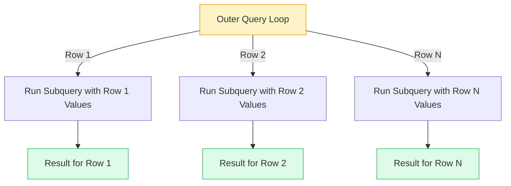

import { Aside, Badge, Card, CardGrid, Code, Tabs, TabItem } from '@astrojs/starlight/components';

## 📄 Correlated Subqueries — Complete Guide

> **A correlated subquery references a column from the outer query — making it re-execute once for every outer row, turning a single query into `N` hidden queries that can silently destroy performance when `N` is large, yet remain the clearest and most natural way to express row-by-row comparisons when `N` is small.**

<Aside type="tip">
**🧠 Mental Model**: Think of a correlated subquery as a **nested for-loop**.  
The outer query is the outer loop, the subquery is the inner loop.  
- `N` = number of outer rows.
- `M` = cost of inner query.
- Total cost = **O(N × M)**.
With an index on the inner correlation column: **O(N × log M)**.
</Aside>

---

## ⚙️ Execution Order & Architecture

Correlated subqueries can appear in almost any clause: `WHERE`, `SELECT`, `HAVING`, `ORDER BY`, and `FROM` (via `LATERAL`).

```
FROM      ← outer table loaded
WHERE     ← correlated subquery can live here ✅
GROUP BY
HAVING    ← correlated subquery can live here ✅
SELECT    ← correlated subquery can live here ✅
ORDER BY  ← correlated subquery can live here ✅
```



<Code lang="sql" title="Correlated Subquery Syntax" code={`-- Correlated = subquery references outer query's current row
-- The reference (u.id below) is what makes it "correlated"

SELECT u.name,
  (SELECT COUNT(*)           -- ← subquery
   FROM   orders o
   WHERE  o.user_id = u.id  -- ← u.id = outer reference
  ) AS order_count
FROM users u;
--   ↑ outer query

-- Execution: For EACH user row, the subquery re-runs with that user's id.
-- 1000 users → subquery runs 1000 times.`} />

---

## 1️⃣ Correlated vs Non-Correlated

```
Non-correlated subquery:           Correlated subquery:
Runs ONCE, result reused           Runs ONCE PER OUTER ROW

SELECT name,                       SELECT name,
  (SELECT AVG(salary)                (SELECT AVG(salary)
   FROM employees)    ← no ref       FROM employees e2
FROM employees e;                    WHERE e2.dept = e.dept ← ref!)
                                   FROM employees e;

Execution:                         Execution:
  Run inner once → 95000           For Raj (Eng dept):
  For every outer row:               Run inner → 110000
    plug in 95000                  For Priya (Sales dept):
                                     Run inner → 75000
                                   For Sam (Eng dept):
                                     Run inner → 110000 (again!)

EXPLAIN: InitPlan ✅               EXPLAIN: SubPlan ⚠️
(computed once, cached)            (computed per row)
```


```sql
-- Spotting correlation: does the subquery reference outer alias?

-- Non-correlated (no outer reference):
WHERE salary > (SELECT AVG(salary) FROM employees)
                ↑ no reference to outer → runs ONCE

-- Correlated (has outer reference):
WHERE salary > (SELECT AVG(salary) FROM employees e2
                WHERE e2.dept_id = e.dept_id)
                                    ↑ e.dept_id from outer → runs per row
```


| Feature | Non-Correlated Subquery | Correlated Subquery |
|---------|------------------------|---------------------|
| **Outer Reference** | ❌ None | ✅ References outer alias (e.g., `e.dept_id`) |
| **Execution Frequency** | Runs **ONCE** | Runs **ONCE PER OUTER ROW** |
| **Caching** | Cached (InitPlan) | Recomputed (SubPlan) |
| **Complexity** | O(M) | O(N × M) |

<Code lang="sql" title="Spotting the Difference" code={`-- ❌ Non-Correlated (Runs once, result reused)
SELECT name,
  (SELECT AVG(salary) FROM employees) AS company_avg  -- No outer ref
FROM employees;

-- ✅ Correlated (Runs per row)
SELECT name,
  (SELECT AVG(e2.salary) FROM employees e2 
   WHERE e2.dept_id = e.dept_id) AS dept_avg   -- References outer 'e'
FROM employees e;`} />

<Aside type="caution">
**EXPLAIN Signals**:  
- `InitPlan` → Non-correlated → Computed **once**, cached. ✅  
- `SubPlan` → Correlated → Computed **per outer row**. ⚠️ Check `N` and indexing!
</Aside>

---

## 2️⃣ Where Correlated Subqueries Appear

### In SELECT — Per-Row Computation

```sql
-- Compute a value relative to each row's context
SELECT
  e.name,
  e.salary,
  e.department,

  -- How does this employee's salary compare to their dept average?
  (SELECT ROUND(AVG(e2.salary), 0)
   FROM   employees e2
   WHERE  e2.department = e.department) AS dept_avg,

  -- Their rank within department
  (SELECT COUNT(*) + 1
   FROM   employees e2
   WHERE  e2.department = e.department
     AND  e2.salary     > e.salary)     AS dept_salary_rank,

  -- How many direct reports do they manage?
  (SELECT COUNT(*)
   FROM   employees e2
   WHERE  e2.manager_id = e.id)         AS direct_reports

FROM employees e
WHERE e.is_active = true
ORDER BY e.department, dept_salary_rank;
```

```
⚠️ Three correlated subqueries in SELECT:
   Each runs once per employee row
   1000 employees × 3 subqueries = 3000 executions

With index on employees(department, salary) and employees(manager_id):
   Each execution = O(log n) → 3000 × log(1000) ≈ 30K comparisons
   Manageable for 1K employees, painful for 1M ✅/⚠️
```

### In WHERE — Per-Row Filter

```sql
-- Find employees earning more than their department average
SELECT e.name, e.salary, e.department
FROM   employees e
WHERE  e.salary > (
  SELECT AVG(e2.salary)
  FROM   employees e2
  WHERE  e2.department = e.department   -- ← correlated
);

-- Find users whose last order was > 30 days ago (churned)
SELECT u.id, u.name, u.email
FROM   users u
WHERE  (
  SELECT MAX(o.created_at)
  FROM   orders o
  WHERE  o.user_id = u.id               -- ← correlated
) < NOW() - INTERVAL '30 days'
AND u.deleted_at IS NULL;

-- Find products whose current price < their average sold price
SELECT p.id, p.name, p.price
FROM   products p
WHERE  p.price < (
  SELECT AVG(oi.unit_price)
  FROM   order_items oi
  WHERE  oi.product_id = p.id           -- ← correlated
    AND  oi.created_at >= NOW() - INTERVAL '90 days'
);
```

### In HAVING — Per-Group Filter

```sql
-- Find departments where top earner > 2× lowest earner
SELECT   e.department
FROM     employees e
GROUP BY e.department
HAVING   MAX(e.salary) > 2 * MIN(e.salary)
  AND EXISTS (
    SELECT 1
    FROM   employees e2
    WHERE  e2.department = e.department  -- ← correlated to GROUP BY
      AND  e2.salary > 150000
  );
```

---

## 2️⃣ Execution Model & Performance

Postgres executes correlated subqueries via a **Nested Loop** pattern. For every row in the outer table, it substitutes the outer value and executes the inner query.

<CardGrid>
  <Card title="Performance Matrix" icon="chart">
    ```text
    N (Outer Rows) | Index? | Performance    | Action
    ---------------|--------|----------------|---------------------------
    Small (<100)   | No     | ✅ Fine        | Keep as is.
    Small (<100)   | Yes    | ✅ Fast        | Excellent.
    Large (>1000)  | Yes    | ⚠️ Ok-ish      | Monitor. Consider rewrite.
    Large (>1000)  | No     | ❌ Disaster    | MUST rewrite as JOIN/CTE.
    Multiple SubQ  | Any    | ❌ Danger      | Each multiplies cost.
    ```
  </Card>
  
  <Card title="The Hidden Cost" icon="warning">
    ```sql
    -- ❌ Dangerous: Large outer table × multiple correlated subqueries
    SELECT u.id,
      (SELECT COUNT(*)    FROM orders WHERE user_id = u.id) AS orders,
      (SELECT SUM(amount) FROM orders WHERE user_id = u.id) AS revenue,
      (SELECT MAX(date)   FROM orders WHERE user_id = u.id) AS last_order
    FROM users u;
    
    -- 100K users × 3 subqueries = 300,000 executions 💀
    ```
  </Card>
</CardGrid>

```
Query:
SELECT u.name,
  (SELECT COUNT(*) FROM orders o WHERE o.user_id = u.id) AS cnt
FROM users u;

Postgres execution loop:

users table:
┌────┬────────┐
│ id │ name   │
├────┼────────┤
│  1 │ Raj    │ → Execute: SELECT COUNT(*) FROM orders WHERE user_id = 1
│    │        │            → uses index on orders.user_id → returns 5
│    │        │            → emit: ('Raj', 5)
├────┼────────┤
│  2 │ Priya  │ → Execute: SELECT COUNT(*) FROM orders WHERE user_id = 2
│    │        │            → returns 3
│    │        │            → emit: ('Priya', 3)
├────┼────────┤
│  3 │ Sam    │ → Execute: SELECT COUNT(*) FROM orders WHERE user_id = 3
│    │        │            → returns 0
│    │        │            → emit: ('Sam', 0)
└────┴────────┘

Total: 3 subquery executions for 3 users
N users → N executions → O(N × inner_cost) total
```

```
EXPLAIN reveals it:

EXPLAIN SELECT u.name,
  (SELECT COUNT(*) FROM orders WHERE user_id = u.id)
FROM users u;

-- Output:
-- Seq Scan on users u
--   SubPlan 1                        ← correlated! runs per row
--     Aggregate
--       -> Index Scan on orders
--            Index Cond: (user_id = u.id)   ← outer ref here

SubPlan = correlated = per-row execution ⚠️
InitPlan = non-correlated = cached ✅
```


```
Performance depends on three factors:

1. N = number of outer rows
2. Index on inner correlated column?
3. How many inner rows match per outer row?

┌─────────────────────┬─────────────┬─────────────────────────────┐
│ Situation           │ Performance │ Action                       │
├─────────────────────┼─────────────┼─────────────────────────────┤
│ N small (<100)      │ ✅ fine     │ Keep correlated subquery     │
│ N large + index     │ ⚠️ ok-ish  │ Monitor, consider rewrite    │
│ N large + no index  │ ❌ disaster │ Must rewrite as JOIN/CTE     │
│ Multiple correlated │ ❌ danger   │ Each multiplies cost         │
│ subqueries per row  │             │ Rewrite to single JOIN       │
└─────────────────────┴─────────────┴─────────────────────────────┘
```

```sql
-- ❌ Dangerous: large outer table + multiple correlated subqueries
SELECT
  u.id,
  u.name,
  (SELECT COUNT(*) FROM orders  WHERE user_id = u.id) AS orders,
  (SELECT SUM(amount) FROM orders WHERE user_id = u.id) AS revenue,
  (SELECT MAX(created_at) FROM orders WHERE user_id = u.id) AS last_order,
  (SELECT COUNT(*) FROM reviews WHERE user_id = u.id) AS reviews
FROM users u;
-- 100K users × 4 subqueries = 400K executions 💀

-- ✅ Rewrite: JOIN + aggregate (single pass)
WITH user_order_stats AS (
  SELECT
    user_id,
    COUNT(*)         AS orders,
    SUM(amount)      AS revenue,
    MAX(created_at)  AS last_order
  FROM   orders
  GROUP BY user_id
),
user_review_stats AS (
  SELECT user_id, COUNT(*) AS reviews
  FROM   reviews
  GROUP BY user_id
)
SELECT
  u.id,
  u.name,
  COALESCE(os.orders,     0) AS orders,
  COALESCE(os.revenue,    0) AS revenue,
  os.last_order,
  COALESCE(rs.reviews,    0) AS reviews
FROM       users             u
LEFT JOIN  user_order_stats  os ON u.id = os.user_id
LEFT JOIN  user_review_stats rs ON u.id = rs.user_id;
-- One scan per table, two aggregations, two joins ✅
-- From 400K executions to ~3 table scans ← orders of magnitude faster
```


---

## 3️⃣ The Rewrite Toolkit — Correlated → Efficient

When correlated subqueries become too slow, use these patterns to rewrite them.

<Tabs>
  <TabItem label="Rewrite 1: Scalar → LEFT JOIN" icon="hash">
    ```sql
    -- ❌ Correlated scalar in SELECT
    SELECT u.name,
    (SELECT SUM(amount) FROM orders WHERE user_id = u.id) AS total
    FROM users u;

    -- ✅ LEFT JOIN + aggregate
    SELECT u.name, COALESCE(SUM(o.amount), 0) AS total
    FROM   users  u
    LEFT JOIN orders o ON u.id = o.user_id
    GROUP BY u.id, u.name;
    ```
  </TabItem>
  
  <TabItem label="Rewrite 2: WHERE → JOIN to CTE" icon="filter">
    ```sql
-- ❌ Correlated subquery in WHERE
SELECT e.name, e.salary, e.department
FROM   employees e
WHERE  e.salary > (
  SELECT AVG(e2.salary)
  FROM   employees e2
  WHERE  e2.department = e.department
);

-- ✅ JOIN to pre-aggregated result
WITH dept_avgs AS (
  SELECT department, AVG(salary) AS avg_salary
  FROM   employees
  GROUP BY department
)
SELECT e.name, e.salary, e.department
FROM   employees e
JOIN   dept_avgs d ON e.department = d.department
WHERE  e.salary > d.avg_salary;
-- dept_avgs computed once → joined cheaply ✅
    ```
  </TabItem>

  <TabItem label="Rewrite 3: Correlated ORDER BY → Window/CTE" icon="sort">
    ```sql
-- Correlated EXISTS (Postgres often handles this well)
SELECT u.name FROM users u
WHERE EXISTS (SELECT 1 FROM orders o WHERE o.user_id = u.id);

-- Postgres rewrites to Hash Semi Join automatically ✅
-- Often no manual rewrite needed for EXISTS

-- But correlated NOT EXISTS for complex conditions:
SELECT u.name FROM users u
WHERE NOT EXISTS (
  SELECT 1 FROM orders o
  WHERE  o.user_id = u.id
    AND  o.amount  > 10000
    AND  o.status  = 'delivered'
);
-- Postgres may or may not decorrelate — always check EXPLAIN ✅
    ```
  </TabItem>

  <TabItem label="Rewrite 4: Multiple Scalars → LATERAL" icon="rocket">
    ```sql
-- ❌ Correlated subquery in ORDER BY
SELECT u.id, u.name
FROM   users u
ORDER BY (
  SELECT SUM(amount) FROM orders WHERE user_id = u.id
) DESC NULLS LAST;
-- Runs subquery for EVERY row in ORDER BY phase 💀

-- ✅ Window function or CTE
WITH user_totals AS (
  SELECT user_id, SUM(amount) AS total
  FROM   orders GROUP BY user_id
)
SELECT u.id, u.name, COALESCE(ut.total, 0) AS total
FROM   users u
LEFT JOIN user_totals ut ON u.id = ut.user_id
ORDER BY total DESC NULLS LAST;
    ```
  </TabItem>
</Tabs>


### Rewrite 5 — Lateral Join (Postgres-Specific Modern Alternative)

```sql
-- Correlated subquery in FROM using LATERAL
-- LATERAL = the right side can reference the left side ✅

-- ❌ Correlated scalar — multiple subqueries
SELECT u.name,
  (SELECT MAX(amount) FROM orders WHERE user_id = u.id) AS max_order,
  (SELECT COUNT(*)    FROM orders WHERE user_id = u.id) AS order_count
FROM users u;

-- ✅ LATERAL — one subquery, multiple columns
SELECT u.name, stats.max_order, stats.order_count
FROM   users u
LEFT JOIN LATERAL (
  SELECT
    MAX(amount)  AS max_order,
    COUNT(*)     AS order_count
  FROM   orders
  WHERE  user_id = u.id          -- ← references u from left side
) stats ON true;                 -- always join (LEFT JOIN LATERAL)

-- Benefits:
-- ✅ One subquery execution per user (not one per column)
-- ✅ Can return multiple columns and rows
-- ✅ Cleaner than multiple correlated scalars
-- ✅ Postgres can optimize better than multiple SubPlans
```

```sql
-- LATERAL for "last N orders per user" (classic N per group)
SELECT u.name, recent.id, recent.amount, recent.created_at
FROM   users u
LEFT JOIN LATERAL (
  SELECT id, amount, created_at
  FROM   orders
  WHERE  user_id = u.id
  ORDER BY created_at DESC
  LIMIT  3                       -- ← last 3 orders per user ✅
) recent ON true
WHERE u.deleted_at IS NULL
ORDER BY u.name, recent.created_at DESC;

-- LATERAL with LIMIT is the idiomatic Postgres way to get
-- "top N per group" — more efficient than window functions
-- for large tables with a good index on (user_id, created_at)
```


<Aside type="note">
**🌟 LATERAL Joins**: A Postgres-specific superpower. It allows a subquery in the `FROM` clause to reference columns from tables appearing earlier in the `FROM` list. It's the most efficient way to get "Top N per group" or multiple aggregates per row.

> 🎯 **Interview Q:** *"How would you get the last 3 orders for each user in one query?"*
> **A:** `LEFT JOIN LATERAL (SELECT ... FROM orders WHERE user_id = u.id ORDER BY created_at DESC LIMIT 3) ON true` — LATERAL allows the subquery to reference the outer row, LIMIT 3 gets exactly 3 per user. Index on `(user_id, created_at DESC)` makes it O(log n) per user.
</Aside>

---

## 4️⃣ Postgres Decorrelation — The Magic Behind the Scenes

The Postgres planner tries to **automatically decorrelate** subqueries, rewriting them into joins to improve performance.


| Query Pattern | Decorrelation Capability | EXPLAIN Node |
|---------------|--------------------------|--------------|
| `EXISTS (SELECT 1 ...)` | ✅ High (Rewritten to Semi-Join) | `Hash Semi Join` |
| `NOT EXISTS` | ✅ High (Rewritten to Anti-Join) | `Hash Anti Join` |
| `IN (SELECT ...)` | ✅ High (Rewritten to Semi-Join) | `Hash Semi Join` |
| Scalar Subquery (`SELECT (SELECT ...)`) | ❌ Low (Usually stays SubPlan) | `SubPlan 1` |
| Subquery with `LIMIT` / `ORDER BY` | ❌ No (Stays Nested Loop) | `Nested Loop` |


```
Postgres query planner tries to DECORRELATE subqueries automatically.
Decorrelation = rewrite correlated subquery as a JOIN internally.

When Postgres CAN decorrelate:
  ✅ Simple correlated subqueries (single table, simple condition)
  ✅ Correlated EXISTS/NOT EXISTS (rewritten to semi/anti join)
  ✅ Correlated IN (rewritten to hash semi join)

When Postgres CANNOT decorrelate:
  ❌ Correlated scalar in SELECT (stays as SubPlan)
  ❌ Correlated subquery with LIMIT or ORDER BY
  ❌ Complex correlated subqueries with aggregates
  ❌ Correlated subquery in HAVING with complex conditions
```

<Code lang="sql" title="Checking Decorrelation" code={`
-- Postgres CAN decorrelate this (EXISTS → Anti-Join):
EXPLAIN SELECT u.name FROM users u
WHERE NOT EXISTS (SELECT 1 FROM orders o WHERE o.user_id = u.id);
-- Hash Anti Join ← decorrelated automatically ✅

-- Postgres CANNOT decorrelate this (stays as SubPlan):
EXPLAIN SELECT u.name,
  (SELECT COUNT(*) FROM orders WHERE user_id = u.id) AS cnt
FROM users u;
-- Seq Scan on users u
--   SubPlan 1    ← NOT decorrelated, runs per row ⚠️

-- Proof: check for SubPlan vs Join in EXPLAIN
-- SubPlan = still correlated = manual rewrite needed
-- Join node = decorrelated by planner = efficient ✅
`} />

> 🎯 **Real-life SDE:** Always run `EXPLAIN (ANALYZE)` on queries with correlated subqueries. If you see `SubPlan` in the output AND the outer table has thousands of rows — that's your performance bottleneck. Rewrite using the toolkit above.

---

## 7️⃣ Correlated Subquery vs Window Function — Overlap Zone

```sql
-- Many correlated patterns = window functions in disguise

-- ❌ Correlated for dept average comparison (expensive)
SELECT e.name, e.salary,
  (SELECT AVG(e2.salary) FROM employees e2
   WHERE e2.department = e.department) AS dept_avg
FROM employees e;

-- ✅ Window function (single pass, no correlation)
SELECT e.name, e.salary,
  AVG(e.salary) OVER (PARTITION BY e.department) AS dept_avg
FROM employees e;

-- ❌ Correlated for running count (expensive)
SELECT e.name, e.hire_date,
  (SELECT COUNT(*) FROM employees e2
   WHERE e2.department = e.department
     AND e2.hire_date  <= e.hire_date) AS employees_before_me
FROM employees e;

-- ✅ Window function (single pass)
SELECT e.name, e.hire_date,
  COUNT(*) OVER (
    PARTITION BY e.department
    ORDER BY e.hire_date
    ROWS BETWEEN UNBOUNDED PRECEDING AND CURRENT ROW
  ) AS employees_before_me
FROM employees e;
```

```
When CORRELATED SUBQUERY is better than window function:

  ✅ Complex filtering in inner query (LATERAL + LIMIT)
  ✅ Accessing different table (not same table as outer)
  ✅ One-off computation for small result sets
  ✅ EXISTS/NOT EXISTS checks (no window fn equivalent)

When WINDOW FUNCTION is better:

  ✅ Same table, different grouping/ordering
  ✅ Running totals, ranks, lag/lead (all single-pass)
  ✅ Large outer result sets
  ✅ Multiple metrics in one pass
```

---


## 5️⃣ Real-Life SDE Patterns

<CardGrid>
  <Card title="Pattern 1: Department Benchmarking" icon="chart">
    ```sql
    -- Flag employees earning above their specific department average
    SELECT e.name, e.salary, e.department,
      (SELECT AVG(salary) FROM employees e2 WHERE e2.department = e.department) AS dept_avg
    FROM employees e;
    -- Simple, readable, fine for small tables.
    -- For large tables: Use Window Function AVG() OVER(PARTITION BY department).
    ```
  </Card>
  
  <Card title="Pattern 2: Top N Per Group (LATERAL)" icon="rocket">
    ```sql
    -- Get the last 3 orders for every user (Idiomatic Postgres)
    SELECT u.name, o.id, o.amount, o.created_at
    FROM users u
    LEFT JOIN LATERAL (
      SELECT id, amount, created_at 
      FROM orders WHERE user_id = u.id 
      ORDER BY created_at DESC LIMIT 3
    ) o ON true
    -- ✅ Much faster than Window Functions for this specific pattern.
    -- Requires index: (user_id, created_at DESC)
    ```
  </Card>

  <Card title="Pattern 3: Conditional Logic & Discounts" icon="tag">
    ```sql
    -- Apply discount based on complex user history
    SELECT o.id, o.amount,
      CASE
        WHEN EXISTS (SELECT 1 FROM orders o2 WHERE o2.user_id = o.user_id AND o2.amount > 1000)
          THEN o.amount * 0.85 -- VIP discount
        WHEN NOT EXISTS (SELECT 1 FROM orders o2 WHERE o2.user_id = o.user_id AND o2.id < o.id)
          THEN o.amount * 0.95 -- First-time buyer
        ELSE o.amount
      END AS final_price
    FROM orders o;
    -- Correlated EXISTS is perfect here for conditional row logic.
    ```
  </Card>

  <Card title="Pattern 4: Consecutive Anomaly Detection" icon="search">
    ```sql
    -- Find products with price drops for 3 consecutive months
    SELECT DISTINCT p.id, p.name FROM products p
    WHERE EXISTS (
      SELECT 1 FROM price_history ph1 WHERE ph1.product_id = p.id AND EXISTS (
        SELECT 1 FROM price_history ph2 WHERE ph2.product_id = ph1.product_id
          AND ph2.month = ph1.month + INTERVAL '1 month' AND ph2.price < ph1.price AND EXISTS (
            -- ... Nested EXISTS chain ...
          )
      )
    );
    -- ✅ Complex nested correlation is powerful for pattern matching.
    ```
  </Card>
</CardGrid>

### Pattern 1 — Row-Relative Comparison (Department Benchmark)

```sql
-- Flag each employee's performance vs their team
SELECT
  e.name,
  e.department,
  e.performance_score,
  ROUND(dept.avg_score, 1)                       AS dept_avg,
  e.performance_score - dept.avg_score            AS vs_avg,
  CASE
    WHEN e.performance_score >= dept.avg_score * 1.2 THEN '🌟 Top performer'
    WHEN e.performance_score >= dept.avg_score        THEN '✅ Above average'
    WHEN e.performance_score >= dept.avg_score * 0.8  THEN '⚠️ Below average'
    ELSE                                               '🔴 At risk'
  END                                             AS performance_band
FROM employees e
JOIN (
  SELECT department, AVG(performance_score) AS avg_score
  FROM   employees
  WHERE  is_active = true
  GROUP BY department
) dept ON e.department = dept.department          -- ← pre-aggregate, then join ✅
WHERE e.is_active = true
ORDER BY e.department, vs_avg DESC;
```

### Pattern 2 — Latest Record Per Group (LATERAL)

```sql
-- Most recent 2 orders per customer for support dashboard
SELECT
  u.id,
  u.name,
  u.email,
  recent.order_id,
  recent.amount,
  recent.status,
  recent.created_at
FROM   users u
LEFT JOIN LATERAL (
  SELECT
    o.id       AS order_id,
    o.amount,
    o.status,
    o.created_at
  FROM   orders o
  WHERE  o.user_id    = u.id
    AND  o.deleted_at IS NULL
  ORDER BY o.created_at DESC
  LIMIT  2                               -- 2 most recent per user ✅
) recent ON true
WHERE u.deleted_at IS NULL
ORDER BY u.name, recent.created_at DESC;
```

### Pattern 3 — Running Balance / Ledger

```sql
-- Account ledger: balance after each transaction
SELECT
  t.id,
  t.description,
  t.amount,
  t.transaction_date,
  (
    SELECT SUM(t2.amount)
    FROM   transactions t2
    WHERE  t2.account_id     = t.account_id    -- same account
      AND  t2.transaction_date <= t.transaction_date  -- up to this date
      AND  t2.id             <= t.id           -- tiebreak by id
  ) AS running_balance
FROM transactions t
WHERE t.account_id = :account_id
ORDER BY t.transaction_date, t.id;

-- Better for production: window function
SELECT
  id, description, amount, transaction_date,
  SUM(amount) OVER (
    PARTITION BY account_id
    ORDER BY transaction_date, id
    ROWS UNBOUNDED PRECEDING
  ) AS running_balance
FROM transactions
WHERE account_id = :account_id
ORDER BY transaction_date, id;
```

### Pattern 4 — Existence-Based Business Rules

```sql
-- Apply discount only if customer meets criteria
SELECT
  o.id,
  o.user_id,
  o.amount,
  CASE
    -- VIP: has spent > 100K lifetime
    WHEN EXISTS (
      SELECT 1 FROM orders o2
      WHERE  o2.user_id = o.user_id
      HAVING SUM(o2.amount) > 100000
    ) THEN o.amount * 0.85              -- 15% discount

    -- Loyal: has ordered 10+ times this year
    WHEN (
      SELECT COUNT(*) FROM orders o2
      WHERE  o2.user_id   = o.user_id
        AND  o2.created_at >= DATE_TRUNC('year', NOW())
    ) >= 10 THEN o.amount * 0.90        -- 10% discount

    -- New: first order
    WHEN NOT EXISTS (
      SELECT 1 FROM orders o2
      WHERE  o2.user_id = o.user_id
        AND  o2.id      < o.id          -- older orders
    ) THEN o.amount * 0.95              -- 5% welcome discount

    ELSE o.amount                       -- no discount
  END AS final_amount
FROM orders o
WHERE o.status = 'pending';
```

### Pattern 5 — Detect Consecutive Anomalies

```sql
-- Find products with price drop in 3 consecutive months
SELECT DISTINCT p.id, p.name
FROM   products p
WHERE  EXISTS (
  SELECT 1
  FROM   price_history ph1
  WHERE  ph1.product_id = p.id
    AND  EXISTS (
      SELECT 1 FROM price_history ph2
      WHERE  ph2.product_id  = ph1.product_id
        AND  ph2.month       = ph1.month + INTERVAL '1 month'
        AND  ph2.price       < ph1.price   -- price dropped month 2
        AND  EXISTS (
          SELECT 1 FROM price_history ph3
          WHERE  ph3.product_id = ph2.product_id
            AND  ph3.month      = ph2.month + INTERVAL '1 month'
            AND  ph3.price      < ph2.price -- price dropped month 3
        )
    )
);
-- Nested correlated EXISTS for consecutive pattern detection ✅
-- Acceptable here: product table is small
```

### Pattern 6 — Conditional Aggregation with Correlated Filter

```sql
-- Monthly report: each product with sales context
SELECT
  p.id,
  p.name,
  p.category,
  p.price,
  -- Current month sales (correlated)
  COALESCE((
    SELECT SUM(oi.quantity * oi.unit_price)
    FROM   order_items oi
    JOIN   orders o ON oi.order_id = o.id
    WHERE  oi.product_id = p.id
      AND  DATE_TRUNC('month', o.created_at) = DATE_TRUNC('month', NOW())
      AND  o.status = 'delivered'
  ), 0)                                   AS current_month_revenue,

  -- Is it a top seller in its category?
  CASE WHEN (
    SELECT COUNT(*) FROM products p2
    WHERE  p2.category = p.category
      AND  (
        SELECT COALESCE(SUM(oi2.quantity), 0)
        FROM   order_items oi2
        WHERE  oi2.product_id = p2.id
      ) > (
        SELECT COALESCE(SUM(oi3.quantity), 0)
        FROM   order_items oi3
        WHERE  oi3.product_id = p.id
      )
  ) < 3 THEN true ELSE false
  END                                     AS is_top_3_in_category

FROM products p
WHERE p.is_active = true
ORDER BY p.category, current_month_revenue DESC;
-- ⚠️ Deep nesting — acceptable for small product catalog
-- For large catalog → rewrite with CTEs
```


---

## 🔬 Verify Yourself

```sql
-- Setup
CREATE TEMP TABLE t_emp (
  id     INT PRIMARY KEY,
  name   TEXT,
  dept   TEXT,
  salary INT,
  mgr_id INT
);
CREATE TEMP TABLE t_orders2 (
  id      INT,
  emp_id  INT,
  amount  INT,
  sale_dt DATE
);

INSERT INTO t_emp VALUES
  (1,'Sharma','Eng',  200000, NULL),
  (2,'Raj',   'Eng',  120000, 1),
  (3,'Priya', 'Eng',  110000, 1),
  (4,'Sam',   'Sales', 90000, 1),
  (5,'Ankit', 'Sales', 85000, 4),
  (6,'Meera', 'Sales', 80000, 4);

INSERT INTO t_orders2 VALUES
  (1,2,5000,'2024-01-15'),
  (2,2,3000,'2024-02-10'),
  (3,3,8000,'2024-01-20'),
  (4,4,2000,'2024-01-05'),
  (5,4,4000,'2024-02-25'),
  (6,5,1500,'2024-03-10');

-- 1. Correlated in SELECT (SubPlan)
SELECT name, dept, salary,
  (SELECT ROUND(AVG(e2.salary))
   FROM   t_emp e2
   WHERE  e2.dept = e.dept) AS dept_avg
FROM t_emp e;
-- Each row gets its dept's average ✅

-- 2. Correlated in WHERE (above dept avg)
SELECT name, salary, dept
FROM   t_emp e
WHERE  salary > (
  SELECT AVG(e2.salary) FROM t_emp e2
  WHERE  e2.dept = e.dept
);
-- Sharma(200K), Raj(120K) above Eng avg(143K)? No - only Sharma
-- Sam(90K) above Sales avg(85K)? Yes ✅
-- Let's check:
SELECT AVG(salary) FROM t_emp WHERE dept='Eng';   -- 143333
SELECT AVG(salary) FROM t_emp WHERE dept='Sales'; -- 85000
-- Above Eng avg:   Sharma(200K) only
-- Above Sales avg: Sam(90K), Ankit(85K)=not above, Meera(80K)=not above
-- Result: Sharma, Sam ✅

-- 3. EXPLAIN: SubPlan vs InitPlan
EXPLAIN SELECT name,
  (SELECT AVG(salary) FROM t_emp)                  -- InitPlan (non-corr)
    AS company_avg,
  (SELECT AVG(e2.salary) FROM t_emp e2
   WHERE e2.dept = e.dept)                          -- SubPlan (corr)
    AS dept_avg
FROM t_emp e;
-- InitPlan 1 → computed once ✅
-- SubPlan 2  → computed per row ⚠️

-- 4. Rewrite correlated → CTE join (better performance)
WITH dept_avgs AS (
  SELECT dept, AVG(salary) AS avg_sal
  FROM   t_emp GROUP BY dept
)
SELECT e.name, e.salary, d.avg_sal AS dept_avg
FROM   t_emp e
JOIN   dept_avgs d ON e.dept = d.dept;
-- Same result, one scan each ✅

-- 5. LATERAL — last 2 sales per employee
SELECT e.name, s.id AS sale_id, s.amount, s.sale_dt
FROM   t_emp e
LEFT JOIN LATERAL (
  SELECT id, amount, sale_dt
  FROM   t_orders2
  WHERE  emp_id = e.id
  ORDER BY sale_dt DESC
  LIMIT 2
) s ON true
ORDER BY e.name, s.sale_dt DESC;
-- Each employee's 2 most recent sales ✅

-- 6. Correlated EXISTS (Postgres decorrelates to Semi-Join)
EXPLAIN SELECT name FROM t_emp e
WHERE EXISTS (
  SELECT 1 FROM t_orders2 o WHERE o.emp_id = e.id
);
-- Hash Semi Join ← decorrelated automatically ✅

-- 7. Correlated scalar NOT decorrelated (stays as SubPlan)
EXPLAIN SELECT name,
  (SELECT COUNT(*) FROM t_orders2 WHERE emp_id = e.id)
FROM t_emp e;
-- SubPlan ← stays correlated ⚠️

-- 8. Self-correlated: manager vs employee salary
SELECT
  e.name     AS employee,
  e.salary   AS emp_salary,
  m.name     AS manager,
  m.salary   AS mgr_salary
FROM t_emp e
JOIN t_emp m ON e.mgr_id = m.id
WHERE e.salary > (
  SELECT AVG(e2.salary) FROM t_emp e2
  WHERE e2.mgr_id = e.mgr_id   -- same manager's team ← correlated
);
-- Employees earning above their team's average ✅
```


## 6️⃣ Correlated Subquery vs Window Functions

Often, what looks like a job for a correlated subquery is actually a job for a Window Function.

<CardGrid>
  <Card title="When to use Correlated Subquery" icon="check">
    - Accessing a **different table** than the outer query.
    - Using `EXISTS` / `NOT EXISTS` (No window equivalent).
    - `LATERAL` joins for "Top N per group".
    - Complex filtering in the inner query.
    - Small result sets (clarity over speed).
  </Card>
  
  <Card title="When to use Window Function" icon="rocket">
    - Metrics on the **same table** (e.g., rank, running total, avg).
    - Large outer result sets.
    - Needing multiple metrics in a **single pass**.
    - Avoiding `GROUP BY` when you want to keep all rows.
  </Card>
</CardGrid>

<Code lang="sql" title="Example: Dept Average Comparison" code={`-- ❌ Correlated Subquery: 1000 users = 1000 subquery executions
SELECT e.name, e.salary,
  (SELECT AVG(salary) FROM employees e2 WHERE e2.department = e.department) AS dept_avg
FROM employees e;

-- ✅ Window Function: Single pass over the table
SELECT e.name, e.salary,
  AVG(salary) OVER (PARTITION BY e.department) AS dept_avg
FROM employees e;`} />

---

## 🔬 Verify Yourself

<Code lang="sql" title="Run these in psql" code={`
-- Setup
CREATE TEMP TABLE t_emp (
  id     INT PRIMARY KEY,
  name   TEXT,
  dept   TEXT,
  salary INT,
  mgr_id INT
);
CREATE TEMP TABLE t_orders2 (
  id      INT,
  emp_id  INT,
  amount  INT,
  sale_dt DATE
);

INSERT INTO t_emp VALUES
  (1,'Sharma','Eng',  200000, NULL),
  (2,'Raj',   'Eng',  120000, 1),
  (3,'Priya', 'Eng',  110000, 1),
  (4,'Sam',   'Sales', 90000, 1),
  (5,'Ankit', 'Sales', 85000, 4),
  (6,'Meera', 'Sales', 80000, 4);

INSERT INTO t_orders2 VALUES
  (1,2,5000,'2024-01-15'),
  (2,2,3000,'2024-02-10'),
  (3,3,8000,'2024-01-20'),
  (4,4,2000,'2024-01-05'),
  (5,4,4000,'2024-02-25'),
  (6,5,1500,'2024-03-10');

-- 1. Correlated in SELECT (SubPlan)
SELECT name, dept, salary,
  (SELECT ROUND(AVG(e2.salary))
   FROM   t_emp e2
   WHERE  e2.dept = e.dept) AS dept_avg
FROM t_emp e;
-- Each row gets its dept's average ✅

-- 2. Correlated in WHERE (above dept avg)
SELECT name, salary, dept
FROM   t_emp e
WHERE  salary > (
  SELECT AVG(e2.salary) FROM t_emp e2
  WHERE  e2.dept = e.dept
);
-- Sharma(200K), Raj(120K) above Eng avg(143K)? No - only Sharma
-- Sam(90K) above Sales avg(85K)? Yes ✅
-- Let's check:
SELECT AVG(salary) FROM t_emp WHERE dept='Eng';   -- 143333
SELECT AVG(salary) FROM t_emp WHERE dept='Sales'; -- 85000
-- Above Eng avg:   Sharma(200K) only
-- Above Sales avg: Sam(90K), Ankit(85K)=not above, Meera(80K)=not above
-- Result: Sharma, Sam ✅

-- 3. EXPLAIN: SubPlan vs InitPlan
EXPLAIN SELECT name,
  (SELECT AVG(salary) FROM t_emp)                  -- InitPlan (non-corr)
    AS company_avg,
  (SELECT AVG(e2.salary) FROM t_emp e2
   WHERE e2.dept = e.dept)                          -- SubPlan (corr)
    AS dept_avg
FROM t_emp e;
-- InitPlan 1 → computed once ✅
-- SubPlan 2  → computed per row ⚠️

-- 4. Rewrite correlated → CTE join (better performance)
WITH dept_avgs AS (
  SELECT dept, AVG(salary) AS avg_sal
  FROM   t_emp GROUP BY dept
)
SELECT e.name, e.salary, d.avg_sal AS dept_avg
FROM   t_emp e
JOIN   dept_avgs d ON e.dept = d.dept;
-- Same result, one scan each ✅

-- 5. LATERAL — last 2 sales per employee
SELECT e.name, s.id AS sale_id, s.amount, s.sale_dt
FROM   t_emp e
LEFT JOIN LATERAL (
  SELECT id, amount, sale_dt
  FROM   t_orders2
  WHERE  emp_id = e.id
  ORDER BY sale_dt DESC
  LIMIT 2
) s ON true
ORDER BY e.name, s.sale_dt DESC;
-- Each employee's 2 most recent sales ✅

-- 6. Correlated EXISTS (Postgres decorrelates to Semi-Join)
EXPLAIN SELECT name FROM t_emp e
WHERE EXISTS (
  SELECT 1 FROM t_orders2 o WHERE o.emp_id = e.id
);
-- Hash Semi Join ← decorrelated automatically ✅

-- 7. Correlated scalar NOT decorrelated (stays as SubPlan)
EXPLAIN SELECT name,
  (SELECT COUNT(*) FROM t_orders2 WHERE emp_id = e.id)
FROM t_emp e;
-- SubPlan ← stays correlated ⚠️

-- 8. Self-correlated: manager vs employee salary
SELECT
  e.name     AS employee,
  e.salary   AS emp_salary,
  m.name     AS manager,
  m.salary   AS mgr_salary
FROM t_emp e
JOIN t_emp m ON e.mgr_id = m.id
WHERE e.salary > (
  SELECT AVG(e2.salary) FROM t_emp e2
  WHERE e2.mgr_id = e.mgr_id   -- same manager's team ← correlated
);
-- Employees earning above their team's average ✅
`} />

---

## 🎯 Interview Cheat Sheet

<CardGrid>
  <Card title="Core Concepts" icon="information">
    ```text
    Q: What makes a subquery "correlated"?
    A: It references a column from the outer query, causing it to re-execute per row.
    
    Q: EXPLAIN signal for correlation?
    A: SubPlan = correlated (per-row cost). InitPlan = non-correlated (cached).
    
    Q: When is correlated subquery fine?
    A: Small outer result (N < ~100), index on correlated column, clear intent.
    ```
  </Card>
  
  <Card title="Rewrites & Optimization" icon="rocket">
    ```text
    Q: Rewrite correlated scalar → ?
    A: CTE + LEFT JOIN or Window Function.
    
    Q: Rewrite correlated WHERE → ?
    A: JOIN to pre-aggregated CTE.
    
    Q: What is LATERAL JOIN?
    A: Postgres feature allowing FROM subqueries to reference outer tables. Best for Top-N per group.
    ```
  </Card>

  <Card title="Decorrelation" icon="shield">
    ```text
    Q: Does Postgres auto-decorrelate?
    A: YES for EXISTS/IN (Semi-Join). NO for scalar SubPlans.
    
    Q: Correlated vs Window Function?
    A: Same table metrics → Window Function. Different table/EXISTS → Correlated.
    ```
  </Card>
</CardGrid>

---

## 🧠 Full Mental Model

```text
CORRELATED SUBQUERY — Complete Picture

Definition:
  Subquery that references the outer query's current row
  = inner loop that depends on outer loop's current iteration

Execution model:
  for each outer_row:                  ← outer loop (N iterations)
    substitute outer_row.col           ← correlated reference
    run subquery with substituted val  ← inner execution (M cost)
    use result for that outer row

  Total cost: O(N × M)
  With index: O(N × log M)            ← acceptable for small N
  No index:   O(N × M)                ← catastrophic for large N

EXPLAIN signals:
  SubPlan  = correlated = per-row cost ⚠️ → check N and indexes
  InitPlan = non-correlated = cached  ✅ → no concern

When to keep:                         When to rewrite:
  N < ~100 rows                         N > 1000 rows
  Index on correlated col               No index available
  Single subquery                       Multiple subqueries per row
  EXISTS/NOT EXISTS                     Scalar returning one value
  LATERAL with LIMIT                    Can be expressed as window fn
  Complex filter in inner query         Simple aggregation

Rewrite options:
  Correlated scalar    → CTE + LEFT JOIN
  Correlated WHERE     → JOIN to pre-aggregate CTE
  Correlated EXISTS    → Postgres auto-rewrites (Semi-Join) ✅
  Multiple correlations→ Single LATERAL JOIN (one subquery, many cols)
  Running totals       → Window function SUM OVER ✅
  Top-N per group      → LATERAL + LIMIT (idiomatic Postgres) ✅

The index rule:
  CREATE INDEX ON inner_table(correlated_column);
  Without this: every outer row = full table scan of inner table 💀
  With this:    every outer row = O(log n) index lookup ✅
```

<Aside type="caution">
**Final Checklist**:
1. ✅ Check `EXPLAIN` for `SubPlan` nodes on large tables.
2. ✅ Ensure an index exists on the inner correlation column.
3. ✅ Use `LATERAL` for efficient "Top N per group" queries.
4. ✅ Rewrite multiple correlated scalars into a single `JOIN` or `LATERAL` to avoid repeated executions.
5. ✅ Use Window Functions for same-table aggregations (running totals, ranks).
</Aside>

---

## 🧪 Test Your Understanding

<Code lang="text" title="Predict the behavior" code={`Q1: What is the EXPLAIN keyword that indicates a correlated subquery?
A) InitPlan
B) SubPlan
C) HashJoin
D) SeqScan

Q2: When is a correlated subquery generally acceptable?
A) When the outer table has 1M rows
B) When there is no index on the correlated column
C) When the outer table is small (N < 100)
D) When used in a LATERAL join

Q3: Rewrite this query to avoid correlation:
SELECT u.name, (SELECT COUNT(*) FROM orders WHERE user_id = u.id) AS cnt FROM users u;

Q4: What does LATERAL allow you to do?
A) Create a temporary table
B) Reference outer table columns inside a FROM subquery
C) Index a subquery
`} />

<details>
<summary>✅ Click to reveal answers</summary>

```text
Q1: B) SubPlan. (InitPlan indicates a non-correlated, cached subquery).

Q2: C) When the outer table is small (N < 100). 
   Also acceptable if N is large but there is a highly efficient index on the correlated column.

Q3: 
   WITH order_counts AS (
     SELECT user_id, COUNT(*) AS cnt FROM orders GROUP BY user_id
   )
   SELECT u.name, COALESCE(oc.cnt, 0) AS cnt
   FROM users u LEFT JOIN order_counts oc ON u.id = oc.user_id;

Q4: B) Reference outer table columns inside a FROM subquery. 
   It enables correlated subqueries in the FROM clause, perfect for Top-N patterns.
```
</details>

<Aside type="tip">
**Next Steps**:
1. ✅ Audit your queries for multiple correlated subqueries in the `SELECT` clause.
2. ✅ Rewrite them using `LATERAL` joins to reduce execution count.
3. ✅ Replace scalar comparisons with Window Functions where possible.
4. ✅ Always verify performance with `EXPLAIN (ANALYZE, BUFFERS)` before deploying.
</Aside>